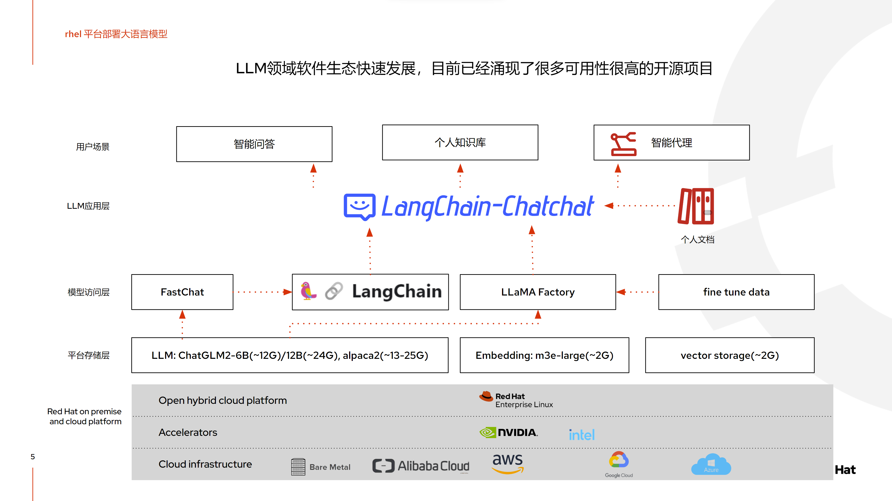

# 在 RHEL9 上训练 LLM 并实现个人知识库 （RAG）

随着chatgpt出圈，大预言模型火遍全球。那么在红帽的平台上，如何训练/微调一个大预言模型，如何使用大预言模型运行一个应用？

现在，我们就在红帽的RHEL操作系统上，来一步一步的从零开始，下载一个大预言模型，部署一个应用，并且微调这个大预言模型。在这个过程中，体验大语言模型的魅力和给我们带来的挑战。

由于大语言模型的火爆，相关的开源项目欣欣向荣，我们主要会使用2个开源项目，来逐步完成我们的实验。

这里是实验架构图：



# 驱动安装

我们的实验环境是一台rhel9主机，开始实验的第一件事情，就是按照nvidia驱动

```bash

grubby --update-kernel=ALL --args="amd_iommu=on iommu=on modprobe.blacklist=nouveau"

grub2-mkconfig -o /etc/grub2.cfg

dnf update -y

reboot

dnf groupinstall -y 'development'

dnf groupinstall -y 'server with gui'


# or using rpm network
# https://developer.nvidia.com/cuda-downloads?target_os=Linux&target_arch=x86_64&Distribution=Rocky&target_version=9&target_type=rpm_network
dnf config-manager --add-repo https://developer.download.nvidia.com/compute/cuda/repos/rhel9/x86_64/cuda-rhel9.repo
dnf clean all
dnf -y module install nvidia-driver:latest-dkms
dnf -y install cuda

# NCCL
# https://developer.nvidia.com/nccl
dnf config-manager --add-repo https://developer.download.nvidia.com/compute/cuda/repos/rhel9/x86_64/cuda-rhel9.repo

dnf install -y libnccl libnccl-devel libnccl-static

curl -s https://packagecloud.io/install/repositories/github/git-lfs/script.rpm.sh | sudo bash
yum install -y git-lfs

dnf install -y conda


```

# 下载模型

大语言模型的数据文件非常大，我们需要提前下载，不然应用运行的时候，会自动下载，为了方便管理，我们先手动下载下来

```bash

# config python to point to python 3.11
alternatives --config python
alternatives --config python3

rm -rf /data/py_env/hg_cli/venv
mkdir -p /data/py_env/hg_cli/

cd /data/py_env/hg_cli
python3 -m venv venv

# very important, run every time when using python
source /data/py_env/hg_cli/venv/bin/activate

python -m pip install --upgrade pip setuptools wheel

pip install --upgrade huggingface_hub

# on helper
# for chatglm2-6b
VAR_NAME=THUDM/ChatGLM2-6B

VAR_NAME_FULL=${VAR_NAME//\//-}
echo $VAR_NAME_FULL
# THUDM-ChatGLM2-6B

mkdir -p /data01/huggingface/${VAR_VAR_NAME_FULLNAME}
cd /data01/huggingface/${VAR_NAME_FULL}

while true; do
    huggingface-cli download --repo-type model --revision main --cache-dir /data01/huggingface/cache --local-dir ./ --local-dir-use-symlinks False --resume-download ${VAR_NAME} 
    if [ $? -eq 0 ]; then
        break
    fi
    sleep 1  # Optional: waits for 1 second before trying again
done

################
# for m3e-large

VAR_NAME=moka-ai/m3e-large

VAR_NAME_FULL=${VAR_NAME//\//-}
echo $VAR_NAME_FULL
# moka-ai-m3e-large

mkdir -p /data01/huggingface/${VAR_VAR_NAME_FULLNAME}
cd /data01/huggingface/${VAR_NAME_FULL}

while true; do
    huggingface-cli download --repo-type model --revision main --cache-dir /data01/huggingface/cache --local-dir ./ --local-dir-use-symlinks False --resume-download ${VAR_NAME} 
    if [ $? -eq 0 ]; then
        break
    fi
    sleep 1  # Optional: waits for 1 second before trying again
done

```

# 运行LLM应用

基于LLM的应用，现在看有3个大的方向，一个是chatgpt这样的智能问答，一个是构建个人知识库（RAG），最后一个是AI Agent (function call)。

由于我们使用的是离线的LLM，泛化能力不够，所以AI Agent相关的功能并不能很好的支撑，那么我们就集中精力，在前个场景。

我们选择了一个开源项目，[Langchain-Chatchat](https://github.com/chatchat-space/Langchain-Chatchat)，类似的开源项目有很多，我们选择这个项目，是因为这个项目文档很丰富，源代码结构简单，支持的应用场景很完整。

```bash

mkdir -p /data/env/
conda create -p /data/env/chatchat python=3.10

conda init bash

conda activate /data/env/chatchat
# conda deactivate

pip3 install --upgrade pip
pip install peft


mkdir -p /data/git_env
cd /data/git_env

git clone https://github.com/chatchat-space/Langchain-Chatchat

export ENV_CWD="/data/git_env/Langchain-Chatchat"

cd ${ENV_CWD}
pip install -r requirements.txt


cd ${ENV_CWD}/configs
/bin/cp -f model_config.py.example model_config.py
/bin/cp -f server_config.py.example server_config.py
/bin/cp -f kb_config.py.exmaple kb_config.py
/bin/cp -f basic_config.py.example basic_config.py
/bin/cp -f prompt_config.py.example prompt_config.py

# apply custom config
/bin/cp -f model_config.multi.py model_config.py


# init vector db
cd ${ENV_CWD}
# /bin/rm -rf ${ENV_CWD}/info.db
# /bin/rm -rf ${ENV_CWD}/samples/vector_store
/bin/rm -rf ${ENV_CWD}/knowledge_base/*/vector_store
python3 init_database.py --recreate-vs

# startup the UI
# no proxy to run ...
unset http_proxy
unset https_proxy
unset no_proxy

cd ${ENV_CWD}
python startup.py -a

# 服务端运行信息：
#     OpenAI API Server: http://0.0.0.0:20000/v1
#     Chatchat  API  Server: http://0.0.0.0:7861
#     Chatchat WEBUI Server: http://0.0.0.0:8501
#     Collecting usage statistics. To deactivate, set browser.gatherUsageStats to False.

# http://172.21.6.98:8501

```

# 微调LLM


# end

