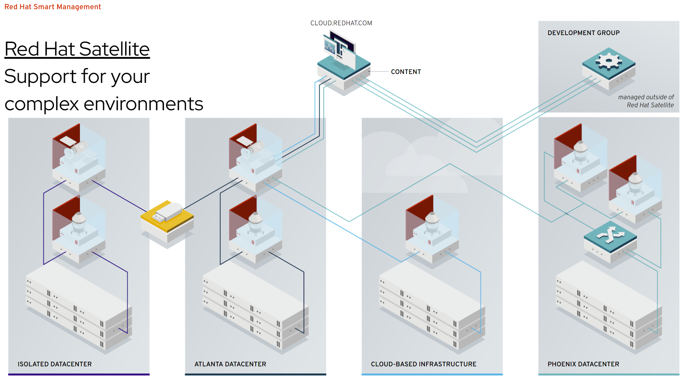

# RHEL 订阅在线注册相关问题

## 在线注册过程
国内客户，购买了rhel订阅以后，就可以把自己的系统，在线注册了。一般用如下的命令：
```bash
subscription-manager register --auto-attach --username ********* --password ********
```
上述命令在国内的网络情况下，经常出现速度慢，超时等错误。这是因为，register过程，要访问国外的服务器。那我们可以搞一个proxy，然后让注册过程走proxy，就能加速。
```bash
export PROXY="127.0.0.1:18801"

subscription-manager register --proxy=$PROXY --auto-attach --username ********* --password ********
```
官方知识库： https://access.redhat.com/solutions/253273
## 离线注册过程
如果客户网络情况太特殊，那么我们还可以走离线注册过程。背后的原理是，之前的在线注册，经过用户名密码验证后，系统会下载一个证书，保存在系统里面，后续再和红帽系统建立连接，就使用这个证书了。

离线注册流程，就是去手动下载这个证书，导入到系统中去，然后走后续流程。

具体步骤，见这个在线知识库： https://access.redhat.com/solutions/3121571

## CCSP订阅的注册过程
CCSP订阅是为云主机厂商提供的一种订阅方式。有了CCSP订阅，云主机厂商需要去维护一套RHUI（Red Hat Update Infrastructure），然后云上的rhel都去访问RHUI来获得更新。

## rpm CDN 加速
上面说的都是注册过程，注册完了，就是下载rpm了。红帽的rpm有全球的CDN加速，由于众所周知的原因，如果客户感觉下载慢，可以切换国内的CDN
```bash
subscription-manager config --rhsm.baseurl=https://china.cdn.redhat.com
subscription-manager refresh
yum clean all
yum makecache
```
官方知识库： https://access.redhat.com/solutions/5090421

## satellite
企业用户的私有云，都是离线的环境。红帽提供了一个产品叫satellite，相当于一个注册服务器的代理和rpm源的私有CDN。

