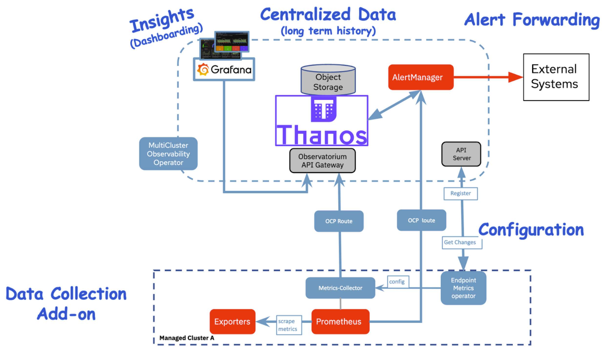
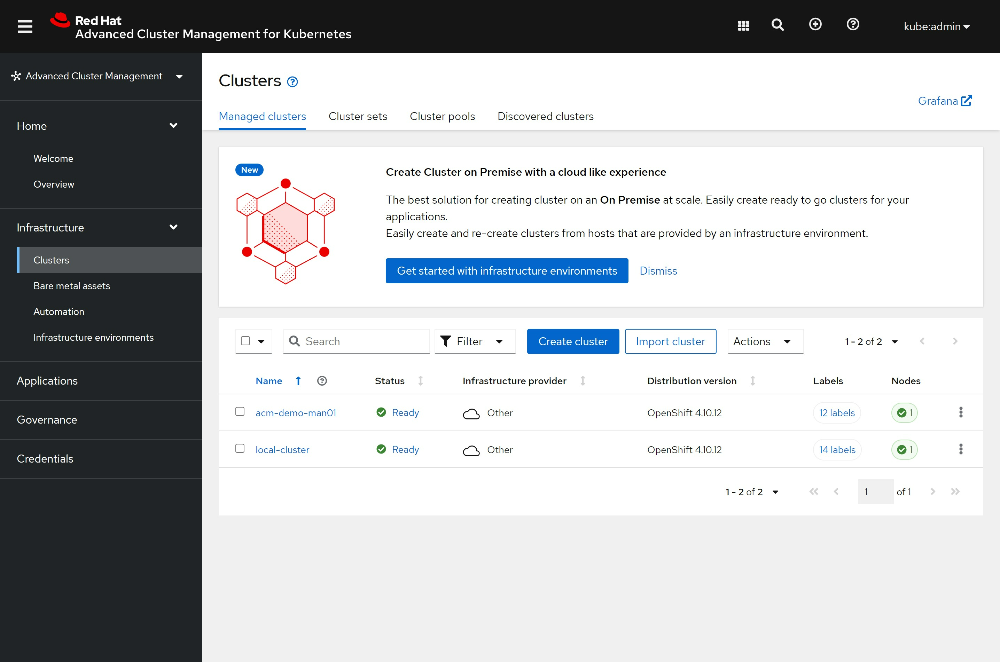
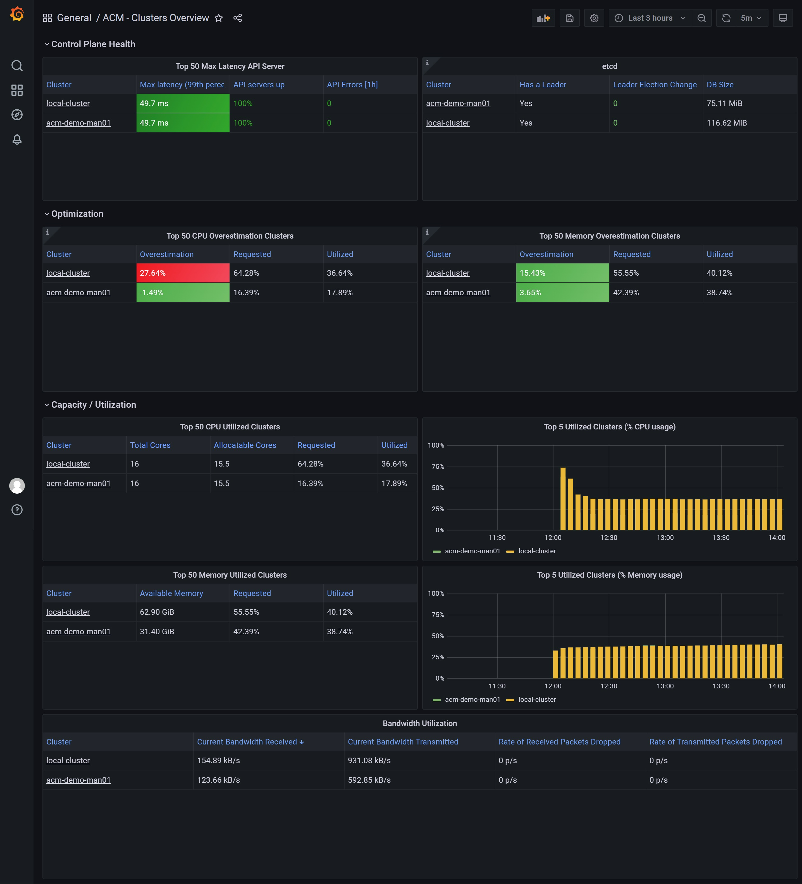
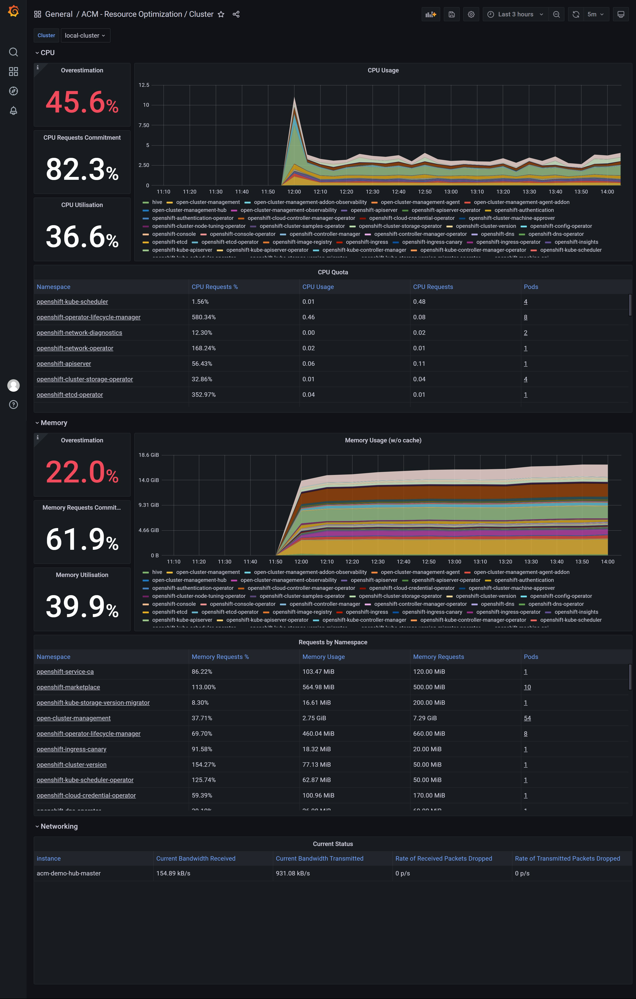
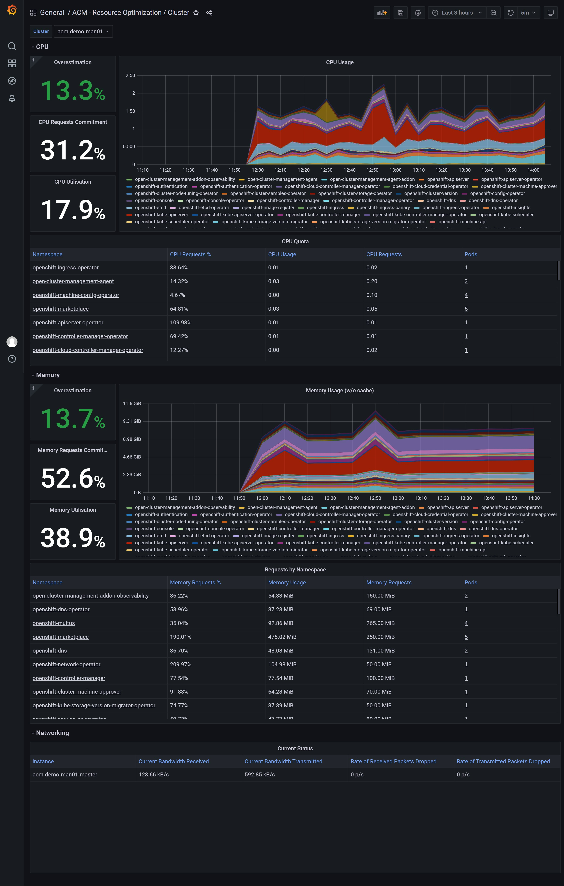

# openshift 4.10 ACM with observ user case

By default, the observability is disabled, here we will enable it, and see what it looks like.

Here is the architecture of the acm observability:



# create the acm hub cluster

- install a sno cluster with 16C, 64GB memory, and 2 100GB disks
- install ODF from operator hub, and [create a ceph following steps here](./4.10.sno.odf.md).
- install ACM from operator hub
- install multiclusterhub with default setting

# create the managed cluster

install a sno cluster with 16C, 32GB memory.

```bash

NODE_SSH_KEY="$(cat ~/.ssh/id_rsa.pub)"
INSTALL_IMAGE_REGISTRY=quaylab.infra.redhat.ren:8443

PULL_SECRET='{"auths":{"registry.redhat.io": {"auth": "ZHVtbXk6ZHVtbXk=","email": "noemail@localhost"},"registry.ocp4.redhat.ren:5443": {"auth": "ZHVtbXk6ZHVtbXk=","email": "noemail@localhost"},"'${INSTALL_IMAGE_REGISTRY}'": {"auth": "'$( echo -n 'admin:shadowman' | openssl base64 )'","email": "noemail@localhost"}}}'

NTP_SERVER=192.168.7.11
HELP_SERVER=192.168.7.11
KVM_HOST=192.168.7.11
API_VIP=192.168.7.100
INGRESS_VIP=192.168.7.101
CLUSTER_PROVISION_IP=192.168.7.103
BOOTSTRAP_IP=192.168.7.12

ACM_DEMO_MNGED_CLUSTER=acm-demo-man01
ACM_DEMO_MNGED_SNO_IP=192.168.7.23

# 定义单节点集群的节点信息
SNO_CLUSTER_NAME=acm-demo-man01
SNO_BASE_DOMAIN=redhat.ren
SNO_IP=192.168.7.23
SNO_GW=192.168.7.11
SNO_NETMAST=255.255.255.0
SNO_NETMAST_S=24
SNO_HOSTNAME=acm-demo-man01-master
SNO_IF=enp1s0
SNO_IF_MAC=`printf '00:60:2F:%02X:%02X:%02X' $[RANDOM%256] $[RANDOM%256] $[RANDOM%256]`
SNO_DNS=192.168.7.11
SNO_DISK=/dev/vda
SNO_CORE_PWD=redhat

echo ${SNO_IF_MAC} > /data/sno/sno.mac

# goto kvm host ( 103 )

scp root@192.168.7.11:/data/install/sno.iso /data/kvm/

virsh destroy ocp4-acm-man01
virsh undefine ocp4-acm-man01

create_lv() {
    var_vg=$1
    var_pool=$2
    var_lv=$3
    var_size=$4
    var_action=$5
    lvremove -f $var_vg/$var_lv
    # lvcreate -y -L $var_size -n $var_lv $var_vg
    if [ "$var_action" == "recreate" ]; then
      lvcreate --type thin -n $var_lv -V $var_size --thinpool $var_vg/$var_pool
      wipefs --all --force /dev/$var_vg/$var_lv
    fi
}

create_lv vgdata poolA lvacm-man01 100G recreate
create_lv vgdata poolA lvacm-man01-data 100G recreate

SNO_MEM=32

virt-install --name=ocp4-acm-man01-master01 --vcpus=16 --ram=$(($SNO_MEM*1024)) \
  --cpu=host-model \
  --disk path=/dev/vgdata/lvacm-man01,device=disk,bus=virtio,format=raw \
  --disk path=/dev/vgdata/lvacm-man01-data,device=disk,bus=virtio,format=raw \
  --os-variant rhel8.3 --network bridge=baremetal,model=virtio \
  --graphics vnc,port=59003 \
  --boot menu=on --cdrom /data/kvm/sno.iso 


# INFO Install complete!
# INFO To access the cluster as the system:admin user when using 'oc', run 'export KUBECONFIG=/data/install/auth/kubeconfig'
# INFO Access the OpenShift web-console here: https://console-openshift-console.apps.acm-demo-man01.redhat.ren
# INFO Login to the console with user: "kubeadmin", and password: "FohuH-IwyJe-3UQPL-AakHm"
# INFO Time elapsed: 0s

```

# enable acm observ in acm hub cluster

[offical document: acm observ enable](https://access.redhat.com/documentation/en-us/red_hat_advanced_cluster_management_for_kubernetes/2.4/html-single/observability/index), it will enable observ in managed cluster automatically.

```bash
# try to install acm observ
# https://access.redhat.com/documentation/en-us/red_hat_advanced_cluster_management_for_kubernetes/2.4/html-single/observability/index
oc create namespace open-cluster-management-observability

DOCKER_CONFIG_JSON=`oc extract secret/pull-secret -n openshift-config --to=-`

oc create secret generic multiclusterhub-operator-pull-secret \
    -n open-cluster-management-observability \
    --from-literal=.dockerconfigjson="$DOCKER_CONFIG_JSON" \
    --type=kubernetes.io/dockerconfigjson

cat << EOF > /data/install/acm.observ.secret.yaml
---
apiVersion: v1
kind: Secret
metadata:
  name: thanos-object-storage
  namespace: open-cluster-management-observability
type: Opaque
stringData:
  thanos.yaml: |
    type: s3
    config:
      bucket: $BUCKET_NAME
      endpoint: $AWS_HOST
      insecure: true
      access_key: $AWS_ACCESS_KEY_ID
      secret_key: $AWS_SECRET_ACCESS_KEY
EOF
oc create -f /data/install/acm.observ.secret.yaml

# oc delete -f /data/install/acm.observ.secret.yaml

cat << EOF > /data/install/acm.observ.yaml
---
apiVersion: observability.open-cluster-management.io/v1beta2
kind: MultiClusterObservability
metadata:
  name: observability
spec:
  observabilityAddonSpec: {}
  storageConfig:
    metricObjectStorage:
      name: thanos-object-storage
      key: thanos.yaml
---
EOF
oc create -f /data/install/acm.observ.yaml -n open-cluster-management

# oc delete -f /data/install/acm.observ.yaml -n open-cluster-management


```

import second cluster into acm, by using kubeconfig file



click 'Grafana' on top right, you will see the grafana dashboard


you can see there are 3 default dashboard included with acm, 2 of them are usable for ocp4

look at the 'ACM - Clusters Overview' dashboard



look at the 'ACM - Resource Optimization / Cluster' dashboard

for acm hub cluster:



for managed cluster:




