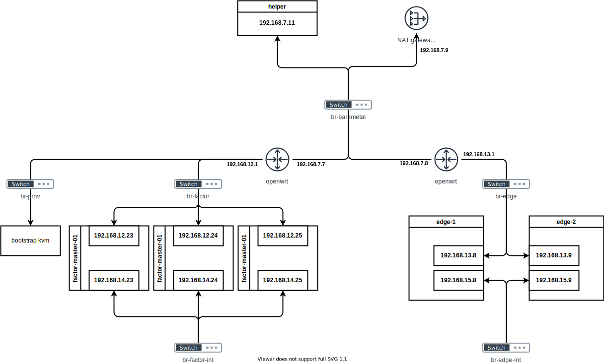
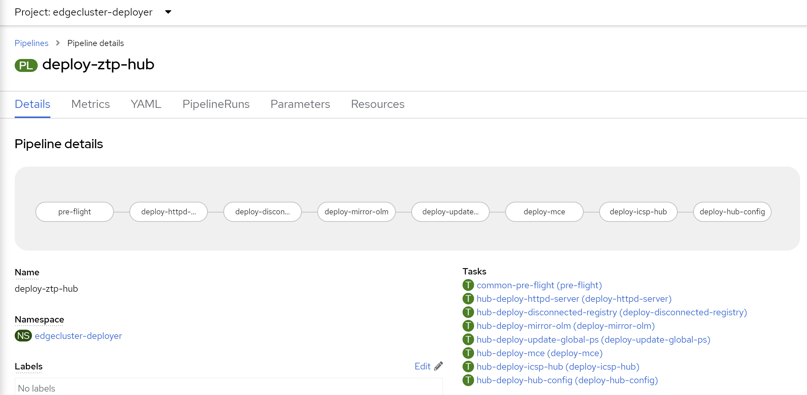
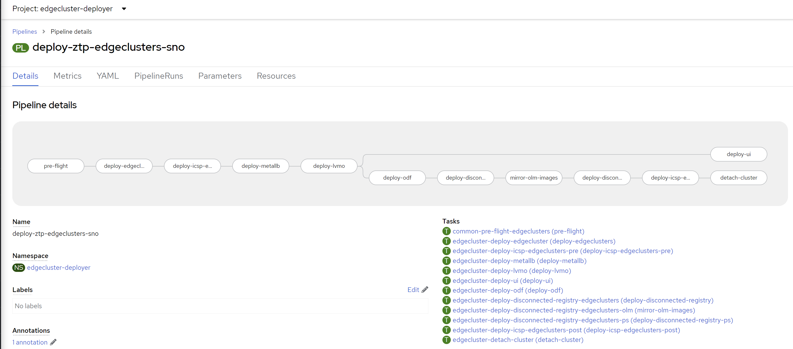
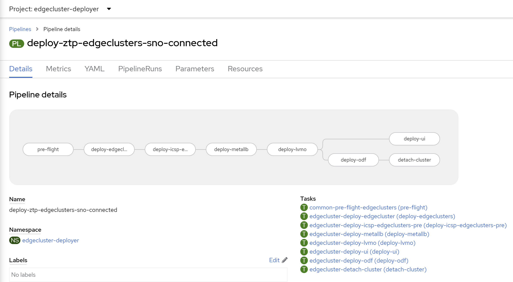
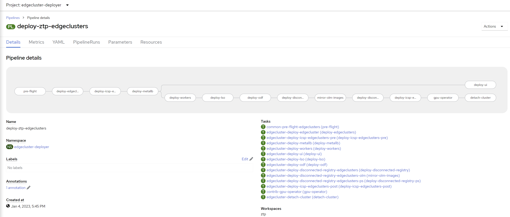
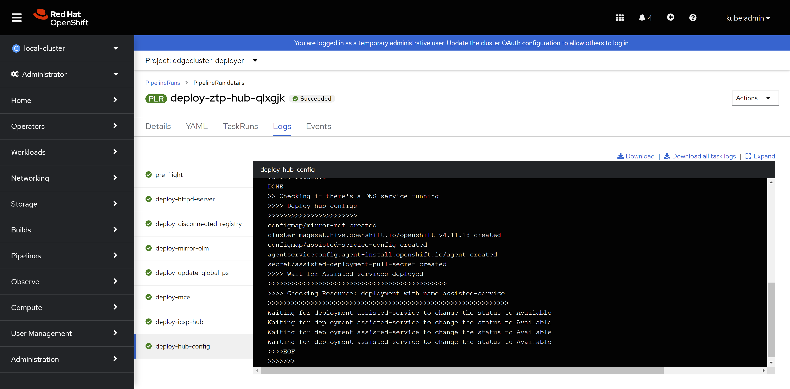

# openshift 4.11 工厂模式

# lab network define



## install ovs using ofed

```bash
mkdir -p /data/down
cd /data/down/
wget -O ofed.tgz http://172.21.6.11:5000/MLNX_OFED_LINUX-5.8-1.1.2.1-rhel8.7-x86_64.tgz

rm -rf /data/ofed
mkdir -p /data/ofed
tar -zvxf /data/down/ofed.tgz --strip 2 -C /data/ofed
cd /data/ofed
# dnf install -y tcl tk kernel-modules-extra python36 make gcc-gfortran tcsh unbound
yum install tcsh make kernel-modules-extra tk gcc-gfortran tcl -y
./mlnxofedinstall --all --force
# ./mlnxofedinstall --dpdk --ovs-dpdk --upstream-libs --add-kernel-support --force --distro rhel8.4

cat << EOF > /etc/yum.repos.d/mlx.repo
[mlnx_ofed]
name=MLNX_OFED Repository
baseurl=file:///data/ofed/RPMS/
enabled=1
gpgcheck=0
EOF

dnf install -y openvswitch

systemctl enable --now ovs-vswitchd

```

## ovs define on 103

```bash

ovs-vsctl add-br br-factory
ovs-vsctl add-br br-edge
ovs-vsctl add-br br-factory-int
ovs-vsctl add-br br-edge-int

ovs-vsctl add-port br-factory vx-factory -- set interface vx-factory type=vxlan options:remote_ip=192.168.7.101 options:key=1

ovs-vsctl add-port br-edge vx-edge -- set interface vx-edge type=vxlan options:remote_ip=192.168.7.101 options:key=2

ovs-vsctl add-port br-factory-int vx-factory-int -- set interface vx-factory-int type=vxlan options:remote_ip=192.168.7.101 options:key=3

ovs-vsctl add-port br-edge-int vx-edge-int -- set interface vx-edge-int type=vxlan options:remote_ip=192.168.7.101 options:key=4

ovs-vsctl show
# 49cef177-c2cb-4fba-9143-34d1cc57c6f1
#     Bridge br-factory
#         Port br-factory
#             Interface br-factory
#                 type: internal
#         Port vx-factory
#             Interface vx-factory
#                 type: vxlan
#                 options: {key="1", remote_ip="192.168.7.101"}
#     Bridge br-edge-int
#         Port br-edge-int
#             Interface br-edge-int
#                 type: internal
#         Port vx-edge-int
#             Interface vx-edge-int
#                 type: vxlan
#                 options: {key="4", remote_ip="192.168.7.101"}
#     Bridge br-edge
#         Port br-edge
#             Interface br-edge
#                 type: internal
#         Port vx-edge
#             Interface vx-edge
#                 type: vxlan
#                 options: {key="2", remote_ip="192.168.7.101"}
#     Bridge br-factory-int
#         Port vx-factory-int
#             Interface vx-factory-int
#                 type: vxlan
#                 options: {key="3", remote_ip="192.168.7.101"}
#         Port br-factory-int
#             Interface br-factory-int
#                 type: internal
#     ovs_version: "2.17.2-9e69ff4"

nmcli connection modify baremetal -ipv4.routes "192.168.12.0/24 192.168.7.7"
nmcli connection modify baremetal -ipv4.routes "192.168.13.0/24 192.168.7.8"
nmcli connection modify baremetal +ipv4.routes "192.168.12.0/24 192.168.77.7"
nmcli connection modify baremetal +ipv4.routes "192.168.13.0/24 192.168.77.8"

nmcli con mod baremetal +ipv4.address '192.168.77.103/24'

nmcli con up baremetal

```

## ovs define on 101

```bash

ovs-vsctl add-br br-factory
ovs-vsctl add-br br-edge
ovs-vsctl add-br br-factory-int
ovs-vsctl add-br br-edge-int

ovs-vsctl add-port br-factory vx-factory -- set interface vx-factory type=vxlan options:remote_ip=192.168.7.103 options:key=1

ovs-vsctl add-port br-edge vx-edge -- set interface vx-edge type=vxlan options:remote_ip=192.168.7.103 options:key=2

ovs-vsctl add-port br-factory-int vx-factory-int -- set interface vx-factory-int type=vxlan options:remote_ip=192.168.7.103 options:key=3

ovs-vsctl add-port br-edge-int vx-edge-int -- set interface vx-edge-int type=vxlan options:remote_ip=192.168.7.103 options:key=4

ovs-vsctl show
# 33a82b4c-1b21-4808-aff8-3260bec0a464
#     Bridge br-factory-int
#         Port vx-factory-int
#             Interface vx-factory-int
#                 type: vxlan
#                 options: {key="3", remote_ip="192.168.7.103"}
#         Port br-factory-int
#             Interface br-factory-int
#                 type: internal
#     Bridge br-edge
#         Port br-edge
#             Interface br-edge
#                 type: internal
#         Port vx-edge
#             Interface vx-edge
#                 type: vxlan
#                 options: {key="2", remote_ip="192.168.7.103"}
#     Bridge br-edge-int
#         Port vx-edge-int
#             Interface vx-edge-int
#                 type: vxlan
#                 options: {key="4", remote_ip="192.168.7.103"}
#         Port br-edge-int
#             Interface br-edge-int
#                 type: internal
#     Bridge br-factory
#         Port br-factory
#             Interface br-factory
#                 type: internal
#         Port vx-factory
#             Interface vx-factory
#                 type: vxlan
#                 options: {key="1", remote_ip="192.168.7.103"}
#     ovs_version: "2.17.2-9e69ff4"

nmcli connection modify baremetal -ipv4.routes "192.168.12.0/24 192.168.7.7"
nmcli connection modify baremetal -ipv4.routes "192.168.13.0/24 192.168.7.8"
nmcli connection modify baremetal +ipv4.routes "192.168.12.0/24 192.168.77.7"
nmcli connection modify baremetal +ipv4.routes "192.168.13.0/24 192.168.77.8"

nmcli con mod baremetal +ipv4.address '192.168.77.101/24'

nmcli con up baremetal

```

## openwrt for factory

```bash

cd /data/kvm

wget -O openwrt.img.gz 'https://downloads.openwrt.org/releases/22.03.2/targets/x86/64/openwrt-22.03.2-x86-64-generic-ext4-combined.img.gz'

gunzip openwrt.img.gz

qemu-img info openwrt.img
# image: openwrt.img
# file format: raw
# virtual size: 120 MiB (126353408 bytes)
# disk size: 120 MiB

/bin/cp -f openwrt.img sdn-openwrt.img

virt-install \
  --name "openwrt-factory" \
  --memory 2048 \
  --vcpus 2 \
  --import \
  --os-variant generic \
  --disk path="sdn-openwrt.img" \
  --network bridge=br-factory,model=virtio,virtualport.type=openvswitch  \
  --network bridge=baremetal,model=virtio \
  --graphics vnc,port=59011 \
  --virt-type kvm \
  --autoconsole text

# Escape character is ^]
# which means ctrl-]

# enter to login
cp /etc/config/network /etc/config/network.bak

cat << EOF > /etc/config/network
config interface 'loopback'
        option device 'lo'
        option proto 'static'
        option ipaddr '127.0.0.1'
        option netmask '255.0.0.0'

config globals 'globals'
        option ula_prefix 'fde9:8afe:899a::/48'

config interface 'lanfact'
        option device 'eth0'
        option proto 'static'
        option ipaddr '192.168.12.1'
        option netmask '255.255.255.0'
        option ip6assign '60'
        list dns '192.168.7.11'

# config interface 'lanedge'
#         option device 'eth1'
#         option proto 'static'
#         option ipaddr '192.168.13.1'
#         option netmask '255.255.255.0'
#         option ip6assign '60'
#         list dns '192.168.7.11'

# config interface 'lan'
#         option device 'eth2'
#         option proto 'static'
#         option ipaddr '192.168.7.7'
#         option netmask '255.255.255.0'
#         option ip6assign '60'
#         list dns '192.168.7.11'

config interface 'wan'
        option device 'eth1'
        option proto 'static'
        option ip6assign '60'
        option gateway '192.168.7.9'
        list ipaddr '192.168.7.7/24'
        list ipaddr '192.168.77.7/24'

# config interface 'wan6'
#         option device 'eth2'
#         option proto 'dhcpv6'

config route
        option interface 'wan'
        option target '192.168.13.0/24'
        option gateway '192.168.7.8'

EOF

# /etc/init.d/network restart


cp /etc/config/firewall /etc/config/firewall.bak

cat << 'EOF' >> /etc/config/firewall

config rule
    option enabled '1'
	  option target 'ACCEPT'
	  option src 'wan'
	  option proto 'tcp'
	  option dest_port '80'
	  option name 'AllowWANWeb'

EOF

sed -i "s/option forward.*REJECT/option forward ACCEPT/g" /etc/config/firewall

sed -i "s/list.*network.*'lan'/list network 'lanfact'\n        list network 'lanedge'\n        list network 'lan'/" /etc/config/firewall

cp /etc/config/dhcp /etc/config/dhcp.bak
cat << 'EOF' >> /etc/config/dhcp

config dhcp 'lanedge'
        option interface 'lanedge'
        option start '20'
        option limit '50'
        option leasetime '12h'
        list dhcp_option '6,172.21.6.11'

config dhcp 'lanfact'
        option interface 'lanfact'
        option start '20'
        option limit '50'
        option leasetime '12h'
        list dhcp_option '6,172.21.6.11'

config dhcp 'lan'
        option interface 'lan'
        option ignore '1'

config host
        option name 'sdn-factory-1'
        option dns '1'
        option mac '52:54:00:12:A2:01'
        option ip '192.168.12.18'

config host
        option name 'sdn-factory-2'
        option dns '1'
        option mac '52:54:00:12:A2:02'
        option ip '192.168.12.19'

config host
        option name 'sdn-edge-1'
        option dns '1'
        option mac '52:54:00:12:A2:11'
        option ip '192.168.13.18'

config host
        option name 'sdn-edge-2'
        option dns '1'
        option mac '52:54:00:12:A2:12'
        option ip '192.168.13.19'

config host
        option name 'bootstrap.factory.wzhlab.top'
        option dns '1'
        option mac '52:54:00:20:A1:04'
        option ip '192.168.12.22'

config host
        option name 'master-01.factory.wzhlab.top'
        option dns '1'
        option mac '52:54:00:20:A1:01'
        option ip '192.168.12.23'

config host
        option name 'master-02.factory.wzhlab.top'
        option dns '1'
        option mac '52:54:00:20:A1:02'
        option ip '192.168.12.24'

config host
        option name 'master-03.factory.wzhlab.top'
        option dns '1'
        option mac '52:54:00:20:A1:03'
        option ip '192.168.12.25'

config host
        option name 'sno-master.edge.wzhlab.top'
        option dns '1'
        option mac '52:54:00:20:A2:01'
        option ip '192.168.12.33'
EOF


# /etc/init.d/network restart
reboot

```

## openwrt for edge

```bash


cd /data/kvm

wget -O openwrt.img.gz 'https://downloads.openwrt.org/releases/22.03.2/targets/x86/64/openwrt-22.03.2-x86-64-generic-ext4-combined.img.gz'

gunzip openwrt.img.gz

qemu-img info openwrt.img
# image: openwrt.img
# file format: raw
# virtual size: 120 MiB (126353408 bytes)
# disk size: 120 MiB

/bin/cp -f openwrt.img sdn-edge-openwrt.img

virt-install \
  --name "openwrt-edge" \
  --memory 2048 \
  --vcpus 2 \
  --import \
  --os-variant generic \
  --disk path="sdn-edge-openwrt.img" \
  --network bridge=br-edge,model=virtio,virtualport.type=openvswitch  \
  --network bridge=baremetal,model=virtio \
  --graphics vnc,port=59012 \
  --virt-type kvm \
  --autoconsole text

# enter to login
cp /etc/config/network /etc/config/network.bak

cat << EOF > /etc/config/network
config interface 'loopback'
        option device 'lo'
        option proto 'static'
        option ipaddr '127.0.0.1'
        option netmask '255.0.0.0'

config globals 'globals'
        option ula_prefix 'fde9:8afe:899a::/48'

# config interface 'lanfact'
#         option device 'eth0'
#         option proto 'static'
#         option ipaddr '192.168.12.1'
#         option netmask '255.255.255.0'
#         option ip6assign '60'
#         list dns '192.168.7.11'

config interface 'lanedge'
        option device 'eth0'
        option proto 'static'
        option ipaddr '192.168.13.1'
        option netmask '255.255.255.0'
        option ip6assign '60'
        list dns '192.168.7.11'

# config interface 'lan'
#         option device 'eth2'
#         option proto 'static'
#         option ipaddr '192.168.7.7'
#         option netmask '255.255.255.0'
#         option ip6assign '60'
#         list dns '192.168.7.11'

config interface 'wan'
        option device 'eth1'
        option proto 'static'
        option ip6assign '60'
        option gateway '192.168.7.9'
        list ipaddr '192.168.7.8/24'
        list ipaddr '192.168.77.8/24'

# config interface 'wan6'
#         option device 'eth2'
#         option proto 'dhcpv6'

config route
        option interface 'wan'
        option target '192.168.12.0/24'
        option gateway '192.168.7.7'
EOF

# /etc/init.d/network restart


cp /etc/config/firewall /etc/config/firewall.bak

cat << 'EOF' >> /etc/config/firewall

config rule
    option enabled '1'
	  option target 'ACCEPT'
	  option src 'wan'
	  option proto 'tcp'
	  option dest_port '80'
	  option name 'AllowWANWeb'

EOF

sed -i "s/option forward.*REJECT/option forward ACCEPT/g" /etc/config/firewall

sed -i "s/list.*network.*'lan'/list network 'lanfact'\n        list network 'lanedge'\n        list network 'lan'/" /etc/config/firewall

cp /etc/config/dhcp /etc/config/dhcp.bak
cat << 'EOF' >> /etc/config/dhcp

config dhcp 'lanedge'
        option interface 'lanedge'
        option start '20'
        option limit '50'
        option leasetime '12h'
        list dhcp_option '6,192.168.7.11'

config dhcp 'lanfact'
        option interface 'lanfact'
        option start '20'
        option limit '50'
        option leasetime '12h'
        list dhcp_option '6,192.168.7.11'

config dhcp 'lan'
        option interface 'lan'
        option ignore '1'

config host
        option name 'sdn-factory-1'
        option dns '1'
        option mac '52:54:00:12:A2:01'
        option ip '192.168.12.18'

config host
        option name 'sdn-factory-2'
        option dns '1'
        option mac '52:54:00:12:A2:02'
        option ip '192.168.12.19'

config host
        option name 'sdn-edge-1'
        option dns '1'
        option mac '52:54:00:12:A2:11'
        option ip '192.168.13.18'

config host
        option name 'sdn-edge-2'
        option dns '1'
        option mac '52:54:00:12:A2:12'
        option ip '192.168.13.19'

config host
        option name 'bootstrap.factory.wzhlab.top'
        option dns '1'
        option mac '52:54:00:20:A1:04'
        option ip '192.168.13.22'

config host
        option name 'master-01.factory.wzhlab.top'
        option dns '1'
        option mac '52:54:00:20:A1:01'
        option ip '192.168.13.23'

config host
        option name 'master-02.factory.wzhlab.top'
        option dns '1'
        option mac '52:54:00:20:A1:02'
        option ip '192.168.13.24'

config host
        option name 'master-03.factory.wzhlab.top'
        option dns '1'
        option mac '52:54:00:20:A1:03'
        option ip '192.168.13.25'

config host
        option name 'sno-master.edge.wzhlab.top'
        option dns '1'
        option mac '52:54:00:20:A2:01'
        option ip '192.168.12.33'
EOF


# /etc/init.d/network restart
reboot

```

## add a bridge on 103

```bash

nmcli connection add type bridge con-name br-prov ifname br-prov ipv4.method disabled ipv6.method disabled

nmcli connection up br-prov

ovs-vsctl add-port br-factory br-prov

ovs-vsctl del-port br-factory host-prov

ovs-vsctl show
# 49cef177-c2cb-4fba-9143-34d1cc57c6f1
#     Bridge br-factory
#         Port vnet4
#             Interface vnet4
#         Port vnet6
#             Interface vnet6
#         Port br-prov
#             Interface br-prov
#         Port vnet8
#             Interface vnet8
#         Port br-factory
#             Interface br-factory
#                 type: internal
#         Port vnet0
#             Interface vnet0
#         Port vx-factory
#             Interface vx-factory
#                 type: vxlan
#                 options: {key="1", remote_ip="192.168.7.101"}
#     Bridge br-edge-int
#         Port br-edge-int
#             Interface br-edge-int
#                 type: internal
#         Port vx-edge-int
#             Interface vx-edge-int
#                 type: vxlan
#                 options: {key="4", remote_ip="192.168.7.101"}
#     Bridge br-edge
#         Port vnet2
#             Interface vnet2
#         Port br-edge
#             Interface br-edge
#                 type: internal
#         Port vx-edge
#             Interface vx-edge
#                 type: vxlan
#                 options: {key="2", remote_ip="192.168.7.101"}
#     Bridge br-factory-int
#         Port vnet7
#             Interface vnet7
#         Port vnet5
#             Interface vnet5
#         Port vnet9
#             Interface vnet9
#         Port vx-factory-int
#             Interface vx-factory-int
#                 type: vxlan
#                 options: {key="3", remote_ip="192.168.7.101"}
#         Port br-factory-int
#             Interface br-factory-int
#                 type: internal
#     ovs_version: "2.17.2-9e69ff4"


```

## start up

```bash

virsh start openwrt-factory
virsh start openwrt-edge

```

# hub install


## kvm setup

做完了上面的准备工作，我们就要开始创建kvm了，我们做实验是会反复重装的，所以会首先有清理的脚本。然后我们有另外一些脚本去创建kvm，注意，我们是创建kvm，而不会去启动他们。

### cleanup

我们准备了脚本，来清理kvm，把物理机清理成一个干净的系统。

```bash

create_lv() {
    var_vg=$1
    var_pool=$2
    var_lv=$3
    var_size=$4
    var_action=$5
    lvremove -f $var_vg/$var_lv
    # lvcreate -y -L $var_size -n $var_lv $var_vg
    if [ "$var_action" == "recreate" ]; then
      lvcreate --type thin -n $var_lv -V $var_size --thinpool $var_vg/$var_pool
      wipefs --all --force /dev/$var_vg/$var_lv
    fi
}

virsh destroy ocp4-ipi-osp-master-01
virsh undefine ocp4-ipi-osp-master-01

create_lv vgdata poolA lv-ocp4-ipi-osp-master-01 100G 
create_lv vgdata poolA lv-ocp4-ipi-osp-master-01-data 100G 
create_lv vgdata poolA lv-ocp4-ipi-osp-master-01-data-02 100G 
create_lv vgdata poolA lv-ocp4-ipi-osp-master-01-data-03 100G 

virsh destroy ocp4-ipi-osp-master-02
virsh undefine ocp4-ipi-osp-master-02

create_lv vgdata poolA lv-ocp4-ipi-osp-master-02 100G 
create_lv vgdata poolA lv-ocp4-ipi-osp-master-02-data 100G 
create_lv vgdata poolA lv-ocp4-ipi-osp-master-02-data-02 100G 
create_lv vgdata poolA lv-ocp4-ipi-osp-master-02-data-03 100G 

virsh destroy ocp4-ipi-osp-master-03
virsh undefine ocp4-ipi-osp-master-03

create_lv vgdata poolA lv-ocp4-ipi-osp-master-03 100G 
create_lv vgdata poolA lv-ocp4-ipi-osp-master-03-data 100G 
create_lv vgdata poolA lv-ocp4-ipi-osp-master-03-data-02 100G 
create_lv vgdata poolA lv-ocp4-ipi-osp-master-03-data-03 100G 

# virsh destroy ocp4-ipi-osp-worker-01
# virsh undefine ocp4-ipi-osp-worker-01

# create_lv vgdata poolA lv-ocp4-ipi-osp-worker-01 200G 
# create_lv vgdata poolA lv-ocp4-ipi-osp-worker-01-data 100G 
# create_lv vgdata poolA lv-ocp4-ipi-osp-worker-01-data-02 100G 
# create_lv vgdata poolA lv-ocp4-ipi-osp-worker-01-data-03 100G 

# virsh destroy ocp4-ipi-osp-worker-02
# virsh undefine ocp4-ipi-osp-worker-02

# create_lv vgdata poolA lv-ocp4-ipi-osp-worker-02 200G 
# create_lv vgdata poolA lv-ocp4-ipi-osp-worker-02-data 100G 
# create_lv vgdata poolA lv-ocp4-ipi-osp-worker-02-data-02 100G 
# create_lv vgdata poolA lv-ocp4-ipi-osp-worker-02-data-03 100G 

# virsh destroy ocp4-ipi-osp-worker-03
# virsh undefine ocp4-ipi-osp-worker-03

# create_lv vgdata poolA lv-ocp4-ipi-osp-worker-03 200G 
# create_lv vgdata poolA lv-ocp4-ipi-osp-worker-03-data 100G 
# create_lv vgdata poolA lv-ocp4-ipi-osp-worker-03-data-02 100G 
# create_lv vgdata poolA lv-ocp4-ipi-osp-worker-03-data-03 100G 

VAR_VM=`virsh list --all | grep bootstrap | awk '{print $2}'`
virsh destroy $VAR_VM
virsh undefine $VAR_VM
VAR_POOL=`virsh pool-list --all | grep bootstrap | awk '{print $1}'`
virsh pool-destroy $VAR_POOL
virsh pool-undefine $VAR_POOL
/bin/rm -rf /var/lib/libvirt/openshift-images/*
/bin/rm -rf /var/lib/libvirt/images/*


```

### define kvm on 103

然后，我们就可以开始定义kvm了，这里不能启动kvm，因为定义的kvm没有引导盘，启动了也无法开始安装，IPI模式下，installer会调用virtual bmc redfish接口，给kvm挂载上启动镜像，开始安装过程。

我们为了简单起见，每个kvm都配置了4块硬盘，4个网卡，其实只有worker node这一个kvm会用到4块硬盘。我们的vda硬盘还要大一些，因为要承载集群内的nfs服务器。由于我们配置了lvm thin provision，所以 lv 使用起来就可以肆无忌惮了。

```bash

/bin/rm -rf /var/lib/libvirt/images/*

create_lv() {
    var_vg=$1
    var_pool=$2
    var_lv=$3
    var_size=$4
    var_action=$5
    lvremove -f $var_vg/$var_lv
    # lvcreate -y -L $var_size -n $var_lv $var_vg
    if [ "$var_action" == "recreate" ]; then
      lvcreate --type thin -n $var_lv -V $var_size --thinpool $var_vg/$var_pool
      wipefs --all --force /dev/$var_vg/$var_lv
    fi
}

SNO_MEM=32
export KVM_DIRECTORY=/data/kvm

virsh destroy ocp4-ipi-osp-master-01
virsh undefine ocp4-ipi-osp-master-01

create_lv vgdata poolA lv-ocp4-ipi-osp-master-01 500G recreate
create_lv vgdata poolA lv-ocp4-ipi-osp-master-01-data 100G recreate
create_lv vgdata poolA lv-ocp4-ipi-osp-master-01-data-02 100G recreate
create_lv vgdata poolA lv-ocp4-ipi-osp-master-01-data-03 100G recreate

virt-install --name=ocp4-ipi-osp-master-01 --vcpus=16 --ram=$(($SNO_MEM*1024)) \
  --cpu=host-model \
  --disk path=/dev/vgdata/lv-ocp4-ipi-osp-master-01,device=disk,bus=virtio,format=raw \
  --disk path=/dev/vgdata/lv-ocp4-ipi-osp-master-01-data,device=disk,bus=virtio,format=raw \
  --disk path=/dev/vgdata/lv-ocp4-ipi-osp-master-01-data-02,device=disk,bus=virtio,format=raw \
  --disk path=/dev/vgdata/lv-ocp4-ipi-osp-master-01-data-03,device=disk,bus=virtio,format=raw \
  --os-variant rhel8.4 \
  --network bridge=br-factory,model=virtio,virtualport.type=openvswitch,mac.address=52:54:00:20:A1:01  \
  --network bridge=br-factory-int,model=virtio,virtualport.type=openvswitch  \
  --print-xml > ${KVM_DIRECTORY}/ocp4-ipi-osp-master-01.xml
virsh define --file ${KVM_DIRECTORY}/ocp4-ipi-osp-master-01.xml

virsh destroy ocp4-ipi-osp-master-02
virsh undefine ocp4-ipi-osp-master-02

create_lv vgdata poolA lv-ocp4-ipi-osp-master-02 500G recreate
create_lv vgdata poolA lv-ocp4-ipi-osp-master-02-data 100G recreate
create_lv vgdata poolA lv-ocp4-ipi-osp-master-02-data-02 100G recreate
create_lv vgdata poolA lv-ocp4-ipi-osp-master-02-data-03 100G recreate

virt-install --name=ocp4-ipi-osp-master-02 --vcpus=16 --ram=$(($SNO_MEM*1024)) \
  --cpu=host-model \
  --disk path=/dev/vgdata/lv-ocp4-ipi-osp-master-02,device=disk,bus=virtio,format=raw \
  --disk path=/dev/vgdata/lv-ocp4-ipi-osp-master-02-data,device=disk,bus=virtio,format=raw \
  --disk path=/dev/vgdata/lv-ocp4-ipi-osp-master-02-data-02,device=disk,bus=virtio,format=raw \
  --disk path=/dev/vgdata/lv-ocp4-ipi-osp-master-02-data-03,device=disk,bus=virtio,format=raw \
  --os-variant rhel8.4 \
  --network bridge:br-factory,model=virtio,virtualport.type=openvswitch,mac.address=52:54:00:20:A1:02  \
  --network bridge:br-factory-int,model=virtio,virtualport.type=openvswitch  \
  --print-xml > ${KVM_DIRECTORY}/ocp4-ipi-osp-master-02.xml
virsh define --file ${KVM_DIRECTORY}/ocp4-ipi-osp-master-02.xml


# SNO_MEM=64

virsh destroy ocp4-ipi-osp-master-03
virsh undefine ocp4-ipi-osp-master-03

create_lv vgdata poolA lv-ocp4-ipi-osp-master-03 500G recreate
create_lv vgdata poolA lv-ocp4-ipi-osp-master-03-data 100G recreate
create_lv vgdata poolA lv-ocp4-ipi-osp-master-03-data-02 100G recreate
create_lv vgdata poolA lv-ocp4-ipi-osp-master-03-data-03 100G recreate

virt-install --name=ocp4-ipi-osp-master-03 --vcpus=16 --ram=$(($SNO_MEM*1024)) \
  --cpu=host-model \
  --disk path=/dev/vgdata/lv-ocp4-ipi-osp-master-03,device=disk,bus=virtio,format=raw \
  --disk path=/dev/vgdata/lv-ocp4-ipi-osp-master-03-data,device=disk,bus=virtio,format=raw \
  --disk path=/dev/vgdata/lv-ocp4-ipi-osp-master-03-data-02,device=disk,bus=virtio,format=raw \
  --disk path=/dev/vgdata/lv-ocp4-ipi-osp-master-03-data-03,device=disk,bus=virtio,format=raw \
  --os-variant rhel8.4 \
  --network bridge:br-factory,model=virtio,virtualport.type=openvswitch,mac.address=52:54:00:20:A1:03  \
  --network bridge:br-factory-int,model=virtio,virtualport.type=openvswitch  \
  --print-xml > ${KVM_DIRECTORY}/ocp4-ipi-osp-master-03.xml
virsh define --file ${KVM_DIRECTORY}/ocp4-ipi-osp-master-03.xml

```

### bmc simulator

定义了kvm，我们需要配套的virtual BMC / redfish 接口来控制他们，这都是为了模拟真实的物理机，在真实的物理机场景下，openshift installer会调用redfish接口来控制物理机。

我们选用openstack项目的sushy工具来做这个virtual BMC。运行一个sushy实例，就可以管理同一个物理机上的所有kvm实例，简单易用。

最后，我们使用systemd来定义一个自动启动的服务，来运行sushy.

这一步操作，对应到架构图，是这部分：


```bash
# try to install and run it manually
dnf -y install python3-pip
pip3 install --user sushy-tools

mkdir -p /etc/crts
scp root@192.168.7.11:/etc/crts/* /etc/crts/

/root/.local/bin/sushy-emulator -i 0.0.0.0 --ssl-certificate /etc/crts/redhat.ren.crt --ssl-key /etc/crts/redhat.ren.key

# try to deploy as systemd service
cat << EOF > /etc/systemd/system/sushy-emulator.service
[Unit]
Description=sushy-emulator

[Service]
User=root
WorkingDirectory=/root
ExecStart=/bin/bash -c '/root/.local/bin/sushy-emulator -i 0.0.0.0 --ssl-certificate /etc/crts/redhat.ren.crt --ssl-key /etc/crts/redhat.ren.key'
Restart=always

[Install]
WantedBy=multi-user.target
EOF

systemctl daemon-reload

systemctl enable --now sushy-emulator.service

```

### get mac and vm list on 103

有了virtual BMC，我们就要抽取一些openshift installer需要用到的参数，一个是kvm的mac地址，一个是redfish里面需要的uuid。

我们使用如下的脚本，来自动的得到，并且上传到 helper 节点去。

```bash

# on helper clean all
/bin/rm -f /data/install/mac.list.*
/bin/rm -f /data/install/vm.list.*

# back to 103
cd /data/kvm/
for i in ocp4-ipi-osp-master-0{1..3}
do
  echo -ne "${i}\t" ; 
  virsh dumpxml ${i} | grep "mac address" | cut -d\' -f2 | tr '\n' '\t'
  echo 
done > mac.list.103
cat /data/kvm/mac.list.103
# ocp4-ipi-osp-master-01  52:54:00:20:a1:01       52:54:00:28:80:6c
# ocp4-ipi-osp-master-02  52:54:00:20:a1:02       52:54:00:0f:44:5d
# ocp4-ipi-osp-master-03  52:54:00:20:a1:03       52:54:00:94:4f:40

cat << 'EOF' > redfish.sh
#!/usr/bin/env bash

curl -k -s https://127.0.0.1:8000/redfish/v1/Systems/ | jq -r '.Members[]."@odata.id"' >  list

while read -r line; do
    curl -k -s https://127.0.0.1:8000/$line | jq -j '.Id, " ", .Name, "\n" '
done < list

EOF
bash redfish.sh | grep ipi > /data/kvm/vm.list.103
cat /data/kvm/vm.list.103
# 2425c99d-39d5-4d8d-bc77-9387c396885a ocp4-ipi-osp-master-01
# 6180bcf0-4c95-47fc-8b65-6c4af68b29c4 ocp4-ipi-osp-master-02
# 284a1136-6b21-4977-ad42-c206483ed1e7 ocp4-ipi-osp-master-03

scp /data/kvm/{mac,vm}.list.* root@192.168.77.11:/data/install/

```

## on helper node

终于所有的准备工作都做完了，我们开始在helper上面进行openshift的安装。在这之前，还有一个配置helper节点的步骤，主要是配置dns服务之类的，在这里就不重复了，有需要了解的，可以看[这里的文档](./4.11.helper.node.oc.mirror.md)

### get installer binary

我们先要从安装文件目录中，得到installer的二进制文件。

```bash

# switch to you install version

export BUILDNUMBER=4.10.45

pushd /data/ocp4/${BUILDNUMBER}
tar -xzf openshift-client-linux-${BUILDNUMBER}.tar.gz -C /usr/local/bin/
tar -xzf openshift-install-linux-${BUILDNUMBER}.tar.gz -C /usr/local/bin/

install -m 755 /data/ocp4/clients/butane-amd64 /usr/local/bin/butane
install -m 755 /data/ocp4/clients/coreos-installer_amd64 /usr/local/bin/coreos-installer
popd

```

### prepare web server for iso/images

接下来，我们准备一个自动启动的 web server，提供一些iso等镜像的下载服务。

```bash
############################
# as root create web server
cd /data/ocp4

python3 -m http.server 8080

cat << EOF > /etc/systemd/system/local-webserver.service
[Unit]
Description=local-webserver

[Service]
User=root
# WorkingDirectory=/data/ocp4
ExecStart=/bin/bash -c 'cd /data/ocp4; python3 -m http.server 8080'
Restart=always

[Install]
WantedBy=multi-user.target
EOF

systemctl daemon-reload

systemctl enable --now local-webserver.service

# end as root
############################
```

### create the install yaml

接下来我们创建安装配置文件。这里面最关键的就是那个yaml模板，我们在模板里面，启动IPI安装模式，并且配置3个master的redfish接口信息，并启用静态IP安装的方法，配置了静态IP信息。

安装配置yaml文件创建后，我们调用installer，把他们转化成ignition等真正的安装配置文件，并且和baremetal installer二进制文件一起，传递到物理机上。

这里面有2个二进制文件，一个是openshift installer，这个一般场景下，比如对接公有云，私有云，就够了，它会创建ignition文件，并且调用各种云的接口，创建虚拟机，开始安装。

但是如果是baremetal场景，有一个单独的baremetal installer二进制文件，它读取配置文件，调用物理机BMC接口信息，来开始安装，这个区别是目前openshift版本上的情况，不知道未来会不会有变化。

```bash
# create a user and create the cluster under the user

useradd -m 3nodeipi

usermod -aG wheel 3nodeipi

su - 3nodeipi

ssh-keygen

cat << EOF > ~/.ssh/config
StrictHostKeyChecking no
UserKnownHostsFile=/dev/null
EOF

chmod 600 ~/.ssh/config

cat << 'EOF' >> ~/.bashrc

export BASE_DIR='/home/3nodeipi/'

EOF

export BASE_DIR='/home/3nodeipi/'
export BUILDNUMBER=4.10.45

mkdir -p ${BASE_DIR}/data/{sno/disconnected,install}

# set some parameter of you rcluster

NODE_SSH_KEY="$(cat ${BASE_DIR}/.ssh/id_rsa.pub)"
INSTALL_IMAGE_REGISTRY=quaylab.infra.wzhlab.top:8443

PULL_SECRET='{"auths":{"registry.redhat.io": {"auth": "ZHVtbXk6ZHVtbXk=","email": "noemail@localhost"},"registry.ocp4.redhat.ren:5443": {"auth": "ZHVtbXk6ZHVtbXk=","email": "noemail@localhost"},"'${INSTALL_IMAGE_REGISTRY}'": {"auth": "'$( echo -n 'admin:redhatadmin' | openssl base64 )'","email": "noemail@localhost"}}}'

# NTP_SERVER=192.168.77.11
# HELP_SERVER=192.168.77.11
# KVM_HOST=192.168.77.11
API_VIP=192.168.12.100
INGRESS_VIP=192.168.12.101
CLUSTER_PROVISION_IP=192.168.12.103
MACHINE_NETWORK='192.168.12.0/24'

# 定义单节点集群的节点信息
SNO_CLUSTER_NAME=factory
SNO_BASE_DOMAIN=wzhlab.top

BOOTSTRAP_IP=192.168.12.22
MASTER_01_IP=192.168.12.23
MASTER_02_IP=192.168.12.24
MASTER_03_IP=192.168.12.25
WORKER_01_IP=192.168.12.26

# BOOTSTRAP_HOSTNAME=bootstrap-demo
# MASTER_01_HOSTNAME=master-01-demo
# MASTER_02_HOSTNAME=master-02-demo
# MASTER_03_HOSTNAME=master-03-demo
# WORKER_01_HOSTNAME=worker-01-demo

# BOOTSTRAP_INTERFACE=enp1s0
# MASTER_01_INTERFACE=enp1s0
# MASTER_02_INTERFACE=enp1s0
# MASTER_03_INTERFACE=enp1s0
# WORKER_01_INTERFACE=enp1s0

BOOTSTRAP_DISK=/dev/vda
MASTER_01_DISK=/dev/vda
MASTER_02_DISK=/dev/vda
MASTER_03_DISK=/dev/vda
WORKER_01_DISK=/dev/vda

# OCP_GW=192.168.7.9
# OCP_NETMASK=255.255.255.0
# OCP_NETMASK_S=24
# OCP_DNS=192.168.7.11

# echo ${SNO_IF_MAC} > /data/sno/sno.mac

mkdir -p ${BASE_DIR}/data/install
cd ${BASE_DIR}/data/install

/bin/rm -rf *.ign .openshift_install_state.json auth bootstrap manifests master*[0-9] worker*[0-9] openshift

cat << EOF > ${BASE_DIR}/data/install/install-config.yaml 
apiVersion: v1
baseDomain: $SNO_BASE_DOMAIN
compute:
- name: worker
  replicas: 0
controlPlane:
  name: master
  replicas: 3 
metadata:
  name: $SNO_CLUSTER_NAME
networking:
  # OVNKubernetes , OpenShiftSDN
  networkType: OVNKubernetes
  clusterNetwork:
  - cidr: 10.128.0.0/14
    hostPrefix: 23
  serviceNetwork:
  - 172.31.0.0/16
  machineNetwork:
  - cidr: $MACHINE_NETWORK
pullSecret: '${PULL_SECRET}'
sshKey: |
$( cat ${BASE_DIR}/.ssh/id_rsa.pub | sed 's/^/   /g' )
additionalTrustBundle: |
$( cat /etc/crts/redhat.ren.ca.crt | sed 's/^/   /g' )
imageContentSources:
- mirrors:
  - ${INSTALL_IMAGE_REGISTRY}/openshift/release-images
  source: quay.io/openshift-release-dev/ocp-release
- mirrors:
  - ${INSTALL_IMAGE_REGISTRY}/openshift/release
  source: quay.io/openshift-release-dev/ocp-v4.0-art-dev
platform:
  baremetal:
    apiVIP: $API_VIP
    ingressVIP: $INGRESS_VIP
    # bootstrapProvisioningIP: $BOOTSTRAP_IP
    # provisioningHostIP: $CLUSTER_PROVISION_IP
    provisioningNetwork: "Disabled"
    externalBridge: br-prov
    bootstrapOSImage: http://192.168.77.11:8080/rhcos-qemu.x86_64.qcow2.gz?sha256=$(zcat /data/ocp4/rhcos-qemu.x86_64.qcow2.gz | sha256sum | awk '{print $1}')
    clusterOSImage: http://192.168.77.11:8080/rhcos-openstack.x86_64.qcow2.gz?sha256=$(sha256sum /data/ocp4/rhcos-openstack.x86_64.qcow2.gz | awk '{print $1}')
    hosts:
      - name: ocp4-ipi-osp-master-01
        role: master
        bootMode: legacy
        bmc:
          address: redfish-virtualmedia://192.168.77.103:8000/redfish/v1/Systems/$(cat /data/install/vm.list.* | grep osp-master-01 | awk '{print $1}')
          username: admin
          password: password
          disableCertificateVerification: True
        bootMACAddress: $(cat /data/install/mac.list.* | grep osp-master-01 | awk '{print $2}')
        rootDeviceHints:
          deviceName: "$MASTER_01_DISK"
        # networkConfig: 
        #   dns-resolver:
        #     config:
        #       server:
        #       - ${OCP_DNS}
        #   interfaces:
        #   - ipv4:
        #       address:
        #       - ip: ${MASTER_01_IP}
        #         prefix-length: ${OCP_NETMASK_S}
        #       dhcp: false
        #       enabled: true
        #     name: ${MASTER_01_INTERFACE}
        #     state: up
        #     type: ethernet
        #   routes:
        #     config:
        #     - destination: 0.0.0.0/0
        #       next-hop-address: ${OCP_GW}
        #       next-hop-interface: ${MASTER_01_INTERFACE}
        #       table-id: 254
      - name: ocp4-ipi-osp-master-02
        role: master
        bootMode: legacy
        bmc:
          address: redfish-virtualmedia://192.168.77.103:8000/redfish/v1/Systems/$(cat /data/install/vm.list.* | grep osp-master-02 | awk '{print $1}')
          username: admin
          password: password
          disableCertificateVerification: True
        bootMACAddress: $(cat /data/install/mac.list.* | grep osp-master-02 | awk '{print $2}')
        rootDeviceHints:
          deviceName: "$MASTER_02_DISK"
        # networkConfig: 
        #   dns-resolver:
        #     config:
        #       server:
        #       - ${OCP_DNS}
        #   interfaces:
        #   - ipv4:
        #       address:
        #       - ip: ${MASTER_02_IP}
        #         prefix-length: ${OCP_NETMASK_S}
        #       dhcp: false
        #       enabled: true
        #     name: ${MASTER_02_INTERFACE}
        #     state: up
        #     type: ethernet
        #   routes:
        #     config:
        #     - destination: 0.0.0.0/0
        #       next-hop-address: ${OCP_GW}
        #       next-hop-interface: ${MASTER_02_INTERFACE}
        #       table-id: 254
      - name: ocp4-ipi-osp-master-03
        role: master
        bootMode: legacy
        bmc:
          address: redfish-virtualmedia://192.168.77.103:8000/redfish/v1/Systems/$(cat /data/install/vm.list.* | grep osp-master-03 | awk '{print $1}')
          username: admin
          password: password
          disableCertificateVerification: True
        bootMACAddress: $(cat /data/install/mac.list.* | grep osp-master-03 | awk '{print $2}')
        rootDeviceHints:
          deviceName: "$MASTER_03_DISK"
        # networkConfig: 
        #   dns-resolver:
        #     config:
        #       server:
        #       - ${OCP_DNS}
        #   interfaces:
        #   - ipv4:
        #       address:
        #       - ip: ${MASTER_03_IP}
        #         prefix-length: ${OCP_NETMASK_S}
        #       dhcp: false
        #       enabled: true
        #     name: ${MASTER_03_INTERFACE}
        #     state: up
        #     type: ethernet
        #   routes:
        #     config:
        #     - destination: 0.0.0.0/0
        #       next-hop-address: ${OCP_GW}
        #       next-hop-interface: ${MASTER_03_INTERFACE}
        #       table-id: 254
EOF

/bin/cp -f ${BASE_DIR}/data/install/install-config.yaml ${BASE_DIR}/data/install/install-config.yaml.bak

/data/ocp4/${BUILDNUMBER}/openshift-baremetal-install --dir ${BASE_DIR}/data/install/ create manifests

# additional ntp config
/bin/cp -f  /data/ocp4/ansible-helper/files/* ${BASE_DIR}/data/install/openshift/

#############################################
# run as root if you have not run below, at least one time
# it will generate registry configuration
# copy image registry proxy related config
cd /data/ocp4
bash image.registries.conf.sh nexus.infra.redhat.ren:8083

/bin/cp -f /data/ocp4/image.registries.conf /etc/containers/registries.conf.d/
#############################################

sudo bash -c "cd /data/ocp4 ; bash image.registries.conf.quay.sh quaylab.infra.wzhlab.top:8443 ;"

/bin/cp -f /data/ocp4/99-worker-container-registries.yaml ${BASE_DIR}/data/install/openshift
/bin/cp -f /data/ocp4/99-master-container-registries.yaml ${BASE_DIR}/data/install/openshift

cd ${BASE_DIR}/data/install/

# /data/ocp4/${BUILDNUMBER}/openshift-baremetal-install --dir ${BASE_DIR}/data/install/ create ignition-configs

# VAR_PWD_HASH="$(python3 -c 'import crypt,getpass; print(crypt.crypt("redhat"))')"

# tmppath=$(mktemp)
# cat ${BASE_DIR}/data/install/bootstrap.ign \
#   | jq --arg VAR "$VAR_PWD_HASH" --arg VAR_SSH "$NODE_SSH_KEY" '.passwd.users += [{ "name": "wzh", "system": true, "passwordHash": $VAR , "sshAuthorizedKeys": [ $VAR_SSH ], "groups": [ "adm", "wheel", "sudo", "systemd-journal"  ] }]' \
#   | jq -c . \
#   > ${tmppath}
# /bin/cp -f ${tmppath} ${BASE_DIR}/data/install/bootstrap.ign
# rm -f ${tmppath}


# then, we copy baremetal install binary to kvm host

sshpass -p panpan ssh-copy-id root@172.21.6.103

scp /data/ocp4/${BUILDNUMBER}/openshift-baremetal-install root@172.21.6.103:/usr/local/bin/

# the, we copy configuration files to kvm host

cat << EOF > ${BASE_DIR}/data/install/scp.sh
ssh root@172.21.6.103 "rm -rf /data/install;"

scp -r ${BASE_DIR}/data/install root@172.21.6.103:/data/install
EOF

bash ${BASE_DIR}/data/install/scp.sh

```

### kvm host (103) to begin install

到现在位置，万事俱备了，我们就可以在物理机上真正的开始安装了。到这一步，我们没有特别需要做的，因为是IPI模式，全自动，我们运行命令，等着安装成功的结果，并且把各种密码输出记录下来就好了。

```bash

cd /data/install
openshift-baremetal-install --dir /data/install/ --log-level debug create cluster
# ......
# INFO Install complete!
# INFO To access the cluster as the system:admin user when using 'oc', run 'export KUBECONFIG=/data/install/auth/kubeconfig'
# INFO Access the OpenShift web-console here: https://console-openshift-console.apps.factory.wzhlab.top
# INFO Login to the console with user: "kubeadmin", and password: "ELIbb-UwbCB-3KkCT-bjvfv"
# DEBUG Time elapsed per stage:
# DEBUG          bootstrap: 2m47s
# DEBUG            masters: 15m31s
# DEBUG Bootstrap Complete: 18m7s
# DEBUG                API: 14m55s
# DEBUG  Bootstrap Destroy: 33s
# DEBUG  Cluster Operators: 11m13s
# INFO Time elapsed: 48m20s


# tail -f /data/install/.openshift_install.log

```

## on helper to see result

我们需要把物理机上的密钥文件等信息，传回helper节点。方便我们后续的操作。

```bash
# on helper node
scp -r root@172.21.6.103:/data/install/auth ${BASE_DIR}/data/install/auth

cd ${BASE_DIR}/data/install
export KUBECONFIG=${BASE_DIR}/data/install/auth/kubeconfig
echo "export KUBECONFIG=${BASE_DIR}/data/install/auth/kubeconfig" >> ~/.bashrc
# oc completion bash | sudo tee /etc/bash_completion.d/openshift > /dev/null


# if you power off cluster for long time
# you will need to re-approve the csr
oc get csr | grep -v Approved
oc get csr -ojson | jq -r '.items[] | select(.status == {} ) | .metadata.name' | xargs oc adm certificate approve

```

## daily operation


### password login and oc config

```bash

# init setting for helper node
cat << EOF > ~/.ssh/config
StrictHostKeyChecking no
UserKnownHostsFile=/dev/null
EOF
chmod 600 ~/.ssh/config


cat > ${BASE_DIR}/data/install/crack.txt << EOF

echo redhat | sudo passwd --stdin root

sudo sed -i "s|^PasswordAuthentication no$|PasswordAuthentication yes|g" /etc/ssh/sshd_config
sudo sed -i "s|^PermitRootLogin no$|PermitRootLogin yes|g" /etc/ssh/sshd_config
sudo sed -i "s|^#ClientAliveInterval 180$|ClientAliveInterval 1800|g" /etc/ssh/sshd_config

sudo systemctl restart sshd

sudo sh -c 'echo "export KUBECONFIG=/etc/kubernetes/static-pod-resources/kube-apiserver-certs/secrets/node-kubeconfigs/localhost.kubeconfig" >> /root/.bashrc'

sudo sh -c 'echo "RET=\\\`oc config use-context system:admin\\\`" >> /root/.bashrc'

EOF

for i in 23 24 25
do
  ssh core@192.168.12.$i < ${BASE_DIR}/data/install/crack.txt
done

```

from other host

```bash
# https://unix.stackexchange.com/questions/230084/send-the-password-through-stdin-in-ssh-copy-id
dnf install -y sshpass

for i in 23 24 25
do
  sshpass -p 'redhat' ssh-copy-id root@192.168.12.$i
done

```

### power off / reboot

```bash

action=poweroff
# action=reboot
for i in 23 24 25
do
  ssh root@192.168.12.$i "$action"
done

virsh shutdown openwrt-factory
virsh shutdown openwrt-edge

```

### power on

```bash

virsh start openwrt-factory
virsh start openwrt-edge

for i in {1..3}
do
  virsh start ocp4-ipi-osp-master-0$i
done

```

### check info

我们日常还会有一些集群各个节点收集信息，脚本操作的工作，也提供脚本模板，帮助日常工作。

```bash

cat > ${BASE_DIR}/data/install/crack.txt << 'EOF'

for i in {3..8}
do
  nmcli con down enp${i}s0
  nmcli con del enp${i}s0
done

EOF

for i in 23 24 25
do
  ssh root@192.168.12.$i < ${BASE_DIR}/data/install/crack.txt
done

```

## deploy NFS on hub

```bash

# go to master-03, this is as storage node
# create the storage path
cat > ${BASE_DIR}/data/install/crack.txt << 'EOF'
mkdir -p /var/wzh-local-pv/
chcon -Rt container_file_t /var/wzh-local-pv/
EOF
ssh root@192.168.12.25 < ${BASE_DIR}/data/install/crack.txt

# on helper
cat << EOF > ${BASE_DIR}/data/install/local-pv.yaml
---
kind: StorageClass
apiVersion: storage.k8s.io/v1
metadata:
  name: local-volume
provisioner: kubernetes.io/no-provisioner
volumeBindingMode: WaitForFirstConsumer
---
apiVersion: v1
kind: PersistentVolume
metadata:
  name: example-local-pv
spec:
  capacity:
    storage: 400Gi
  accessModes:
  - ReadWriteOnce
  persistentVolumeReclaimPolicy: Retain
  storageClassName: local-volume
  local:
    path: /var/wzh-local-pv/
  nodeAffinity:
    required:
      nodeSelectorTerms:
      - matchExpressions:
        - key: kubernetes.io/hostname
          operator: In
          values:
          - master-03
EOF
oc create --save-config -f ${BASE_DIR}/data/install/local-pv.yaml

# oc delete -f ${BASE_DIR}/data/install/local-pv.yaml


oc create ns nfs-system

# oc project nfs-system

cd ${BASE_DIR}/data/install

export http_proxy="http://127.0.0.1:18801"
export https_proxy=${http_proxy}

wget -O nfs.all.yaml https://raw.githubusercontent.com/wangzheng422/nfs-ganesha-server-and-external-provisioner/wzh/deploy/openshift/nfs.all.local.pv.wzhlab.yaml

unset http_proxy
unset https_proxy

/bin/cp -f nfs.all.yaml nfs.all.yaml.run

# sed -i 's/storageClassName: odf-lvm-vg1/storageClassName: local-volume/' nfs.all.yaml.run
sed -i 's/one-master-03.acm-demo-one.redhat.ren/master-03/' nfs.all.yaml.run
sed -i 's/storage: 5Gi/storage: 400Gi/' nfs.all.yaml.run

oc create --save-config -n nfs-system -f nfs.all.yaml.run

# oc delete -n nfs-system -f nfs.all.yaml.run

oc patch storageclass wzhlab-top-nfs -p '{"metadata": {"annotations":{"storageclass.kubernetes.io/is-default-class":"true"}}}'

```

## try to instal pipeline

```bash

cd /data/ocp4/client
tar zvxf tkn-linux-amd64.tar.gz

install tkn /usr/local/bin/

YQ_VERSION=4.25.3
URL="https://github.com/mikefarah/yq/releases/download/v${YQ_VERSION}/yq_linux_amd64"
wget $URL

install yq_linux_amd64 /usr/local/bin/yq

# copy pipeline dir to helper node
cd ${BASE_DIR}/data/pipelines/

bash bootstrap.wzh.sh

```











## try to run the hub pipeline

```bash
# run as 3nodeipi

# create a pvc
cat << EOF > ${BASE_DIR}/data/install/storage.yaml
apiVersion: v1
kind: PersistentVolumeClaim
metadata:
  annotations:
  name: ztp-pvc
  namespace: edgecluster-deployer
spec:
  accessModes:
  - ReadWriteOnce
  resources:
    requests:
      storage: 10Gi
  volumeMode: Filesystem
EOF
oc create --save-config -f ${BASE_DIR}/data/install/storage.yaml

# update the pull secret
oc set data secret/pull-secret -n openshift-config --from-file=.dockerconfigjson=/data/pull-secret.json

# update the pull secret again
oc get secret/pull-secret -n openshift-config --template='{{index .data ".dockerconfigjson" | base64decode}}' > ${BASE_DIR}/data/install/auth.json

# oc registry login --registry="ztpfw-registry-ztpfw-registry.apps.factory.wzhlab.top" \
#   --auth-basic="dummy:dummy123" \
#   --to=${BASE_DIR}/data/install/auth.json

oc registry login --registry="quaylab.infra.wzhlab.top:5443" \
  --auth-basic="admin:redhatadmin" \
  --to=${BASE_DIR}/data/install/auth.json

oc set data secret/pull-secret -n openshift-config --from-file=.dockerconfigjson=${BASE_DIR}/data/install/auth.json


cat << EOF > ${BASE_DIR}/data/install/edgeclusters.yaml
config:
  OC_OCP_VERSION: "4.11.18"
  OC_ACM_VERSION: "2.6"
  OC_ODF_VERSION: "4.11"
  REGISTRY: "quaylab.infra.wzhlab.top:5443"
EOF

tkn pipeline start -n edgecluster-deployer -p edgeclusters-config="$(cat ${BASE_DIR}/data/install/edgeclusters.yaml)" -p kubeconfig=${KUBECONFIG} -w name=ztp,claimName=ztp-pvc --timeout 5h --use-param-defaults  deploy-ztp-hub 
# PipelineRun started: deploy-ztp-hub-run-k9zt8

# In order to track the PipelineRun progress run:
# tkn pipelinerun logs deploy-ztp-hub-run-k9zt8 -f -n edgecluster-deployer

# to restart
oc delete -f ${BASE_DIR}/data/install/storage.yaml

oc delete cm/ztpfwregistry -n openshift-config

oc delete ns ztpfw-registry

# define proxy and retry
cat << EOF > ${BASE_DIR}/data/install/proxy.yaml
apiVersion: config.openshift.io/v1
kind: Proxy
metadata:
  name: cluster
spec:
  httpProxy: http://192.168.77.11:18801 
  httpsProxy: http://192.168.77.11:18801 
  noProxy: 127.0.0.1,10.1.0.0/16,172.30.0.0/16,192.168.0.0/16,172.21.0.0/16
  readinessEndpoints:
  - http://www.google.com 
  - https://www.google.com
  trustedCA:
    name: ""
EOF


```



# edge install - SNO

## kvm setup on 101

### cleanup on 101

我们准备了脚本，来清理kvm，把物理机清理成一个干净的系统。

```bash

create_lv() {
    var_vg=$1
    var_pool=$2
    var_lv=$3
    var_size=$4
    var_action=$5
    lvremove -f $var_vg/$var_lv
    # lvcreate -y -L $var_size -n $var_lv $var_vg
    if [ "$var_action" == "recreate" ]; then
      lvcreate --type thin -n $var_lv -V $var_size --thinpool $var_vg/$var_pool
      wipefs --all --force /dev/$var_vg/$var_lv
    fi
}

virsh destroy ocp4-ipi-edge-master-01
virsh undefine ocp4-ipi-edge-master-01 --nvram

create_lv vgdata poolA lv-ocp4-ipi-edge-master-01 100G 
create_lv vgdata poolA lv-ocp4-ipi-edge-master-01-data 100G 
create_lv vgdata poolA lv-ocp4-ipi-edge-master-01-data-02 100G 
create_lv vgdata poolA lv-ocp4-ipi-edge-master-01-data-03 100G 

# VAR_VM=`virsh list --all | grep bootstrap | awk '{print $2}'`
# virsh destroy $VAR_VM
# virsh undefine $VAR_VM
# VAR_POOL=`virsh pool-list --all | grep bootstrap | awk '{print $1}'`
# virsh pool-destroy $VAR_POOL
# virsh pool-undefine $VAR_POOL
# /bin/rm -rf /var/lib/libvirt/openshift-images/*
# /bin/rm -rf /var/lib/libvirt/images/*


```

### define the kvm on 101

```bash

/bin/rm -rf /var/lib/libvirt/images/*

create_lv() {
    var_vg=$1
    var_pool=$2
    var_lv=$3
    var_size=$4
    var_action=$5
    lvremove -f $var_vg/$var_lv
    # lvcreate -y -L $var_size -n $var_lv $var_vg
    if [ "$var_action" == "recreate" ]; then
      lvcreate --type thin -n $var_lv -V $var_size --thinpool $var_vg/$var_pool
      wipefs --all --force /dev/$var_vg/$var_lv
    fi
}

SNO_MEM=64
export KVM_DIRECTORY=/data/kvm

virsh destroy ocp4-ipi-edge-master-01
virsh undefine ocp4-ipi-edge-master-01 --nvram

create_lv vgdata poolA lv-ocp4-ipi-edge-master-01 500G recreate
create_lv vgdata poolA lv-ocp4-ipi-edge-master-01-data 100G recreate
create_lv vgdata poolA lv-ocp4-ipi-edge-master-01-data-02 100G recreate
create_lv vgdata poolA lv-ocp4-ipi-edge-master-01-data-03 100G recreate

virt-install --name=ocp4-ipi-edge-master-01 --vcpus=16 --ram=$(($SNO_MEM*1024)) \
  --cpu=host-model \
  --disk path=/dev/vgdata/lv-ocp4-ipi-edge-master-01,device=disk,bus=virtio,format=raw \
  --disk path=/dev/vgdata/lv-ocp4-ipi-edge-master-01-data,device=disk,bus=virtio,format=raw \
  --disk path=/dev/vgdata/lv-ocp4-ipi-edge-master-01-data-02,device=disk,bus=virtio,format=raw \
  --disk path=/dev/vgdata/lv-ocp4-ipi-edge-master-01-data-03,device=disk,bus=virtio,format=raw \
  --os-variant rhel8.4 \
  --network bridge=br-factory,model=virtio,virtualport.type=openvswitch,mac.address=52:54:00:20:a2:01  \
  --network bridge=br-factory-int,model=virtio,virtualport.type=openvswitch  \
  --print-xml > ${KVM_DIRECTORY}/ocp4-ipi-edge-master-01.xml
virsh define --file ${KVM_DIRECTORY}/ocp4-ipi-edge-master-01.xml

```


### bmc simulator on 101

定义了kvm，我们需要配套的virtual BMC / redfish 接口来控制他们，这都是为了模拟真实的物理机，在真实的物理机场景下，openshift installer会调用redfish接口来控制物理机。

我们选用openstack项目的sushy工具来做这个virtual BMC。运行一个sushy实例，就可以管理同一个物理机上的所有kvm实例，简单易用。

最后，我们使用systemd来定义一个自动启动的服务，来运行sushy.

这一步操作，对应到架构图，是这部分：


```bash
# try to install and run it manually
dnf -y install python3-pip
pip3 install --user sushy-tools

mkdir -p /etc/crts
scp root@192.168.7.11:/etc/crts/* /etc/crts/

/root/.local/bin/sushy-emulator -i 0.0.0.0 --ssl-certificate /etc/crts/redhat.ren.crt --ssl-key /etc/crts/redhat.ren.key

# try to deploy as systemd service
cat << EOF > /etc/systemd/system/sushy-emulator.service
[Unit]
Description=sushy-emulator

[Service]
User=root
WorkingDirectory=/root
ExecStart=/bin/bash -c '/root/.local/bin/sushy-emulator -i 0.0.0.0 --ssl-certificate /etc/crts/redhat.ren.crt --ssl-key /etc/crts/redhat.ren.key'
Restart=always

[Install]
WantedBy=multi-user.target
EOF

systemctl daemon-reload

systemctl enable --now sushy-emulator.service

```

### get mac and vm list on 101

有了virtual BMC，我们就要抽取一些openshift installer需要用到的参数，一个是kvm的mac地址，一个是redfish里面需要的uuid。

我们使用如下的脚本，来自动的得到，并且上传到 helper 节点去。

```bash

# on helper clean all
/bin/rm -f /data/install/mac.list.*
/bin/rm -f /data/install/vm.list.*

# back to 101
cd /data/kvm/
for i in ocp4-ipi-edge-master-0{1..1}
do
  echo -ne "${i}\t" ; 
  virsh dumpxml ${i} | grep "mac address" | cut -d\' -f2 | tr '\n' '\t'
  echo 
done > mac.list.101
cat /data/kvm/mac.list.101
# ocp4-ipi-edge-master-01 52:54:00:20:a2:01       52:54:00:ed:26:29

cat << 'EOF' > redfish.sh
#!/usr/bin/env bash

curl -k -s https://127.0.0.1:8000/redfish/v1/Systems/ | jq -r '.Members[]."@odata.id"' >  list

while read -r line; do
    curl -k -s https://127.0.0.1:8000/$line | jq -j '.Id, " ", .Name, "\n" '
done < list

EOF
bash redfish.sh | grep ipi > /data/kvm/vm.list.101
cat /data/kvm/vm.list.101
# a0e2256f-ed97-4754-80e7-7761b80b3929 ocp4-ipi-edge-master-01

scp /data/kvm/{mac,vm}.list.* root@192.168.77.11:/data/install/

```


## install on hub

```bash
# on 101
rm -f /usr/share/OVMF/OVMF_CODE.fd
# ln -s /usr/share/OVMF/OVMF_VARS.fd /usr/share/OVMF/OVMF_CODE.fd
# ln -s /usr/share/OVMF/OVMF_CODE.secboot.fd /usr/share/OVMF/OVMF_CODE.fd
ln -s /usr/share/edk2/ovmf/OVMF_CODE.cc.fd /usr/share/OVMF/OVMF_CODE.fd

# on helper as 3nodeipi

cat << EOF > ${BASE_DIR}/data/install/edgeclusters.yaml
config:
  OC_OCP_VERSION: "4.11.18"
  OC_ACM_VERSION: "2.6"
  OC_ODF_VERSION: "4.11"
  REGISTRY: "quaylab.infra.wzhlab.top:5443"
edgeclusters:
  - edge01:
      config:
        tpm: false
      master0:
        # ignore_ifaces: eno1 eno2
        nic_ext_dhcp: enp1s0 # ext_dhcp -> DHCP
        mac_ext_dhcp: "52:54:00:20:a2:01"
        bmc_url: "redfish-virtualmedia://192.168.77.101:8000/redfish/v1/Systems/$(cat /data/install/vm.list.* | grep ocp4-ipi-edge-master-01 | awk '{print $1}')"
        bmc_user: "admin" #TODO  may be clear test and render with script
        bmc_pass: "password" #TODO  may be clear test and render with script
        root_disk: "/dev/vda"
        storage_disk:
          - /dev/vdb
          - /dev/vdc
          - /dev/vdd
EOF

tkn pipeline start -n edgecluster-deployer -p edgeclusters-config="$(cat ${BASE_DIR}/data/install/edgeclusters.yaml)" -p kubeconfig=${KUBECONFIG} -w name=ztp,claimName=ztp-pvc --timeout 5h --use-param-defaults deploy-ztp-edgeclusters-sno
# PipelineRun started: deploy-ztp-edgeclusters-sno-run-w46fv

# In order to track the PipelineRun progress run:
# tkn pipelinerun logs deploy-ztp-edgeclusters-sno-run-w46fv -f -n edgecluster-deployer


```


```bash

# on hub master
# ssh root@192.168.12.23

VAR_CLUSTER=edge02
oc get secret/$VAR_CLUSTER-keypair -n $VAR_CLUSTER --template='{{index .data "id_rsa.key" | base64decode}}' > ${BASE_DIR}/data/install/edge.key

chmod 600 ${BASE_DIR}/data/install/edge.key

ssh -i ${BASE_DIR}/data/install/edge.key core@192.168.12.49

```

# end