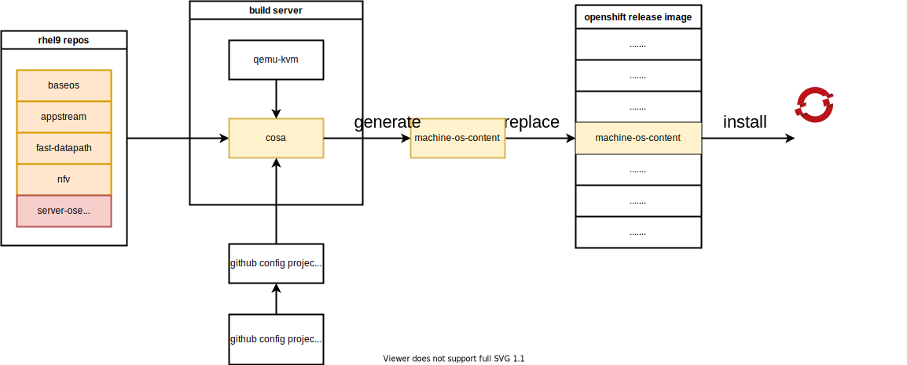
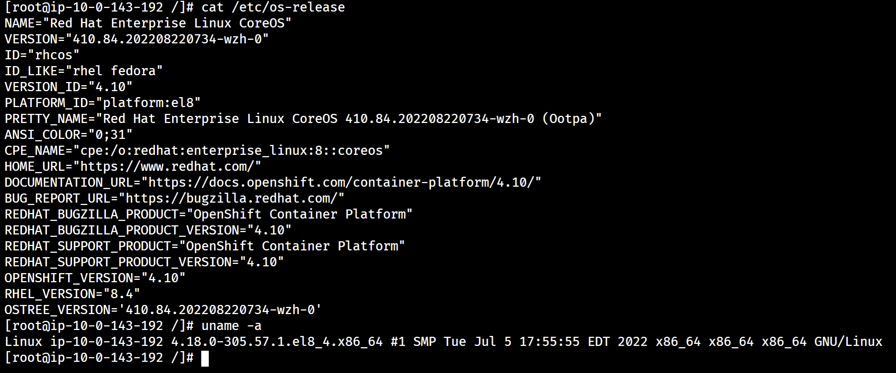
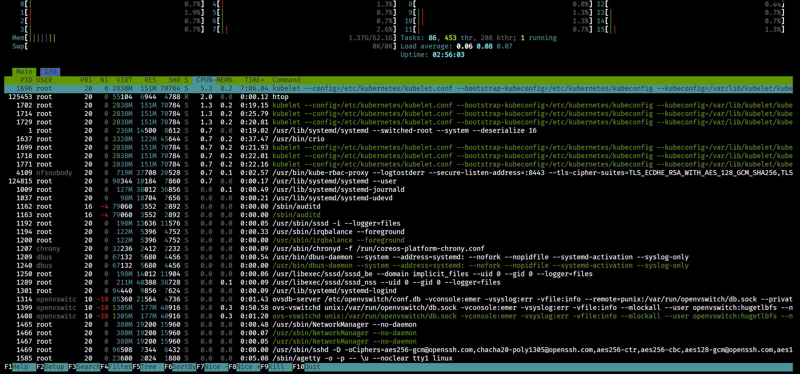

# customized coreos/rhcos for openshift4 / 定制 openshift4 的底层 coreos/rhcos 操作系统

我们做项目的时候，经常有对底层操作系统做修改的需求，比如
- 添加一些顺手的工具，如 htop, tcpdump, iperf 等，都是系统出故障的时候，排查用的利器
- 添加一些内核驱动程序，特别是我们有特殊的硬件插了进来，比如 DPU，GPU
- 我们有一些特殊的软件方案，需要在操作系统一层进行启动。

When we are working on projects, we often need to modify the underlying operating system, such as
- Add some handy tools, such as htop, tcpdump, iperf, etc., which are all useful tools for troubleshooting when the system fails
- Add some kernel drivers, especially we have special hardware plugged in, like DPU, GPU
- We have some special software solutions that need to be activated at the OS level.

而 openshift4 设计的初衷，是云原生安全，于是把底层操作系统，使用 coreos / rhcos 的方式提供，并且 rhcos 官方没有定制化方法和文档。这种方法确实提高了 openshift4 的安全性，稳定性，和全局的一致性，但是项目中也确实遇到了很多尴尬。

The original intention of openshift4 design is cloud-native security, so the underlying operating system is provided in the form of coreos / rhcos, and rhcos officially does not have customized methods and documents. This approch does improve the security, stability, and global consistency of openshift4, but it does encounter a lot of embarrassment in the project.

本文就针对以上问题，摸索出了如何定制底层 rhcos ， 并且应用到 openshift4 之上的方法。其实这些方法，在 openshift 的 github 项目文档中都有，只不过之前没仔细研究罢了。

In view of the above problems, this article finds out how to customize the underlying rhcos and apply it to openshift4. In fact, these methods are available in the github project documentation of openshift, but they have not been carefully studied before.

⚠️⚠️⚠️注意，本文所述方法，涉及到了以下问题，不能使用在生产环境中，只能作为 PoC 应急，或者研究学习之用。如果确实是项目急需，请和红帽GPS部门沟(gěi)通(qián)，获得支持。
- ⚠️编译需要多个 rhel 相关的特种源，而且还是 eus, tus 版本，这些都需要单独购买
- ⚠️编译需要一个红帽内部的 repo 源，属于红帽机密
- ⚠️自定义的 rhcos 不能得到红帽 CEE 支持

⚠️⚠️⚠️ Note that the method described in this article involves the following issues and cannot be used in a production environment. It can only be used as a PoC emergency or for research and learning. If it is really urgent for the project, please communicate with the Red Hat GPS department for support.
- ⚠️ Compilation requires multiple rhel-related special sources, and they are also eus and tus versions, which need to be purchased separately
- ⚠️ Compilation requires a Red Hat internal repo source, which is Red Hat Confidential
- ⚠️ Custom rhcos cannot be supported by Red Hat CEE

本次实验的架构图如下： The architecture diagram of this experiment is as follows:



过程中，重度使用了 cosa , 这个是 coreos-assembler 工具集中的命令，他封装了一系列的工具，根据一个配置文件项目，来自动化的编译出来 coreos/rhcos 镜像。

In the process, cosa is heavily used, which is a command in the coreos-assembler tool set. It encapsulates a series of tools and automatically compiles the coreos/rhcos image according to a configuration file project.

## 视频讲解 / Video explanation

[<kbd></kbd>](https://www.bilibili.com/video/BV1ud4y1d74C/)

- [bilibili](https://www.bilibili.com/video/BV1ud4y1d74C/)
- [youtube](https://youtu.be/cxS4l1fJcOM)

# 准备 dnf repo 源 / Prepare the dnf repo source

注意，这些 repo 源都是需要特殊单独购买，请联系红帽销售和GPS服务部门。

Note that these repo sources are required to be purchased separately, please contact Red Hat Sales and GPS Services.

```bash

# install a rhel on vultr

# disable user/passwd login
# ChallengeResponseAuthentication no
# PasswordAuthentication no
# UsePAM no
sed -i 's/PasswordAuthentication yes/PasswordAuthentication no/g' /etc/ssh/sshd_config
sed -i 's/UsePAM yes/UsePAM no/g' /etc/ssh/sshd_config

systemctl restart sshd

ssh root@v.redhat.ren -o PubkeyAuthentication=no
# root@v.redhat.ren: Permission denied (publickey,gssapi-keyex,gssapi-with-mic).

subscription-manager register --auto-attach --username ******** --password ********

# subscription-manager release --list
# subscription-manager release --set=8.4

# subscription-manager config --rhsm.baseurl=https://china.cdn.redhat.com

subscription-manager repos --list > list

subscription-manager repos \
    --enable="rhel-8-for-x86_64-baseos-rpms" \
    --enable="rhel-8-for-x86_64-appstream-rpms" \
    --enable="codeready-builder-for-rhel-8-x86_64-rpms" \
    # 

dnf -y install https://dl.fedoraproject.org/pub/epel/epel-release-latest-8.noarch.rpm

dnf install -y byobu htop

# byobu
dnf update -y

reboot

mkdir -p /data/dnf

# Create new empty partitions, and filesystem
parted -s /dev/vdb mklabel gpt
parted -s /dev/vdb unit mib mkpart primary 0% 100%

mkfs.ext4 /dev/vdb1

cat << EOF >> /etc/fstab
/dev/vdb1               /data/dnf      ext4    defaults,noatime,nofail 0 0
EOF

mount /dev/vdb1 /data/dnf

mkdir -p /data/dnf/dnf-ocp-4.10

cd /data/dnf/dnf-ocp-4.10

subscription-manager release --set=8.4

dnf reposync --repoid rhel-8-for-x86_64-baseos-eus-rpms -m --download-metadata --delete -n
dnf reposync --repoid=rhel-8-for-x86_64-appstream-eus-rpms -m --download-metadata --delete -n
dnf reposync --repoid=rhel-8-for-x86_64-nfv-tus-rpms -m --download-metadata --delete -n
dnf reposync --repoid=advanced-virt-for-rhel-8-x86_64-eus-rpms -m --download-metadata --delete -n
dnf reposync --repoid=fast-datapath-for-rhel-8-x86_64-rpms -m --download-metadata --delete -n

subscription-manager release --set=8

dnf -y install vsftpd

mkdir -p /var/ftp/dnf
mount --bind /data/dnf/dnf-ocp-4.10 /var/ftp/dnf
chcon -R -t public_content_t /var/ftp/dnf

sed -i "s/anonymous_enable=NO/anonymous_enable=YES/" /etc/vsftpd/vsftpd.conf

cat << EOF >> /etc/vsftpd/vsftpd.conf

pasv_enable=YES
pasv_max_port=10100
pasv_min_port=10090

EOF

systemctl disable --now firewalld
systemctl enable --now vsftpd
```

# 准备 build 服务器 / Prepare the build server

注意，build 服务器需要支持 kvm ，如果选用的云平台，需要云平台支持嵌套虚拟化。

本次实验，我们选用了一台 centos stream 8 的云主机。

Note that the build server needs to support kvm. If you choose a cloud platform, the cloud platform needs to support nested virtualization.

In this experiment, we chose a cloud host of centos stream 8.

```bash
# install a centos stream 8 on digitalocean, 
# 2c 2G for ostree only
# 4c 8G for iso because it needs metal first

dnf install -y epel-release

dnf install -y byobu htop

dnf update -y

reboot

dnf groupinstall -y server

dnf install -y lftp podman

dnf -y install qemu-kvm libvirt libguestfs-tools virt-install virt-viewer virt-manager tigervnc-server

systemctl disable --now firewalld
systemctl enable --now libvirtd
```

# 开始编译 rhcos / Start compiling rhcos

cosa 的输入是一个配置文件项目，上游是 https://github.com/openshift/os ， 我们做了下游扩展，加入了 epel 源，并且把操作系统名字，加入了 wzh 的标记，并且添加了 htop, tcpdump, iperf3 这几个常用的排错命令，作为演示。我们还从 epel 引入 pdns, pdns-recursor ， 支持离线环境 dns 内嵌。 同时，我们从 https://github.com/distribution/distribution/releases 下载 docker image registry 的二进制文件加入进来，支持镜像仓库内嵌。 

The input of cosa is a configuration file project, and the upstream is https://github.com/openshift/os. We made downstream extensions, added the epel source, added the operating system name, added the wzh mark, and added htop , tcpdump, iperf3 These commonly used troubleshooting commands are used as demonstrations.

```bash
# machine-os-images just copy a iso into container
# machine-os-content is our target

# follow coreos-assembler instruction
# https://github.com/coreos/coreos-assembler/blob/main/docs/building-fcos.md
# https://coreos.github.io/coreos-assembler/
# https://github.com/openshift/os/blob/master/docs/development-rhcos.md
# https://github.com/openshift/os/blob/master/docs/development.md

# https://github.com/openshift/os/blob/master/docs/development.md
# https://github.com/openshift/release/blob/master/core-services/release-controller/README.md#rpm-mirrors

export COREOS_ASSEMBLER_CONTAINER=quay.io/coreos-assembler/coreos-assembler:rhcos-4.10
# export COREOS_ASSEMBLER_CONTAINER=quay.io/coreos-assembler/coreos-assembler:latest
podman pull $COREOS_ASSEMBLER_CONTAINER

podman login ************* quay.io

cosa() {
   env | grep COREOS_ASSEMBLER
   local -r COREOS_ASSEMBLER_CONTAINER_LATEST="quay.io/coreos-assembler/coreos-assembler:latest"
   if [[ -z ${COREOS_ASSEMBLER_CONTAINER} ]] && $(podman image exists ${COREOS_ASSEMBLER_CONTAINER_LATEST}); then
       local -r cosa_build_date_str="$(podman inspect -f "{{.Created}}" ${COREOS_ASSEMBLER_CONTAINER_LATEST} | awk '{print $1}')"
       local -r cosa_build_date="$(date -d ${cosa_build_date_str} +%s)"
       if [[ $(date +%s) -ge $((cosa_build_date + 60*60*24*7)) ]] ; then
         echo -e "\e[0;33m----" >&2
         echo "The COSA container image is more that a week old and likely outdated." >&2
         echo "You should pull the latest version with:" >&2
         echo "podman pull ${COREOS_ASSEMBLER_CONTAINER_LATEST}" >&2
         echo -e "----\e[0m" >&2
         sleep 10
       fi
   fi
   set -x
   podman run --rm -ti --security-opt label=disable --privileged                                    \
              --uidmap=1000:0:1 --uidmap=0:1:1000 --uidmap 1001:1001:64536                          \
              -v ${PWD}:/srv/ --device /dev/kvm --device /dev/fuse                                  \
              -v /run/user/0/containers/auth.json:/home/builder/.docker/config.json                      \
              --tmpfs /tmp -v /var/tmp:/var/tmp --name cosa                                         \
              ${COREOS_ASSEMBLER_CONFIG_GIT:+-v $COREOS_ASSEMBLER_CONFIG_GIT:/srv/src/config/:ro}   \
              ${COREOS_ASSEMBLER_GIT:+-v $COREOS_ASSEMBLER_GIT/src/:/usr/lib/coreos-assembler/:ro}  \
              ${COREOS_ASSEMBLER_CONTAINER_RUNTIME_ARGS}                                            \
              ${COREOS_ASSEMBLER_CONTAINER:-$COREOS_ASSEMBLER_CONTAINER_LATEST} "$@"
   rc=$?; set +x; return $rc
}

mkdir -p /data/rhcos
cd /data/rhcos

cosa init --branch wzh-ocp-4.10 https://github.com/wangzheng422/machine-os-content

sed -i 's/REPO_IP/v.redhat.ren/g' /data/rhcos/src/config/wzh.repo

wget -O src/config/overlay.d/99wzh-pdns/usr/sbin/registry.tgz https://github.com/distribution/distribution/releases/download/v2.8.1/registry_2.8.1_linux_amd64.tar.gz

tar zvxf src/config/overlay.d/99wzh-pdns/usr/sbin/registry.tgz -C src/config/overlay.d/99wzh-pdns/usr/sbin

/bin/rm -f src/config/overlay.d/99wzh-pdns/usr/sbin/registry.tgz
/bin/rm -f src/config/overlay.d/99wzh-pdns/usr/sbin/LICENSE
/bin/rm -f src/config/overlay.d/99wzh-pdns/usr/sbin/README.md

cosa fetch

cosa build ostree
# ......
# Ignored user missing from new passwd file: root
# New passwd entries: clevis, dnsmasq, gluster, systemd-coredump, systemd-journal-remote, systemd-resolve, tcpdump, unbound
# Ignored group missing from new group file: root
# New group entries: clevis, dnsmasq, gluster, input, kvm, printadmin, render, systemd-coredump, systemd-journal-remote, systemd-resolve, tcpdump, unbound
# Committing... done
# Metadata Total: 10907
# Metadata Written: 3721
# Content Total: 6584
# Content Written: 1344
# Content Cache Hits: 22043
# Content Bytes Written: 328474751
# 3721 metadata, 24647 content objects imported; 2.4 GB content written
# Wrote commit: 12876365301ad8f07ecf89b4fbe184f000a0816c895c6659ebc6822ef9c18ff7
# New image input checksum: 05e3c499a794b62d22ba12d8d73404ce5970d24b4f7a664b71d17c5cf50ccd4c
# None
# New build ID: 410.84.wzh.202208220647-0
# sha256:fa305389ffa50b73e259000d8f21753049de7e4c217c12df470798d34bd4b209
# Total objects: 28612
# No unreachable objects
# Ignoring non-directory /srv/builds/.build-commit
# + rc=0
# + set +x

# or build with default setting, ostree and qcow2
# cosa build

cosa list
# 410.84.wzh.202208220647-0
#    Timestamp: 2022-08-22T06:59:55Z (0:02:49 ago)
#    Artifacts: ostree
#       Config: wzh-ocp-4.10 (16c263bb4b5c) (dirty)

cosa upload-oscontainer --name "quay.io/wangzheng422/ocp"
# quay.io/wangzheng422/ocp:410.84.202208220734-wzh-0 afbdcfab3ffa897842f181505897e6b448f40e961014f74d94996e0589934b7e

# for pdns
# quay.io/wangzheng422/ocp:410.84.202208251115-wzh-0 75beaec896b43eaa910e04f9c405687419baff09eb627c984382698f67066e8a

cosa buildextend-metal
# ......
# + cosa meta --workdir /srv --build 410.84.202208221336-wzh-0 --artifact metal --artifact-json /srv/tmp/build.metal/meta.json.new
# /srv/builds/410.84.202208221336-wzh-0/x86_64/meta.json wrote with version stamp 1661176393037675276
# + /usr/lib/coreos-assembler/finalize-artifact rhcos-410.84.202208221336-wzh-0-metal.x86_64.raw /srv/builds/410.84.202208221336-wzh-0/x86_64/rhcos-410.84.202208221336-wzh-0-metal.x86_64.raw
# + set +x
# Successfully generated: rhcos-410.84.202208221336-wzh-0-metal.x86_64.raw

cosa buildextend-metal4k
# ......
# + cosa meta --workdir /srv --build 410.84.202208221336-wzh-0 --artifact metal4k --artifact-json /srv/tmp/build.metal4k/meta.json.new
# /srv/builds/410.84.202208221336-wzh-0/x86_64/meta.json wrote with version stamp 1661176647683428498
# + /usr/lib/coreos-assembler/finalize-artifact rhcos-410.84.202208221336-wzh-0-metal4k.x86_64.raw /srv/builds/410.84.202208221336-wzh-0/x86_64/rhcos-410.84.202208221336-wzh-0-metal4k.x86_64.raw
# + set +x
# Successfully generated: rhcos-410.84.202208221336-wzh-0-metal4k.x86_64.raw

cosa buildextend-live
# ......
# Writing:   Extension record                        Start Block 43
# Done with: Extension record                        Block(s)    1
# Writing:   The File(s)                             Start Block 44
#   9.70% done, estimate finish Mon Aug 22 14:14:12 2022
#  19.36% done, estimate finish Mon Aug 22 14:14:12 2022
#  29.05% done, estimate finish Mon Aug 22 14:14:12 2022
#  38.71% done, estimate finish Mon Aug 22 14:14:12 2022
#  48.40% done, estimate finish Mon Aug 22 14:14:12 2022
#  58.06% done, estimate finish Mon Aug 22 14:14:12 2022
#  67.75% done, estimate finish Mon Aug 22 14:14:12 2022
#  77.41% done, estimate finish Mon Aug 22 14:14:12 2022
#  87.10% done, estimate finish Mon Aug 22 14:14:12 2022
#  96.78% done, estimate finish Mon Aug 22 14:14:12 2022
# Total translation table size: 2048
# Total rockridge attributes bytes: 2838
# Total directory bytes: 12288
# Path table size(bytes): 96
# Done with: The File(s)                             Block(s)    51483
# Writing:   Ending Padblock                         Start Block 51527
# Done with: Ending Padblock                         Block(s)    150
# Max brk space used 24000
# 51677 extents written (100 MB)
# + /usr/bin/isohybrid --uefi /srv/tmp/buildpost-live/rhcos-410.84.202208221336-wzh-0-live.x86_64.iso.minimal
# + isoinfo -lR -i /srv/tmp/buildpost-live/rhcos-410.84.202208221336-wzh-0-live.x86_64.iso
# Embedded 262144 bytes Ignition config space at 4872192
# + coreos-installer iso extract pack-minimal-iso /srv/tmp/buildpost-live/rhcos-410.84.202208221336-wzh-0-live.x86_64.iso /srv/tmp/buildpost-live/rhcos-410.84.202208221336-wzh-0-live.x86_64.iso.minimal --consume
# Packing minimal ISO
# Matched 17 files of 17
# Total bytes skipped: 105419322
# Total bytes written: 486854
# Total bytes written (compressed): 2808
# Verifying that packed image matches digest
# Packing successful!
# Updated: builds/410.84.202208221336-wzh-0/x86_64/meta.json

# Create a new release based on openshift 4.10.28 and override a single image
oc adm release new -a /data/pull-secret.json \
  --from-release quay.io/openshift-release-dev/ocp-release@sha256:2127608ebd67a2470860c42368807a0de2308dba144ec4c298bec1c03d79cb52 \
  machine-os-content=quay.io/wangzheng422/ocp:410.84.202208251115-wzh-0 \
  --to-image docker.io/wangzheng422/ocp:4.10-demo-pdns

oc image mirror docker.io/wangzheng422/ocp:4.10-demo-pdns quay.io/wangzheng422/ocp:4.10-demo-pdns

oc adm release info quay.io/wangzheng422/ocp:4.10-demo --commit-urls=true
# Name:      4.10.28
# Digest:    sha256:57add9e36d950ea7eacfe8704279573952cfbed3192449b7cdcc8a72c4d28921
# Created:   2022-08-22T08:13:38Z
# OS/Arch:   linux/amd64
# Manifests: 544

# Pull From: quay.io/wangzheng422/ocp@sha256:57add9e36d950ea7eacfe8704279573952cfbed3192449b7cdcc8a72c4d28921

# Release Metadata:
#   Version:  4.10.28
#   Upgrades: 4.9.19, 4.9.21, 4.9.22, 4.9.23, 4.9.24, 4.9.25, 4.9.26, 4.9.27, 4.9.28, 4.9.29, 4.9.30, 4.9.31, 4.9.32, 4.9.33, 4.9.34, 4.9.35, 4.9.36, 4.9.37, 4.9.38, 4.9.39, 4.9.40, 4.9.41, 4.9.42, 4.9.43, 4.9.44, 4.9.45, 4.9.46, 4.10.3, 4.10.4, 4.10.5, 4.10.6, 4.10.7, 4.10.8, 4.10.9, 4.10.10, 4.10.11, 4.10.12, 4.10.13, 4.10.14, 4.10.15, 4.10.16, 4.10.17, 4.10.18, 4.10.20, 4.10.21, 4.10.22, 4.10.23, 4.10.24, 4.10.25, 4.10.26, 4.10.27
#   Metadata:
#     url: https://access.redhat.com/errata/RHBA-2022:6095

# Component Versions:
#   kubernetes 1.23.5
#   machine-os 410.84.202208220734-wzh-0 Red Hat Enterprise Linux CoreOS

# Images:
#   NAME                                           URL
#   alibaba-cloud-controller-manager               https://github.com/openshift/cloud-provider-alibaba-cloud/commit/db2d118ad70ff62a2111e83a8d14c5b32e176b38
#   alibaba-cloud-csi-driver                       https://github.com/openshift/alibaba-cloud-csi-driver/commit/3ddbb2b9d4994206183b5ffd6a0872ad9a5ce193
#   alibaba-disk-csi-driver-operator               https://github.com/openshift/alibaba-disk-csi-driver-operator/commit/f0d6966321e3d416efec2ac7405494b057cb35f8
#   alibaba-machine-controllers                    https://github.com/openshift/cluster-api-provider-alibaba/commit/0206121348c9a0d220dd6805cea79d1eae7fd3e0
# ......

oc adm release info quay.io/wangzheng422/ocp:4.10-demo
# ......
#   machine-config-operator                        sha256:6f0daed53e44e6377b0ac440f6293949278b912051b933b2dddfce0e6af2c70b
#   machine-os-content                             quay.io/wangzheng422/ocp:410.84.202208220734-wzh-0
#   machine-os-images                              sha256:783daa259e91647dec5b3e82ce496f8733345d707910d7dbbbdcaadcd75d599b
# ......
```

# 应用到 openshift4 / Apply to openshift4

我们编译好了 rhcos， 那么怎么应用到 openshift4 集群上呢，一般来说，有3种办法，[github上有文章写](https://github.com/openshift/os/blob/master/docs/faq.md#q-how-do-i-upgrade-the-os)，笔者认为，直接集群级别强制升级最简单。当然，不同项目，不同情况，需要根据情况分析。

We have compiled rhcos, so how to apply it to the openshift4 cluster, generally speaking, there are 3 ways, [there is an article on github](https://github.com/openshift/os/blob/master/docs/faq.md#q-how-do-i-upgrade-the-os), the author believes that the direct cluster level forced upgrade is the easiest. Of course, different projects and different situations need to be analyzed according to the situation.

## 直接强制升级 / Direct forced upgrade

```bash
# test upgrade
oc adm upgrade \
  --to-image=quay.io/wangzheng422/ocp@sha256:f6a031706e0abb162a96360bce1f857c98c53c912b6c6cbd47c0c19e3cd11ccf \
  --allow-explicit-upgrade --allow-upgrade-with-warnings=true --force=true 

# after cluster upgrade
# check the os-release
cat /etc/os-release 
# NAME="Red Hat Enterprise Linux CoreOS"
# VERSION="410.84.202208220734-wzh-0"
# ID="rhcos"
# ID_LIKE="rhel fedora"
# VERSION_ID="4.10"
# PLATFORM_ID="platform:el8"
# PRETTY_NAME="Red Hat Enterprise Linux CoreOS 410.84.202208220734-wzh-0 (Ootpa)"
# ANSI_COLOR="0;31"
# CPE_NAME="cpe:/o:redhat:enterprise_linux:8::coreos"
# HOME_URL="https://www.redhat.com/"
# DOCUMENTATION_URL="https://docs.openshift.com/container-platform/4.10/"
# BUG_REPORT_URL="https://bugzilla.redhat.com/"
# REDHAT_BUGZILLA_PRODUCT="OpenShift Container Platform"
# REDHAT_BUGZILLA_PRODUCT_VERSION="4.10"
# REDHAT_SUPPORT_PRODUCT="OpenShift Container Platform"
# REDHAT_SUPPORT_PRODUCT_VERSION="4.10"
# OPENSHIFT_VERSION="4.10"
# RHEL_VERSION="8.4"
# OSTREE_VERSION='410.84.202208220734-wzh-0'
```
以下是截屏，这里是 os-release， 可以看到有 wzh 的标记：



这里是在 rhcos 上直接运行 htop 的界面：



# analyze the content 

我们可以 dump 这个 machine-os-content 的内容出来仔细分析。

We can dump the contents of this machine-os-content and analyze it carefully.

```bash

export BUILDNUMBER=4.10.28

wget -O openshift-client-linux-${BUILDNUMBER}.tar.gz https://mirror.openshift.com/pub/openshift-v4/clients/ocp/${BUILDNUMBER}/openshift-client-linux-${BUILDNUMBER}.tar.gz
wget -O openshift-install-linux-${BUILDNUMBER}.tar.gz https://mirror.openshift.com/pub/openshift-v4/clients/ocp/${BUILDNUMBER}/openshift-install-linux-${BUILDNUMBER}.tar.gz

tar -xzf openshift-client-linux-${BUILDNUMBER}.tar.gz -C /usr/local/sbin/
tar -xzf openshift-install-linux-${BUILDNUMBER}.tar.gz -C /usr/local/sbin/

mkdir -p /data/ostree
cd /data/ostree

oc image extract --path /:/data/ostree --registry-config /run/user/0/containers/auth.json quay.io/wangzheng422/ocp:410.84.wzh.202208211552-0

```

# end