# 1. demo lab for openshift 4.12

In this document, we will record the steps to build a demo lab, to show the capability of openshift.

The key show points includes:
1. agent based install ( 3 master node ) with static ip allocation
2. worker node scale out
3. data foundation install

Some additional technical skill includes:
1. simulate bmc for kvm
2. lvm thin provision for kvm
3. ansible tips 

Suggested demo senario in the furture:
1. ODF DR
2. CNV
3. osp on ocp

The architecture of demo lab is:


The purpose of this document is to show a practice way to build an openshift demo lab, so the partner can know where to start to build their own lab. For production env, please contact redhat professional service (GPS) for assistant.

- [1. demo lab for openshift 4.12](#1-demo-lab-for-openshift-412)
- [2. remote access config](#2-remote-access-config)
- [3. setup helper node](#3-setup-helper-node)
  - [3.1. config host BM (97)](#31-config-host-bm-97)
  - [3.2. create helper vm](#32-create-helper-vm)
  - [3.3. setup helper vm](#33-setup-helper-vm)
  - [3.4. download installation media](#34-download-installation-media)
    - [3.4.1. on a VPS with vultr](#341-on-a-vps-with-vultr)
    - [3.4.2. on helper vm node](#342-on-helper-vm-node)
  - [3.5. automatic setup power dns](#35-automatic-setup-power-dns)
  - [3.6. create ca key and crt](#36-create-ca-key-and-crt)
  - [3.7. setup image registry](#37-setup-image-registry)
- [4. install 3 master compact cluster](#4-install-3-master-compact-cluster)
  - [4.1. config on helper node](#41-config-on-helper-node)
  - [4.2. boot 3 kvm for master node](#42-boot-3-kvm-for-master-node)
  - [4.3. wait and check the result](#43-wait-and-check-the-result)
- [5. scale out 3 kvm worker nodes](#5-scale-out-3-kvm-worker-nodes)
  - [5.1. config on host server](#51-config-on-host-server)
  - [5.2. config on helper node](#52-config-on-helper-node)
  - [5.3. scale out and check the result](#53-scale-out-and-check-the-result)
  - [5.4. scale in and check the result](#54-scale-in-and-check-the-result)
- [6. add 3 infra nodes](#6-add-3-infra-nodes)
  - [6.1. config on helper node](#61-config-on-helper-node)
  - [6.2. config infra host BM nodes (98)](#62-config-infra-host-bm-nodes-98)
  - [6.3. boot 3 infra kvm](#63-boot-3-infra-kvm)
  - [6.4. wait and check the result](#64-wait-and-check-the-result)
- [7. add 2 worker BM nodes](#7-add-2-worker-bm-nodes)
  - [7.1. config on helper node](#71-config-on-helper-node)
  - [7.2. boot the BM and check the result](#72-boot-the-bm-and-check-the-result)
- [8. set up infra role on cluster](#8-set-up-infra-role-on-cluster)
  - [8.1. basic cluster config](#81-basic-cluster-config)
  - [8.2. move workload to infra node](#82-move-workload-to-infra-node)
    - [8.2.1. for router](#821-for-router)
    - [8.2.2. for internal registry](#822-for-internal-registry)
    - [8.2.3. for monitor](#823-for-monitor)
    - [8.2.4. for logging](#824-for-logging)
- [9. install ODF](#9-install-odf)
  - [9.1. download additional installation media](#91-download-additional-installation-media)
  - [9.2. install ODF](#92-install-odf)
  - [9.3. patch for csi components](#93-patch-for-csi-components)
- [10. end](#10-end)


# 2. remote access config

we will use zerotier to connect to the demo lab. we will use the BM 192.168.25.90 as jumpbox.

```bash
# on 192.168.25.90
# install zerotier
curl -s https://install.zerotier.com | sudo bash

# join zerotier network
zerotier-cli join xxxxxxxxxxxx

# using a moon to accelerate network speed
zerotier-cli orbit xxxxxxxxxxxx xxxxxxxxxxxx

# enable gui
dnf groupinstall -y 'server with gui' 

# add some handy tools
dnf install -y \
  https://download-ib01.fedoraproject.org/pub/epel/8/Everything/x86_64/Packages/b/byobu-5.133-1.el8.noarch.rpm  \
  https://dl.fedoraproject.org/pub/epel/8/Everything/x86_64/Packages/s/screen-4.6.2-12.el8.x86_64.rpm \
  https://dl.fedoraproject.org/pub/epel/8/Everything/x86_64/Packages/h/htop-3.2.1-1.el8.x86_64.rpm

# add support for kvm and vnc
dnf -y install qemu-kvm libvirt libguestfs-tools virt-install virt-viewer virt-manager tigervnc-server

# auto start libvirt
systemctl enable --now libvirtd

# create password for vnc
# replease xxxxxx with your password
printf 'xxxxxx\nxxxxxx\n\n' | vncpasswd

# create vnc config for vnc starting up
cat << EOF > ~/.vnc/config
session=gnome
securitytypes=vncauth,tlsvnc
# desktop=sandbox
# localhost
geometry=1440x855
alwaysshared
EOF

# auto start vnc session for root user at port 5902
cat << EOF >> /etc/tigervnc/vncserver.users
:2=root
EOF

# auto start vnc session
systemctl enable --now vncserver@:2

# disable firewalld totally, just because I am lazy.
# DO NOT use at production env.
systemctl diable --now firewalld

```

# 3. setup helper node

We need helper node, or called it base station, to host several service like container image registry, dns, load balancer for api server, yum repo ( based on use case ). The helper node is also an operation console, the login key, kubeconfig is store on helper node by default.

We will use helper node as default gw for our disconnected openshift cluster. Openshift needs a gateway to be alive, the gateway doesn't need to be functional, for example, it can forward packet to outside, if it can be pinged by openshift nodes, that is OK. If we lost the gateway, or the gateway can't be pinged, openshift installtion will be wired, and failed finally.

We will bring in some hack tips, will use powerdns as dns service, and replease load balancer, normally it is haproxy, with lua plugin of the powerdns. DO NOT use this in production env. It is just convinent for the author.

As disconnection env, we will download the installation media on VPS and sync it to helper node.

## 3.1. config host BM (97)

```bash
# DO NOT use at production env.
cat << EOF > ~/.ssh/config
StrictHostKeyChecking no
UserKnownHostsFile=/dev/null
EOF

# setup ntp server on BM node
sed -i "s/#allow.*/allow all/" /etc/chrony.conf
systemctl enable --now chronyd

chronyc sources -v
#   .-- Source mode  '^' = server, '=' = peer, '#' = local clock.
#  / .- Source state '*' = current best, '+' = combined, '-' = not combined,
# | /             'x' = may be in error, '~' = too variable, '?' = unusable.
# ||                                                 .- xxxx [ yyyy ] +/- zzzz
# ||      Reachability register (octal) -.           |  xxxx = adjusted offset,
# ||      Log2(Polling interval) --.      |          |  yyyy = measured offset,
# ||                                \     |          |  zzzz = estimated error.
# ||                                 |    |           \
# MS Name/IP address         Stratum Poll Reach LastRx Last sample
# ===============================================================================
# ^+ 111.235.248.121               1   8   377    31   -210us[ -210us] +/- 2855us
# ^- static.home.twn.sciurida>     2   7   377   129   +468us[ +448us] +/- 9558us
# ^* twtpe2-ntp-002.aaplimg.c>     1   7   377    33    -50us[  -76us] +/- 1457us
# ^- 114-33-15-129.hinet-ip.h>     2   9   377   335   +994us[ +957us] +/- 8159us

```

## 3.2. create helper vm

```bash

SNO_MEM=32

# clean up kvm, if we created it before.
virsh destroy ocp4-helper
virsh undefine ocp4-helper

virt-install --name=ocp4-helper --vcpus=8 --ram=$(($SNO_MEM*1024)) \
  --cpu=host-model \
  --disk path=/image/ocp4-helper.qcow2,bus=virtio,size=800 \
  --os-variant rhel8.3 --network bridge=br-int,model=virtio,mac=52:54:00:12:A1:01 \
  --graphics vnc,port=59003 --noautoconsole \
  --boot menu=on --cdrom /home/rhel-8.8-x86_64-dvd.iso


```

## 3.3. setup helper vm

```bash
# DO NOT use at production env.
cat << EOF > ~/.ssh/config
StrictHostKeyChecking no
UserKnownHostsFile=/dev/null
EOF

# DO NOT use at production env.
systemctl disable --now firewalld

# ntp
mv /etc/chrony.conf /etc/chrony.conf.bak

cat << EOF > /etc/chrony.conf
server 192.168.10.90 iburst
driftfile /var/lib/chrony/drift
makestep 1.0 3
rtcsync
allow all
logdir /var/log/chrony
EOF
systemctl restart chronyd

systemctl enable --now chronyd

# wait sometime, then check the status
chronyc sources -v
#   .-- Source mode  '^' = server, '=' = peer, '#' = local clock.
#  / .- Source state '*' = current best, '+' = combined, '-' = not combined,
# | /             'x' = may be in error, '~' = too variable, '?' = unusable.
# ||                                                 .- xxxx [ yyyy ] +/- zzzz
# ||      Reachability register (octal) -.           |  xxxx = adjusted offset,
# ||      Log2(Polling interval) --.      |          |  yyyy = measured offset,
# ||                                \     |          |  zzzz = estimated error.
# ||                                 |    |           \
# MS Name/IP address         Stratum Poll Reach LastRx Last sample
# ===============================================================================
# ^* 192.168.10.90                 3   6     7    10   -859ns[-1112ms] +/- 2795us

# setup http web server for yum repo
mkdir -p /data/yum.repos

rsync -P -arz  root@192.168.10.90:/mnt/disc/BaseOS /data/yum.repos/
rsync -P -arz  root@192.168.10.90:/mnt/disc/AppStream /data/yum.repos/

cat << EOF > /etc/yum.repos.d/wzh.repo
[BaseOS]
name=BaseOS
baseurl=file:////data/yum.repos/BaseOS
enabled=1
gpgcheck=0

[AppStream]
name=AppStream
baseurl=file:////data/yum.repos/AppStream
enabled=1
gpgcheck=0
EOF

dnf groupinstall -y 'development'

dnf install -y python3 nmstate ansible-core

cat << EOF > /etc/systemd/system/local-webserver-yum.service
[Unit]
Description=local-webserver-yum

[Service]
User=root
WorkingDirectory=/data/yum.repos
ExecStart=/bin/bash -c 'python3 -m http.server 5000'
Restart=always

[Install]
WantedBy=multi-user.target
EOF

systemctl daemon-reload

systemctl enable --now local-webserver-yum.service

cat << EOF > /etc/yum.repos.d/wzh.repo
[BaseOS]
name=BaseOS
baseurl=http://192.168.10.10:5000/BaseOS
enabled=1
gpgcheck=0

[AppStream]
name=AppStream
baseurl=http://192.168.10.10:5000/AppStream
enabled=1
gpgcheck=0

[epel-fix]
name=epel-fix
baseurl=http://192.168.10.10:5000/epel-fix
enabled=1
gpgcheck=0

EOF

```

## 3.4. download installation media

we will download the installation media on VPS and sync it to helper node.

### 3.4.1. on a VPS with vultr

```bash
# on a vultr
dnf install -y createrepo_c

# add your ocp pull secret, the content can be download from redhat portal
SEC_FILE='/data/pull-secret.json'

cat << 'EOF' > $SEC_FILE
{"auths":xxxxxxxxxxxxxxxxxxxxxxxxxxx
EOF

SEC_FILE="$HOME/.docker/config.json"
mkdir -p ${SEC_FILE%/*}

cat << 'EOF' > $SEC_FILE
{"auths":xxxxxxxxxxxxxxxxxxxxxxxxxxx
EOF

/bin/rm -rf /data/ocp4

/bin/rm -rf /data/ocp4/tmp/
mkdir -p /data/ocp4/tmp/
cd /data/ocp4/tmp/
# export http_proxy="http://127.0.0.1:18801"
# export https_proxy=${http_proxy}
git clone https://github.com/wangzheng422/openshift4-shell
# unset http_proxy
# unset https_proxy

cd /data/ocp4/tmp/openshift4-shell
git checkout ocp-4.12
# git pull origin ocp-${var_major_version}
/bin/cp -rf /data/ocp4/tmp/openshift4-shell/* /data/ocp4/

/bin/rm -rf /data/ocp4/tmp/

mkdir -p /data/ocp4/container.images
cd /data/ocp4/container.images

podman pull registry.access.redhat.com/ubi8/pause:8.7-6
podman save registry.access.redhat.com/ubi8/pause:8.7-6 | pigz -c > pause.tgz

cd /data/ocp4/
bash helper.node.client.sh -v 4.12.16

tar -xzf /data/ocp-4.12.16/oc-mirror.tar.gz -C /usr/local/bin/
chmod +x /usr/local/bin/oc-mirror

cat > /data/ocp4/mirror.yaml << EOF
apiVersion: mirror.openshift.io/v1alpha2
kind: ImageSetConfiguration
# archiveSize: 4
mirror:
  platform:
    architectures:
      - amd64
      # - arm64
    channels:
      - name: stable-4.12
        type: ocp
        minVersion: 4.12.16
        maxVersion: 4.12.16
        shortestPath: true
    graph: false
  additionalImages:
    - name: registry.redhat.io/redhat/redhat-operator-index:v4.12
    - name: registry.redhat.io/redhat/certified-operator-index:v4.12
    - name: registry.redhat.io/redhat/community-operator-index:v4.12
    - name: registry.redhat.io/redhat/redhat-marketplace-index:v4.12 
    - name: quay.io/openshift/origin-kube-rbac-proxy:latest
    - name: quay.io/wangzheng422/debug-pod:alma-9.1
  # operators:
  #   - catalog: registry.redhat.io/redhat/redhat-operator-index:v4.10  
  #     packages:
  #     - name: cluster-logging                                   
  #       channels:
  #       - name: stable
  #         minVersion: 5.6.3
  #     - name: elasticsearch-operator                               
  #       channels:
  #       - name: stable
  #         minVersion: 5.6.3
  #     - name: jaeger-product                             
  #       channels:
  #       - name: stable
  #         minVersion: 1.39.0-3
  #     - name: kubernetes-nmstate-operator                               
  #       channels:
  #       - name: stable
  #         minVersion: 4.10.0-202303022128
  #     - name: odf-operator                                 
  #       channels:
  #       - name: stable-4.10
  #         minVersion: 4.10.11
  #     - name: sriov-network-operator                             
  #       channels:
  #       - name: stable
  #         minVersion: 4.10.0-202302280915
  #     - name: kubevirt-hyperconverged
  #       channels:
  #       - name: stable
  #         minVersion: 4.10.8
EOF


mkdir -p /data/ocp-install/oc-mirror/
cd /data/ocp-install/oc-mirror/

oc-mirror --config /data/ocp4/mirror.yaml file:///data/ocp-install/oc-mirror/

# sync back to demo lab jumpbox
cd /data
rsync -P -arz  /data/ocp4 root@10.229.104.55:/home/wzh/
rsync -P -arz  /data/ocp-4.12.16 root@10.229.104.55:/home/wzh/
rsync -P -arz  /data/ocp-install root@10.229.104.55:/home/wzh/

```

### 3.4.2. on helper vm node

sync back from demo lab jumpbox

```bash
# on helper vm node
rsync -P -arz  root@192.168.10.90:/home/wzh/* /data/

mkdir -p /data/yum.repos/epel-fix
rsync -P -arz /data/ocp4/rpms/* /data/yum.repos/epel-fix/

```

## 3.5. automatic setup power dns

setup pdns by using an ansible playbook. RedHatters build some ansible projects to help deply the openshift, our ansible playbook is used some scripts from them.

```bash

dnf install -y ansible-core

cd /data/ocp4/ansible-helper

cat > var.yaml << EOF
helper:
  ip_addr: 192.168.10.10
  nic: enp1s0
pdns:
  bind: 0.0.0.0
  port: 53
  recursor_port: 5301
  # forward: 172.21.1.1
  static:
    - base_domain: demolab-infra.wzhlab.top
      record:
        - name: registry
          ip_addr: 192.168.10.10
        - name: quay
          ip_addr: 192.168.10.10
ntp:
  server: 192.168.10.10

# below doesn't need after ocp-4.12 for agent based installer
# becaure coredns, haproxy move to static-pod
# and they are configured to support local resolve and redirection.
# keep here for legacy compatibility
cluster:
  - base_domain: demolab-ocp.wzhlab.top
    node: 
      - ip_addr: 192.168.10.21
        name: master-01
      - ip_addr: 192.168.10.22
        name: master-02
      - ip_addr: 192.168.10.23
        name: master-03
      - ip_addr: 192.168.10.31
        name: infra-01
      - ip_addr: 192.168.10.32
        name: infra-02
      - ip_addr: 192.168.10.33
        name: infra-03
      - ip_addr: 192.168.10.41
        name: worker-01
      - ip_addr: 192.168.10.42
        name: worker-02
      - ip_addr: 192.168.10.51
        name: scale-01
      - ip_addr: 192.168.10.52
        name: scale-02
      - ip_addr: 192.168.10.53
        name: scale-03
    api:
      - ip_addr: 192.168.10.11
    api_int:
      - ip_addr: 192.168.10.11
    apps:
      - ip_addr: 192.168.12.12
ptr: 
  - addr: 192.168.10
    domain: ptr01.wzhlab.top
EOF

cd /data/ocp4/ansible-helper
# ansible-playbook -vvv -e @var.yaml  helper.yaml
ansible-playbook  -e @var.yaml  helper.yaml


```

and config public dns record, if your workstation's dns not point to our helper node's power dns.

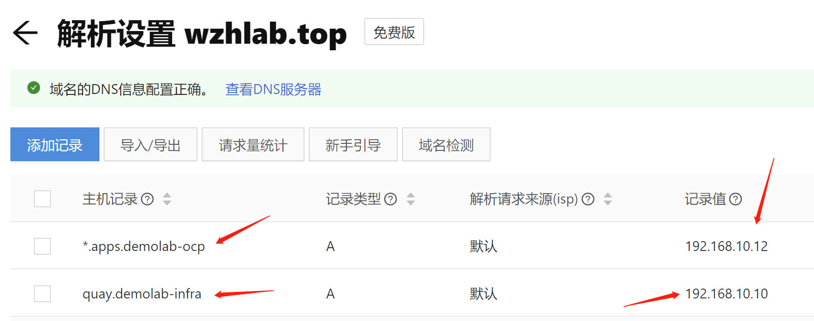

## 3.6. create ca key and crt

```bash
# on helper vm

mkdir -p /etc/crts/ && cd /etc/crts

# https://access.redhat.com/documentation/en-us/red_hat_codeready_workspaces/2.1/html/installation_guide/installing-codeready-workspaces-in-tls-mode-with-self-signed-certificates_crw
openssl genrsa -out /etc/crts/wzhlab.top.ca.key 4096

openssl req -x509 \
  -new -nodes \
  -key /etc/crts/wzhlab.top.ca.key \
  -sha256 \
  -days 36500 \
  -out /etc/crts/wzhlab.top.ca.crt \
  -subj /CN="Local wzh lab Signer" \
  -reqexts SAN \
  -extensions SAN \
  -config <(cat /etc/pki/tls/openssl.cnf \
      <(printf '[SAN]\nbasicConstraints=critical, CA:TRUE\nkeyUsage=keyCertSign, cRLSign, digitalSignature'))

openssl genrsa -out /etc/crts/wzhlab.top.key 2048

openssl req -new -sha256 \
    -key /etc/crts/wzhlab.top.key \
    -subj "/O=Local wzh lab /CN=*.demolab-infra.wzhlab.top" \
    -reqexts SAN \
    -config <(cat /etc/pki/tls/openssl.cnf \
        <(printf "\n[SAN]\nsubjectAltName=DNS:*.demolab-infra.wzhlab.top,DNS:*.demolab-ocp.wzhlab.top,DNS:*.wzhlab.top\nbasicConstraints=critical, CA:FALSE\nkeyUsage=digitalSignature, keyEncipherment, keyAgreement, dataEncipherment\nextendedKeyUsage=serverAuth")) \
    -out /etc/crts/wzhlab.top.csr

openssl x509 \
    -req \
    -sha256 \
    -extfile <(printf "subjectAltName=DNS:*.demolab-infra.wzhlab.top,DNS:*.demolab-ocp.wzhlab.top,DNS:*.wzhlab.top\nbasicConstraints=critical, CA:FALSE\nkeyUsage=digitalSignature, keyEncipherment, keyAgreement, dataEncipherment\nextendedKeyUsage=serverAuth") \
    -days 36500 \
    -in /etc/crts/wzhlab.top.csr \
    -CA /etc/crts/wzhlab.top.ca.crt \
    -CAkey /etc/crts/wzhlab.top.ca.key \
    -CAcreateserial -out /etc/crts/wzhlab.top.crt

openssl x509 -in /etc/crts/wzhlab.top.crt -text

/bin/cp -f /etc/crts/wzhlab.top.ca.crt /etc/pki/ca-trust/source/anchors/
update-ca-trust extract


```

## 3.7. setup image registry


```bash

# https://docs.openshift.com/container-platform/4.12/installing/disconnected_install/installing-mirroring-creating-registry.html

ssh-copy-id root@192.168.10.10

podman load -i /data/ocp4/container.images/pause.tgz

mkdir -p /data/quay 
cd /data/ocp4/clients
tar zvxf mirror-registry.tar.gz

# replace the xxxxxx with your password
./mirror-registry install -v \
  --initPassword xxxxxx --initUser admin \
  -k ~/.ssh/id_rsa \
  --quayHostname quay.demolab-infra.wzhlab.top --quayRoot /data/quay \
  --targetHostname quay.demolab-infra.wzhlab.top \
  --sslKey /etc/crts/wzhlab.top.key --sslCert /etc/crts/wzhlab.top.crt

# ......
# PLAY RECAP ****************************************************************************************************************************************************************root@quay.demolab-infra.wzhlab.top : ok=48   changed=26   unreachable=0    failed=0    skipped=19   rescued=0    ignored=0

# INFO[2023-05-25 13:04:43] Quay installed successfully, config data is stored in /data/quay
# INFO[2023-05-25 13:04:43] Quay is available at https://quay.demolab-infra.wzhlab.top:8443 with credentials (admin, xxxxxx)


podman pod ps
# POD ID        NAME        STATUS      CREATED        INFRA ID      # OF CONTAINERS
# 5afa94fc84fc  quay-pod    Running     9 minutes ago  b911a67bf5cb  4


# import installation media into quay
mkdir -p $HOME/.local/bin
cat << 'EOF' >> ~/.bash_profile

PATH=$HOME/.local/bin:$PATH
export PATH

EOF

export BUILDNUMBER=4.12.16

pushd /data/ocp-${BUILDNUMBER}
tar -xzf openshift-client-linux-${BUILDNUMBER}.tar.gz -C ~/.local/bin/
tar -xzf openshift-install-linux-${BUILDNUMBER}.tar.gz -C ~/.local/bin/
tar -xzf oc-mirror.tar.gz -C ~/.local/bin/
chmod +x ~/.local/bin/oc-mirror
/bin/cp -f openshift-baremetal-install ~/.local/bin/
popd


SEC_FILE="$HOME/.docker/config.json"
mkdir -p ${SEC_FILE%/*}

cat << 'EOF' > $SEC_FILE
{"auths":xxxxxxxxxxxxxxxxxxxxxxxxxxx
EOF

mkdir -p /data/wzh.work
cd /data/wzh.work
oc-mirror --from=/data/ocp-install/oc-mirror/mirror_seq1_000000.tar \
  docker://quay.demolab-infra.wzhlab.top:8443

```
after import, you can check the result from web console. as you can see, there are several repository created.

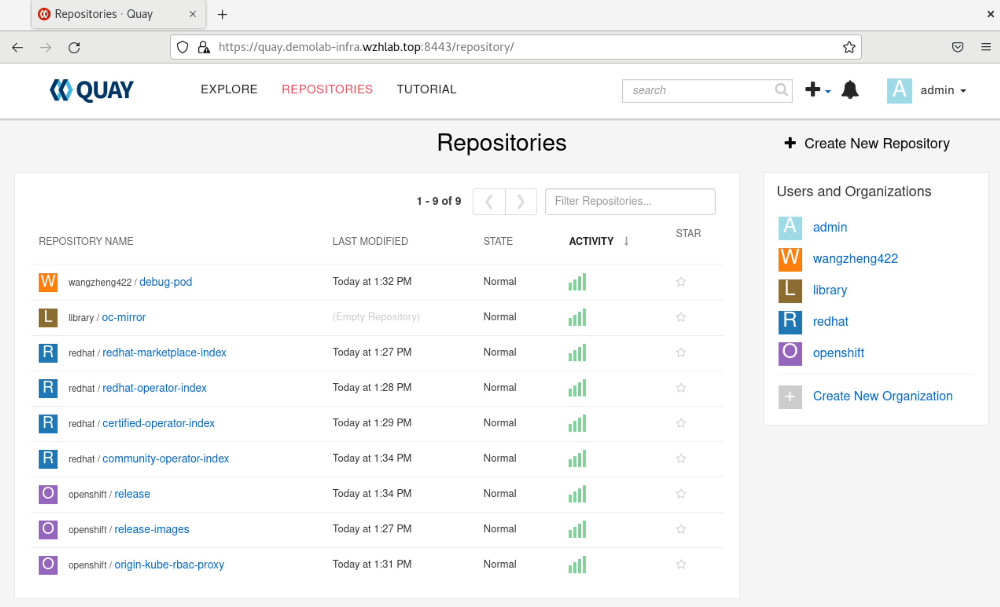

# 4. install 3 master compact cluster

all dependency service are installed and ready, now we will start to install 3 master compact cluster. we will begin with 3 node compact cluster, and then demo to scale out 3 kvm worker node, add 3 infra node and 2 baremetal worker node.

## 4.1. config on helper node

```bash
# create a user to hold the config env for the new ocp cluster
useradd -m 3node

usermod -aG wheel 3node

echo -e "%wheel\tALL=(ALL)\tNOPASSWD: ALL" > /etc/sudoers.d/020_sudo_for_me

su - 3node

ssh-keygen

cat << EOF > ~/.ssh/config
StrictHostKeyChecking no
UserKnownHostsFile=/dev/null
EOF

chmod 600 ~/.ssh/config

cat << 'EOF' >> ~/.bashrc

export BASE_DIR='/home/3node/'

EOF


export BUILDNUMBER=4.12.16

mkdir -p ~/.local/bin
pushd /data/ocp-${BUILDNUMBER}
tar -xzf openshift-client-linux-${BUILDNUMBER}.tar.gz -C ~/.local/bin/
tar -xzf openshift-install-linux-${BUILDNUMBER}.tar.gz -C ~/.local/bin/
install -m 755 /data/ocp4/clients/butane-amd64 ~/.local/bin/butane
install -m 755 /data/ocp4/clients/coreos-installer_amd64 ~/.local/bin/coreos-installer
popd


export BUILDNUMBER=4.12.16

mkdir -p ${BASE_DIR}/data/{sno/disconnected,install}

# set some parameter of you rcluster

NODE_SSH_KEY="$(cat ${BASE_DIR}/.ssh/id_rsa.pub)"
INSTALL_IMAGE_REGISTRY=quay.demolab-infra.wzhlab.top:8443

# update the xxxxxx with your password for the image registry
PULL_SECRET='{"auths":{"registry.redhat.io": {"auth": "ZHVtbXk6ZHVtbXk=","email": "noemail@localhost"},"registry.ocp4.redhat.ren:5443": {"auth": "ZHVtbXk6ZHVtbXk=","email": "noemail@localhost"},"'${INSTALL_IMAGE_REGISTRY}'": {"auth": "'$( echo -n 'admin:xxxxxx' | openssl base64 )'","email": "noemail@localhost"}}}'


NTP_SERVER=192.168.10.10
# HELP_SERVER=192.168.7.11
# KVM_HOST=192.168.7.11
API_VIP=192.168.10.11
INGRESS_VIP=192.168.10.12
# CLUSTER_PROVISION_IP=192.168.7.103
# BOOTSTRAP_IP=192.168.7.12

# 定义单节点集群的节点信息
SNO_CLUSTER_NAME=demolab-ocp
SNO_BASE_DOMAIN=wzhlab.top

# BOOTSTRAP_IP=192.168.77.42
MASTER_01_IP=192.168.10.21
MASTER_02_IP=192.168.10.22
MASTER_03_IP=192.168.10.23

# BOOTSTRAP_IPv6=fd03::42
MASTER_01_IPv6=fd03::21
MASTER_02_IPv6=fd03::22
MASTER_03_IPv6=fd03::23

# BOOTSTRAP_HOSTNAME=bootstrap-demo
MASTER_01_HOSTNAME=master-01
MASTER_02_HOSTNAME=master-02
MASTER_03_HOSTNAME=master-03

# BOOTSTRAP_INTERFACE=enp1s0
MASTER_01_INTERFACE=enp1s0
MASTER_02_INTERFACE=enp1s0
MASTER_03_INTERFACE=enp1s0

MASTER_01_INTERFACE_MAC=52:54:00:13:A1:21
MASTER_02_INTERFACE_MAC=52:54:00:13:A1:22
MASTER_03_INTERFACE_MAC=52:54:00:13:A1:23

# BOOTSTRAP_DISK=/dev/vda
MASTER_01_DISK=/dev/vda
MASTER_02_DISK=/dev/vda
MASTER_03_DISK=/dev/vda

OCP_GW=192.168.10.10
OCP_NETMASK=255.255.255.0
OCP_NETMASK_S=24
OCP_DNS=192.168.10.10

OCP_GW_v6=fd03::10
OCP_NETMASK_v6=64

# echo ${SNO_IF_MAC} > /data/sno/sno.mac

mkdir -p ${BASE_DIR}/data/install
cd ${BASE_DIR}/data/install

/bin/rm -rf *.ign .openshift_install_state.json auth bootstrap manifests master*[0-9] worker*[0-9] *

cat << EOF > ${BASE_DIR}/data/install/install-config.yaml 
apiVersion: v1
baseDomain: $SNO_BASE_DOMAIN
compute:
- name: worker
  replicas: 0 
controlPlane:
  name: master
  replicas: 3 
metadata:
  name: $SNO_CLUSTER_NAME
networking:
  # OVNKubernetes , OpenShiftSDN
  clusterNetwork:
    - cidr: 172.21.0.0/16
      hostPrefix: 23
    # - cidr: fd02::/48
    #   hostPrefix: 64
  machineNetwork:
    - cidr: 192.168.10.0/24
    # - cidr: 2001:DB8::/32
  serviceNetwork:
    - 172.22.0.0/16
    # - fd03::/112
platform:
  baremetal:
    apiVIPs:
    - $API_VIP
    # - 2001:DB8::4
    ingressVIPs:
    - $INGRESS_VIP
    # - 2001:DB8::5
pullSecret: '${PULL_SECRET}'
sshKey: |
$( cat ${BASE_DIR}/.ssh/id_rsa.pub | sed 's/^/   /g' )
additionalTrustBundle: |
$( cat /etc/crts/wzhlab.top.ca.crt | sed 's/^/   /g' )
imageContentSources:
- mirrors:
  - ${INSTALL_IMAGE_REGISTRY}/openshift/release-images
  source: quay.io/openshift-release-dev/ocp-release
- mirrors:
  - ${INSTALL_IMAGE_REGISTRY}/openshift/release
  source: quay.io/openshift-release-dev/ocp-v4.0-art-dev
EOF

cat << EOF > ${BASE_DIR}/data/install/agent-config.yaml
apiVersion: v1alpha1
kind: AgentConfig
metadata:
  name: $SNO_CLUSTER_NAME
rendezvousIP: $MASTER_01_IP
additionalNTPSources:
- $NTP_SERVER
hosts:
  - hostname: $MASTER_01_HOSTNAME
    role: master
    rootDeviceHints:
      deviceName: "$MASTER_01_DISK"
    interfaces:
      - name: $MASTER_01_INTERFACE
        macAddress: $MASTER_01_INTERFACE_MAC
    networkConfig:
      interfaces:
        - name: $MASTER_01_INTERFACE
          type: ethernet
          state: up
          mac-address: $MASTER_01_INTERFACE_MAC
          ipv4:
            enabled: true
            address:
              - ip: $MASTER_01_IP
                prefix-length: $OCP_NETMASK_S
            dhcp: false
      dns-resolver:
        config:
          server:
            - $OCP_DNS
      routes:
        config:
          - destination: 0.0.0.0/0
            next-hop-address: $OCP_GW
            next-hop-interface: $MASTER_01_INTERFACE
            table-id: 254
  - hostname: $MASTER_02_HOSTNAME
    role: master
    rootDeviceHints:
      deviceName: "$MASTER_02_DISK"
    interfaces:
      - name: $MASTER_02_INTERFACE
        macAddress: $MASTER_02_INTERFACE_MAC
    networkConfig:
      interfaces:
        - name: $MASTER_02_INTERFACE
          type: ethernet
          state: up
          mac-address: $MASTER_02_INTERFACE_MAC
          ipv4:
            enabled: true
            address:
              - ip: $MASTER_02_IP
                prefix-length: $OCP_NETMASK_S
            dhcp: false
      dns-resolver:
        config:
          server:
            - $OCP_DNS
      routes:
        config:
          - destination: 0.0.0.0/0
            next-hop-address: $OCP_GW
            next-hop-interface: $MASTER_02_INTERFACE
            table-id: 254
  - hostname: $MASTER_03_HOSTNAME
    role: master
    rootDeviceHints:
      deviceName: "$MASTER_03_DISK" 
    interfaces:
      - name: $MASTER_03_INTERFACE
        macAddress: $MASTER_03_INTERFACE_MAC
    networkConfig:
      interfaces:
        - name: $MASTER_03_INTERFACE
          type: ethernet
          state: up
          mac-address: $MASTER_03_INTERFACE_MAC
          ipv4:
            enabled: true
            address:
              - ip: $MASTER_03_IP
                prefix-length: $OCP_NETMASK_S
            dhcp: false
      dns-resolver:
        config:
          server:
            - $OCP_DNS
      routes:
        config:
          - destination: 0.0.0.0/0
            next-hop-address: $OCP_GW
            next-hop-interface: $MASTER_03_INTERFACE
            table-id: 254            
EOF

/bin/cp -f ${BASE_DIR}/data/install/install-config.yaml ${BASE_DIR}/data/install/install-config.yaml.bak
/bin/cp -f ${BASE_DIR}/data/install/agent-config.yaml ${BASE_DIR}/data/install/agent-config.yaml.bak

openshift-install --dir=${BASE_DIR}/data/install agent create cluster-manifests

sudo bash -c "/bin/cp -f mirror/registries.conf /etc/containers/registries.conf.d/; chmod +r /etc/containers/registries.conf.d/*"

# /bin/cp -f  /data/ocp4/ansible-helper/files/* ${BASE_DIR}/data/install/openshift/

sudo bash -c "cd /data/ocp4 ; bash image.registries.conf.sh quay.demolab-infra.wzhlab.top:8443 ;"

/bin/cp -f /data/ocp4/99-worker-container-registries.yaml ${BASE_DIR}/data/install/
/bin/cp -f /data/ocp4/99-master-container-registries.yaml ${BASE_DIR}/data/install/

cd ${BASE_DIR}/data/install/

# openshift-install --dir=${BASE_DIR}/data/install create ignition-configs 

mkdir -p ~/.cache/agent/image_cache/
/bin/cp -f /data/ocp-$BUILDNUMBER/rhcos-live.x86_64.iso ~/.cache/agent/image_cache/coreos-x86_64.iso

openshift-install --dir=${BASE_DIR}/data/install agent create image --log-level=debug
# ......
# DEBUG Fetching image from OCP release (oc adm release info --image-for=machine-os-images --insecure=true --icsp-file=/tmp/icsp-file3636774741 quay.io/openshift-release-dev/ocp-release@sha256:96bf74ce789ccb22391deea98e0c5050c41b67cc17defbb38089d32226dba0b8)
# DEBUG The file was found in cache: /home/3node/.cache/agent/image_cache/coreos-x86_64.iso
# INFO Verifying cached file
# DEBUG extracting /coreos/coreos-x86_64.iso.sha256 to /tmp/cache1876698393, oc image extract --path /coreos/coreos-x86_64.iso.sha256:/tmp/cache1876698393 --confirm --icsp-file=/tmp/icsp-file455852761 quay.io/openshift-release-dev/ocp-v4.0-art-dev@sha256:052130abddf741195b6753888cf8a00757dedeb7010f7d4dcc4b842b5bc705f6
# ......


# we will add another user for debugging
# DO NOT USE IN PRODUCTION
coreos-installer iso ignition show agent.x86_64.iso > ignition.ign

# HTTP_PATH=http://192.168.7.11:8080/ignition

source /data/ocp4/acm.fn.sh

# 我们会创建一个wzh用户，密码是redhat，这个可以在第一次启动的是，从console/ssh直接用用户名口令登录
# 方便排错和研究
VAR_PWD_HASH="$(python3 -c 'import crypt,getpass; print(crypt.crypt("redhat"))')"

cat ${BASE_DIR}/data/install/ignition.ign \
  | jq --arg VAR "$VAR_PWD_HASH" --arg VAR_SSH "$NODE_SSH_KEY" '.passwd.users += [{ "name": "wzh", "system": true, "passwordHash": $VAR , "sshAuthorizedKeys": [ $VAR_SSH ], "groups": [ "adm", "wheel", "sudo", "systemd-journal"  ] }]' \
  | jq -c . \
  > ${BASE_DIR}/data/install/ignition-iso.ign

coreos-installer iso ignition embed -f -i ignition-iso.ign agent.x86_64.iso

# VAR_IMAGE_VER=rhcos-410.86.202303200936-AnolisOS-0-live.x86_64.iso


```

## 4.2. boot 3 kvm for master node

```bash
# on helper node
# copy back the iso to baremetal 97
scp /home/3node/data/install/agent.x86_64.iso  root@192.168.10.90:/home/wzh.iso/


# on baremetal 97

# cleanup
virsh destroy ocp4-master-01
virsh undefine ocp4-master-01
/bin/rm -f /image/ocp4-master-01.qcow2

virsh destroy ocp4-master-02
virsh undefine ocp4-master-02
/bin/rm -f /image/ocp4-master-02.qcow2

virsh destroy ocp4-master-03
virsh undefine ocp4-master-03
/bin/rm -f /image/ocp4-master-03.qcow2


SNO_MEM=48

virsh destroy ocp4-master-01
virsh undefine ocp4-master-01

virt-install --name=ocp4-master-01 --vcpus=12 --ram=$(($SNO_MEM*1024)) \
  --cpu=host-model \
  --disk path=/image/ocp4-master-01.qcow2,bus=virtio,size=120 \
  --os-variant rhel8.3 \
  --network bridge=br-int,model=virtio,mac=52:54:00:13:A1:21 \
  --graphics vnc,port=59021 --noautoconsole \
  --boot menu=on --cdrom /home/wzh.iso/agent.x86_64.iso

virsh destroy ocp4-master-02
virsh undefine ocp4-master-02

virt-install --name=ocp4-master-02 --vcpus=12 --ram=$(($SNO_MEM*1024)) \
  --cpu=host-model \
  --disk path=/image/ocp4-master-02.qcow2,bus=virtio,size=120 \
  --os-variant rhel8.3 \
  --network bridge=br-int,model=virtio,mac=52:54:00:13:A1:22 \
  --graphics vnc,port=59022 --noautoconsole \
  --boot menu=on --cdrom /home/wzh.iso/agent.x86_64.iso

virsh destroy ocp4-master-03
virsh undefine ocp4-master-03

virt-install --name=ocp4-master-03 --vcpus=12 --ram=$(($SNO_MEM*1024)) \
  --cpu=host-model \
  --disk path=/image/ocp4-master-03.qcow2,bus=virtio,size=120 \
  --os-variant rhel8.3 \
  --network bridge=br-int,model=virtio,mac=52:54:00:13:A1:23 \
  --graphics vnc,port=59023 --noautoconsole \
  --boot menu=on --cdrom /home/wzh.iso/agent.x86_64.iso

```

The vm will reboot, in the first reboot, the kvm will not poweron after poweroff, keep an eye on the kvm manager, and start it manually.

## 4.3. wait and check the result

```bash
cd ${BASE_DIR}/data/install
export KUBECONFIG=${BASE_DIR}/data/install/auth/kubeconfig
echo "export KUBECONFIG=${BASE_DIR}/data/install/auth/kubeconfig" >> ~/.bashrc
# oc completion bash | sudo tee /etc/bash_completion.d/openshift > /dev/null


cd ${BASE_DIR}/data/install
openshift-install --dir=${BASE_DIR}/data/install agent wait-for bootstrap-complete \
    --log-level=debug

# DEBUG Host master-02 validation: Host subnets are not overlapping
# DEBUG Host master-02 validation: cnv is disabled
# DEBUG Host master-02 validation: lso is disabled
# DEBUG Host master-02 validation: lvm is disabled
# DEBUG Host master-02 validation: odf is disabled
# INFO Host: master-03, reached installation stage Done
# INFO Host: master-01, reached installation stage Waiting for controller: waiting for controller pod ready event
# INFO Bootstrap configMap status is complete
# INFO cluster bootstrap is complete

# if for some reason, master-01 is pending approve to join cluster
# add master-01 back
# you should not use below commands in normal case.
oc get csr
oc get csr -ojson | jq -r '.items[] | select(.status == {} ) | .metadata.name' | xargs oc adm certificate approve


cd ${BASE_DIR}/data/install
openshift-install --dir=${BASE_DIR}/data/install agent wait-for install-complete 
# INFO Bootstrap Kube API Initialized
# INFO Bootstrap configMap status is complete
# INFO cluster bootstrap is complete
# INFO Cluster is installed
# INFO Install complete!
# INFO To access the cluster as the system:admin user when using 'oc', run
# INFO     export KUBECONFIG=/home/3node/data/install/auth/kubeconfig
# INFO Access the OpenShift web-console here: https://console-openshift-console.apps.demolab-ocp.wzhlab.top
# INFO Login to the console with user: "kubeadmin", and password: "jxjb8-PPkX5-4WF78-5w8eL"


# customize registry config for quay
oc patch mcp/master --patch '{"spec":{"paused":true}}' --type=merge
oc patch mcp/worker --patch '{"spec":{"paused":true}}' --type=merge

oc create -f ${BASE_DIR}/data/install/99-worker-container-registries.yaml
oc create -f ${BASE_DIR}/data/install/99-master-container-registries.yaml

oc patch mcp/master --patch '{"spec":{"paused":false}}' --type=merge
oc patch mcp/worker --patch '{"spec":{"paused":false}}' --type=merge

```

# 5. scale out 3 kvm worker nodes

We will build 3 kvm worker nodes, and let openshift to scale out openshift nodes on these kvm. So we can demo the openshift scale-out and scale-in function.

The lab BM's bmc is connect to br-mgmt, and the br-int can not route to the br-mgmt, so the metal3's pod can't access bmc/idrac to insert boot image, that is why we have to demo the scale-out function using kvm.

## 5.1. config on host server

```bash

# on baremetal 97
mkdir -p /home/wzh.work

# cleanup
virsh destroy ocp4-scale-01
virsh undefine ocp4-scale-01
/bin/rm -f /image/ocp4-scale-01.qcow2

virsh destroy ocp4-scale-02
virsh undefine ocp4-scale-02
/bin/rm -f /image/ocp4-scale-02.qcow2

virsh destroy ocp4-scale-03
virsh undefine ocp4-scale-03
/bin/rm -f /image/ocp4-scale-03.qcow2

# define scale worker


SNO_MEM=48

virsh destroy ocp4-scale-01
virsh undefine ocp4-scale-01

virt-install --name=ocp4-scale-01 --vcpus=12 --ram=$(($SNO_MEM*1024)) \
  --cpu=host-model \
  --disk path=/image/ocp4-scale-01.qcow2,bus=virtio,size=100 \
  --os-variant rhel8.3 \
  --network bridge=br-int,model=virtio,mac=52:54:00:13:A1:51 \
  --graphics vnc,port=59051 --noautoconsole \
  --print-xml > /home/wzh.work/ocp4-scale-01.xml
virsh define --file /home/wzh.work/ocp4-scale-01.xml

virsh destroy ocp4-scale-02
virsh undefine ocp4-scale-02

virt-install --name=ocp4-scale-02 --vcpus=12 --ram=$(($SNO_MEM*1024)) \
  --cpu=host-model \
  --disk path=/image/ocp4-scale-02.qcow2,bus=virtio,size=100 \
  --os-variant rhel8.3 \
  --network bridge=br-int,model=virtio,mac=52:54:00:13:A1:52 \
  --graphics vnc,port=59052 --noautoconsole \
  --print-xml > /home/wzh.work/ocp4-scale-02.xml
virsh define --file /home/wzh.work/ocp4-scale-02.xml

virsh destroy ocp4-scale-03
virsh undefine ocp4-scale-03

virt-install --name=ocp4-scale-03 --vcpus=12 --ram=$(($SNO_MEM*1024)) \
  --cpu=host-model \
  --disk path=/image/ocp4-scale-03.qcow2,bus=virtio,size=100 \
  --os-variant rhel8.3 \
  --network bridge=br-int,model=virtio,mac=52:54:00:13:A1:53 \
  --graphics vnc,port=59053 --noautoconsole \
  --print-xml > /home/wzh.work/ocp4-scale-03.xml
virsh define --file /home/wzh.work/ocp4-scale-03.xml

# setup and start bmc simulator for kvm
dnf -y install python3-pip
python3 -m pip install --upgrade pip --user
pip3 install --user sushy-tools

mkdir -p /etc/crts
scp root@192.168.10.10:/etc/crts/* /etc/crts/

# /root/.local/bin/sushy-emulator -i 0.0.0.0 --ssl-certificate /etc/crts/redhat.ren.crt --ssl-key /etc/crts/redhat.ren.key

# try to deploy as systemd service
cat << EOF > /etc/systemd/system/sushy-emulator.service
[Unit]
Description=sushy-emulator

[Service]
User=root
WorkingDirectory=/root
ExecStart=/bin/bash -c '/root/.local/bin/sushy-emulator -i 0.0.0.0 --ssl-certificate /etc/crts/wzhlab.top.crt --ssl-key /etc/crts/wzhlab.top.key'
Restart=always

[Install]
WantedBy=multi-user.target
EOF

systemctl daemon-reload

systemctl enable --now sushy-emulator.service


# collect mac and vm info for helper

# on helper clean all
# /bin/rm -f /data/install/mac.list.*
# /bin/rm -f /data/install/vm.list.*

# back to 103
cd /home/wzh.work
for i in ocp4-scale-0{1..3}
do
  echo -ne "${i}\t" ; 
  virsh dumpxml ${i} | grep "mac address" | cut -d\' -f2 | tr '\n' '\t'
  echo 
done > mac.list.97
cat /home/wzh.work/mac.list.97
# ocp4-scale-01   52:54:00:13:a1:51
# ocp4-scale-02   52:54:00:13:a1:52
# ocp4-scale-03   52:54:00:13:a1:53

cat << 'EOF' > redfish.sh
#!/usr/bin/env bash

curl -k -s https://127.0.0.1:8000/redfish/v1/Systems/ | jq -r '.Members[]."@odata.id"' >  list

while read -r line; do
    curl -k -s https://127.0.0.1:8000/$line | jq -j '.Id, " ", .Name, "\n" '
done < list

EOF
bash redfish.sh | grep ocp4-scale > /home/wzh.work/vm.list.97
cat /home/wzh.work/vm.list.97
# e0113aa6-1465-40da-9128-ae9087c76924 ocp4-scale-02
# 97d16a4b-fae3-43b7-bd5b-711c83cf840f ocp4-scale-01
# 25dda43c-fb42-4ac8-bea1-46c46635e7fa ocp4-scale-03

scp /home/wzh.work/{mac,vm}.list.* root@192.168.10.10:/home/3node/data/install/

cat > /home/wzh.work/crack.txt << 'EOF'

chown 3node: /home/3node/data/install/*

EOF
ssh root@192.168.10.10 < /home/wzh.work/crack.txt

```

## 5.2. config on helper node

```bash

# on helper node

cd ${BASE_DIR}/data/install/

cat << EOF > ${BASE_DIR}/data/install/bmh-01.yaml
# below is for ocp4-scale-01
---
apiVersion: v1
kind: Secret
metadata:
  name: scale-01-bmc-secret
type: Opaque
data:
  username: $(echo -ne "admin" | base64)
  password: $(echo -ne "password" | base64)
---
apiVersion: v1
kind: Secret
metadata:
  name: ocp4-scale-01-network-config-secret
type: Opaque
stringData:
  nmstate: |
    dns-resolver:
      config:
        server:
        - 192.168.10.10
    interfaces:
    - ipv4:
        address:
        - ip: 192.168.10.51
          prefix-length: 24
        dhcp: false
        enabled: true
      name: enp1s0
      state: up
      type: ethernet
    routes:
      config:
      - destination: 0.0.0.0/0
        next-hop-address: 192.168.10.10
        next-hop-interface: enp1s0
        table-id: 254
---
apiVersion: metal3.io/v1alpha1
kind: BareMetalHost
metadata:
  name: ocp4-scale-01
spec:
  online: false
  bootMode: legacy 
  # externallyProvisioned: true
  # hardwareProfile: unknown
  bootMACAddress: $(cat ${BASE_DIR}/data/install/mac.list.* | grep ocp4-scale-01 | awk '{print $2}')
  bmc:
    address: redfish-virtualmedia://192.168.10.90:8000/redfish/v1/Systems/$(cat ${BASE_DIR}/data/install/vm.list.* | grep ocp4-scale-01 | awk '{print $1}')
    credentialsName: scale-01-bmc-secret
    disableCertificateVerification: true
  rootDeviceHints:
    deviceName: /dev/vda
  preprovisioningNetworkDataName: ocp4-scale-01-network-config-secret

# below is for ocp4-scale-02
---
apiVersion: v1
kind: Secret
metadata:
  name: scale-02-bmc-secret
type: Opaque
data:
  username: $(echo -ne "admin" | base64)
  password: $(echo -ne "password" | base64)
---
apiVersion: v1
kind: Secret
metadata:
  name: ocp4-scale-02-network-config-secret
type: Opaque
stringData:
  nmstate: |
    dns-resolver:
      config:
        server:
        - 192.168.10.10
    interfaces:
    - ipv4:
        address:
        - ip: 192.168.10.52
          prefix-length: 24
        dhcp: false
        enabled: true
      name: enp1s0
      state: up
      type: ethernet
    routes:
      config:
      - destination: 0.0.0.0/0
        next-hop-address: 192.168.10.10
        next-hop-interface: enp1s0
        table-id: 254
---
apiVersion: metal3.io/v1alpha1
kind: BareMetalHost
metadata:
  name: ocp4-scale-02
spec:
  online: false
  bootMode: legacy 
  # externallyProvisioned: true
  # hardwareProfile: unknown
  bootMACAddress: $(cat ${BASE_DIR}/data/install/mac.list.* | grep ocp4-scale-02 | awk '{print $2}')
  bmc:
    address: redfish-virtualmedia://192.168.10.90:8000/redfish/v1/Systems/$(cat ${BASE_DIR}/data/install/vm.list.* | grep ocp4-scale-02 | awk '{print $1}')
    credentialsName: scale-02-bmc-secret
    disableCertificateVerification: true
  rootDeviceHints:
    deviceName: /dev/vda
  preprovisioningNetworkDataName: ocp4-scale-02-network-config-secret

# below is for ocp4-scale-03
---
apiVersion: v1
kind: Secret
metadata:
  name: scale-03-bmc-secret
type: Opaque
data:
  username: $(echo -ne "admin" | base64)
  password: $(echo -ne "password" | base64)
---
apiVersion: v1
kind: Secret
metadata:
  name: ocp4-scale-03-network-config-secret
type: Opaque
stringData:
  nmstate: |
    dns-resolver:
      config:
        server:
        - 192.168.10.10
    interfaces:
    - ipv4:
        address:
        - ip: 192.168.10.53
          prefix-length: 24
        dhcp: false
        enabled: true
      name: enp1s0
      state: up
      type: ethernet
    routes:
      config:
      - destination: 0.0.0.0/0
        next-hop-address: 192.168.10.10
        next-hop-interface: enp1s0
        table-id: 254
---
apiVersion: metal3.io/v1alpha1
kind: BareMetalHost
metadata:
  name: ocp4-scale-03
spec:
  online: false
  bootMode: legacy 
  # externallyProvisioned: true
  # hardwareProfile: unknown
  bootMACAddress: $(cat ${BASE_DIR}/data/install/mac.list.* | grep ocp4-scale-03 | awk '{print $2}')
  bmc:
    address: redfish-virtualmedia://192.168.10.90:8000/redfish/v1/Systems/$(cat ${BASE_DIR}/data/install/vm.list.* | grep ocp4-scale-03 | awk '{print $1}')
    credentialsName: scale-03-bmc-secret
    disableCertificateVerification: true
  rootDeviceHints:
    deviceName: /dev/vda
  preprovisioningNetworkDataName: ocp4-scale-03-network-config-secret

EOF
oc -n openshift-machine-api create -f ${BASE_DIR}/data/install/bmh-01.yaml

```

After apply the baremetal host config, the kvm will boot, and ocp will detect the machine hareware config using ironic. And the kvm will be power-off after the check finish.

Then you can see the baremetal is ready to provision.

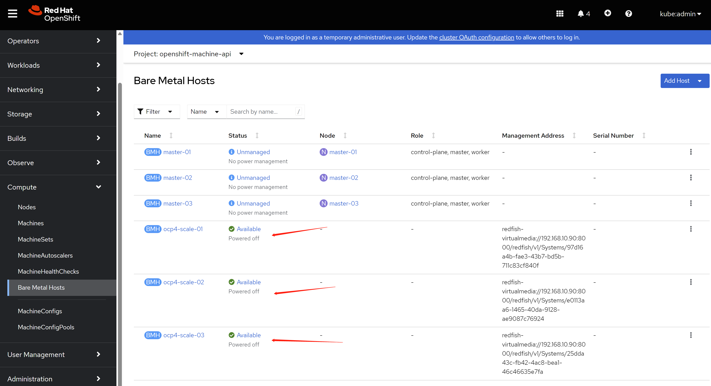

## 5.3. scale out and check the result

find the entry of machineset config, and set the machine count to '1'.

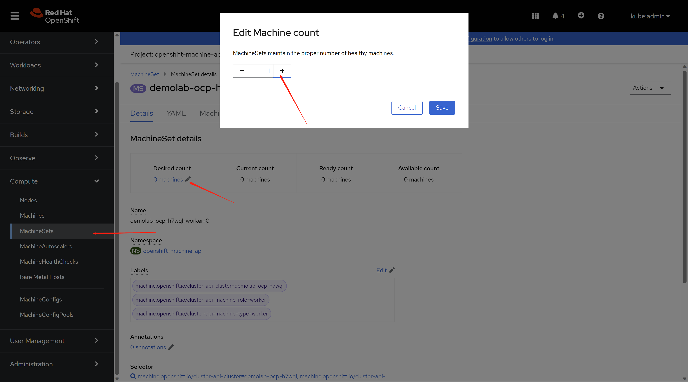

You will find the kvm is booting and provisioning as worker node.

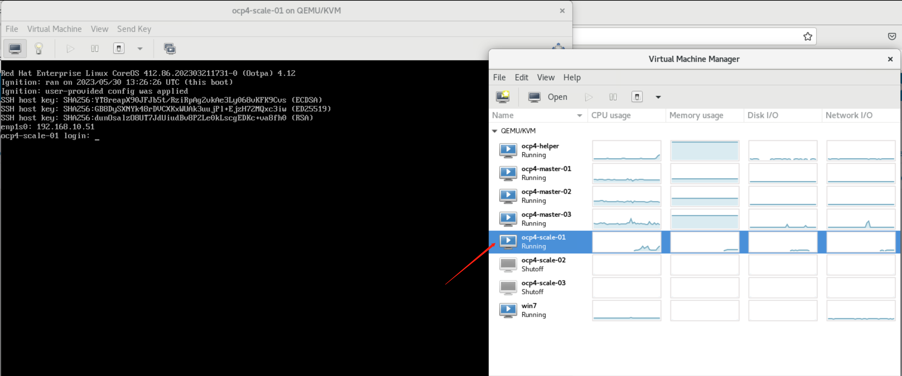

after some time, the worker node is provisioned, and you can see it in cli console.
```bash
oc get node
# NAME                              STATUS   ROLES                         AGE     VERSION
# master-01                         Ready    control-plane,master,worker   3h19m   v1.25.8+37a9a08
# master-02                         Ready    control-plane,master,worker   4h1m    v1.25.8+37a9a08
# master-03                         Ready    control-plane,master,worker   4h3m    v1.25.8+37a9a08
# scale-01.demolab-ocp.wzhlab.top   Ready    worker                        3m55s   v1.25.8+37a9a08
```

you can find a new baremetal host is provisioned in web console.


You can also find a new machine is created in web console.


you can also find a new node is created in web console.


## 5.4. scale in and check the result

Scale in is very simple, just open machine set config, and decrease the number
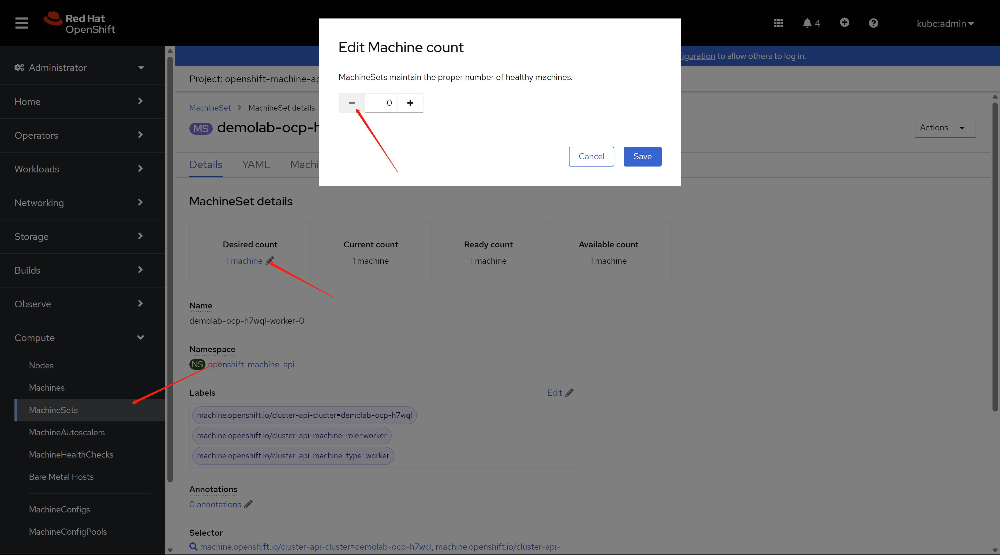

Then, the vm is powered off, and the CR, like machine and node is deleted.


You can confirm that in the cli.
```bash
oc get node
# NAME        STATUS   ROLES                         AGE     VERSION
# master-01   Ready    control-plane,master,worker   3h52m   v1.25.8+37a9a08
# master-02   Ready    control-plane,master,worker   4h33m   v1.25.8+37a9a08
# master-03   Ready    control-plane,master,worker   4h35m   v1.25.8+37a9a08

```

# 6. add 3 infra nodes

Add the 3 infra kvm node is simple, becasue we will not using metal3 to automatically scale-out. We will build an ISO file for each of the kvm, and boot kvm using them.

## 6.1. config on helper node

```bash
# get ignition file for worker node
cd ${BASE_DIR}/data/install/

oc extract -n openshift-machine-api secret/worker-user-data-managed --keys=userData --to=- > worker.ign

# copy the ignition file to root of local web server
# later, during the rhcos booting, it will fetch the ignition file
# from the webserver
sudo mkdir -p /data/yum.repos/conf
sudo /bin/cp -f worker.ign /data/yum.repos/conf/


# some env

# BOOTSTRAP_IP=192.168.77.42
INFRA_01_IP=192.168.10.31
INFRA_02_IP=192.168.10.32
INFRA_03_IP=192.168.10.33

# BOOTSTRAP_IPv6=fd03::42
INFRA_01_IPv6=fd03::31
INFRA_02_IPv6=fd03::32
INFRA_03_IPv6=fd03::33

# BOOTSTRAP_HOSTNAME=bootstrap-demo
INFRA_01_HOSTNAME=infra-01
INFRA_02_HOSTNAME=infra-02
INFRA_03_HOSTNAME=infra-03

# BOOTSTRAP_INTERFACE=enp1s0
INFRA_01_INTERFACE=enp1s0
INFRA_02_INTERFACE=enp1s0
INFRA_03_INTERFACE=enp1s0


# BOOTSTRAP_DISK=/dev/vda
INFRA_01_DISK=/dev/vda
INFRA_02_DISK=/dev/vda
INFRA_03_DISK=/dev/vda

OCP_GW=192.168.10.10
OCP_NETMASK=255.255.255.0
OCP_NETMASK_S=24
OCP_DNS=192.168.10.10

OCP_GW_v6=fd03::10
OCP_NETMASK_v6=64


# build the iso file for each of kvm
export BUILDNUMBER=4.12.16
cd ${BASE_DIR}/data/install/

/bin/cp -f /data/ocp-${BUILDNUMBER}/rhcos-live.x86_64.iso infra-01.iso

coreos-installer iso kargs modify -a "ip=$INFRA_01_IP::$OCP_GW:$OCP_NETMASK:$INFRA_01_HOSTNAME:$INFRA_01_INTERFACE:none nameserver=$OCP_DNS coreos.inst.install_dev=$INFRA_01_DISK coreos.inst.ignition_url=http://192.168.10.10:5000/conf/worker.ign coreos.inst.insecure systemd.debug-shell=1 " infra-01.iso

/bin/cp -f /data/ocp-${BUILDNUMBER}/rhcos-live.x86_64.iso infra-02.iso

coreos-installer iso kargs modify -a "ip=$INFRA_02_IP::$OCP_GW:$OCP_NETMASK:$INFRA_02_HOSTNAME:$INFRA_02_INTERFACE:none nameserver=$OCP_DNS coreos.inst.install_dev=$INFRA_02_DISK coreos.inst.ignition_url=http://192.168.10.10:5000/conf/worker.ign coreos.inst.insecure systemd.debug-shell=1 " infra-02.iso

/bin/cp -f /data/ocp-${BUILDNUMBER}/rhcos-live.x86_64.iso infra-03.iso

coreos-installer iso kargs modify -a "ip=$INFRA_03_IP::$OCP_GW:$OCP_NETMASK:$INFRA_03_HOSTNAME:$INFRA_03_INTERFACE:none nameserver=$OCP_DNS coreos.inst.install_dev=$INFRA_03_DISK coreos.inst.ignition_url=http://192.168.10.10:5000/conf/worker.ign coreos.inst.insecure systemd.debug-shell=1 " infra-03.iso

# transfer the iso file to kvm host server ( 98 )
scp infra-01.iso root@192.168.10.92:/data/kvm/
scp infra-02.iso root@192.168.10.92:/data/kvm/
scp infra-03.iso root@192.168.10.92:/data/kvm/

```


## 6.2. config infra host BM nodes (98)

```bash
# dnf setup for the server
cat << EOF > ~/.ssh/config
StrictHostKeyChecking no
UserKnownHostsFile=/dev/null
EOF

# DO NOT use at production env.
systemctl disable --now firewalld

# ntp
mv /etc/chrony.conf /etc/chrony.conf.bak

cat << EOF > /etc/chrony.conf
server 192.168.10.90 iburst
driftfile /var/lib/chrony/drift
makestep 1.0 3
rtcsync
allow all
logdir /var/log/chrony
EOF
systemctl restart chronyd

systemctl enable --now chronyd

cat << EOF > /etc/yum.repos.d/wzh.repo
[BaseOS]
name=BaseOS
baseurl=http://192.168.10.10:5000/BaseOS
enabled=1
gpgcheck=0

[AppStream]
name=AppStream
baseurl=http://192.168.10.10:5000/AppStream
enabled=1
gpgcheck=0

[epel-fix]
name=epel-fix
baseurl=http://192.168.10.10:5000/epel-fix
enabled=1
gpgcheck=0

EOF

dnf groupinstall -y 'server with gui'

# add support for kvm and vnc
dnf -y install qemu-kvm libvirt libguestfs-tools virt-install virt-viewer virt-manager tigervnc-server

# auto start libvirt
systemctl enable --now libvirtd

# create password for vnc
# replace 'xxxxxx' with your password
printf 'xxxxxx\nxxxxxx\n\n' | vncpasswd

# create vnc config for vnc starting up
cat << EOF > ~/.vnc/config
session=gnome
securitytypes=vncauth,tlsvnc
# desktop=sandbox
geometry=1440x855
alwaysshared
EOF

# auto start vnc session for root user at port 5902
cat << EOF >> /etc/tigervnc/vncserver.users
:2=root
EOF

# auto start vnc session
systemctl enable --now vncserver@:2

#setup network bridge
cat << 'EOF' > /data/kvm/bridge.sh
#!/usr/bin/env bash

PUB_CONN='eno1'
PUB_IP='192.168.10.92/24'
PUB_GW='192.168.10.10'
PUB_DNS='192.168.10.10'
BR_IF='br-int'

nmcli con down "$PUB_CONN"
nmcli con delete "$PUB_CONN"
nmcli con down "$BR_IF"
nmcli con delete "$BR_IF"
# RHEL 8.1 appends the word "System" in front of the connection,delete in case it exists
nmcli con down "System $PUB_CONN"
nmcli con delete "System $PUB_CONN"
nmcli connection add ifname "$BR_IF" type bridge con-name "$BR_IF" ipv4.method 'manual' \
    ipv4.address "$PUB_IP" \
    ipv4.gateway "$PUB_GW" \
    ipv4.dns "$PUB_DNS"
    
nmcli con add type bridge-slave ifname "$PUB_CONN" master "$BR_IF"
nmcli con down "$PUB_CONN";pkill dhclient;dhclient "$BR_IF"
nmcli con up "$BR_IF"
EOF

bash /data/kvm/bridge.sh


# setup the thin provision lvm
lsblk
# NAME   MAJ:MIN RM  SIZE RO TYPE MOUNTPOINT
# sda      8:0    0  4.4T  0 disk
# ├─sda1   8:1    0  600M  0 part /boot/efi
# ├─sda2   8:2    0    1G  0 part /boot
# └─sda3   8:3    0  500G  0 part /
# sr0     11:0    1 1024M  0 rom

fdisk /dev/sda
# n -> to create new partition
# w -> to write out the new partition

lsblk
# NAME   MAJ:MIN RM  SIZE RO TYPE MOUNTPOINT
# sda      8:0    0  4.4T  0 disk
# ├─sda1   8:1    0  600M  0 part /boot/efi
# ├─sda2   8:2    0    1G  0 part /boot
# ├─sda3   8:3    0  500G  0 part /
# └─sda4   8:4    0  3.9T  0 part
# sr0     11:0    1 1024M  0 rom

pvcreate -y /dev/sda4
vgcreate vgdata /dev/sda4

# https://access.redhat.com/articles/766133
lvcreate -y -n poolA -L 100G vgdata
lvcreate -y -n poolA_meta -L 1G vgdata
lvconvert -y --thinpool vgdata/poolA --poolmetadata vgdata/poolA_meta
  # Thin pool volume with chunk size 64.00 KiB can address at most <15.88 TiB of data.
  # WARNING: Converting vgdata/poolA and vgdata/poolA_meta to thin pool's data and metadata volumes with metadata wiping.
  # THIS WILL DESTROY CONTENT OF LOGICAL VOLUME (filesystem etc.)
  # Converted vgdata/poolA and vgdata/poolA_meta to thin pool.

lvextend -l +100%FREE vgdata/poolA
  # Rounding size to boundary between physical extents: <3.88 GiB.
  # Size of logical volume vgdata/poolA_tmeta changed from 1.00 GiB (256 extents) to <3.88 GiB (992 extents).
  # Size of logical volume vgdata/poolA_tdata changed from 100.00 GiB (25600 extents) to <3.87 TiB (1013929 extents).
  # Logical volume vgdata/poolA successfully resized.

lsblk
# NAME                   MAJ:MIN RM  SIZE RO TYPE MOUNTPOINT
# sda                      8:0    0  4.4T  0 disk
# ├─sda1                   8:1    0  600M  0 part /boot/efi
# ├─sda2                   8:2    0    1G  0 part /boot
# ├─sda3                   8:3    0  500G  0 part /
# └─sda4                   8:4    0  3.9T  0 part
#   ├─vgdata-poolA_tmeta 253:0    0  3.9G  0 lvm
#   │ └─vgdata-poolA     253:2    0  3.9T  0 lvm
#   └─vgdata-poolA_tdata 253:1    0  3.9T  0 lvm
#     └─vgdata-poolA     253:2    0  3.9T  0 lvm
# sr0                     11:0    1 1024M  0 rom

```

why we use thin provision lvm, not using qcow2 file on xfs filesystem? because the performance, lvm is 2x or 3x faster than qcow2 file on filesystem.

## 6.3. boot 3 infra kvm

```bash
# cleanup the kvm config

create_lv() {
    var_vg=$1
    var_pool=$2
    var_lv=$3
    var_size=$4
    var_action=$5
    lvremove -f $var_vg/$var_lv
    # lvcreate -y -L $var_size -n $var_lv $var_vg
    if [ "$var_action" == "recreate" ]; then
      lvcreate --type thin -n $var_lv -V $var_size --thinpool $var_vg/$var_pool
      wipefs --all --force /dev/$var_vg/$var_lv
    fi
}

virsh destroy ocp4-infra-01
virsh undefine ocp4-infra-01

create_lv vgdata poolA lv-ocp4-infra-01 100G 
create_lv vgdata poolA lv-ocp4-infra-01-data 1024G 

virsh destroy ocp4-infra-02
virsh undefine ocp4-infra-02

create_lv vgdata poolA lv-ocp4-infra-02 100G 
create_lv vgdata poolA lv-ocp4-infra-02-data 1024G 

virsh destroy ocp4-infra-03
virsh undefine ocp4-infra-03

create_lv vgdata poolA lv-ocp4-infra-03 100G 
create_lv vgdata poolA lv-ocp4-infra-03-data 1024G 

# start the kvm

SNO_MEM=32

virsh destroy ocp4-infra-01
virsh undefine ocp4-infra-01

create_lv vgdata poolA lv-ocp4-infra-01 100G recreate
create_lv vgdata poolA lv-ocp4-infra-01-data 1024G recreate

virt-install --name=ocp4-infra-01 --vcpus=16 --ram=$(($SNO_MEM*1024)) \
  --cpu=host-model \
  --disk path=/dev/vgdata/lv-ocp4-infra-01,device=disk,bus=virtio,format=raw \
  --disk path=/dev/vgdata/lv-ocp4-infra-01-data,device=disk,bus=virtio,format=raw \
  --os-variant rhel8.3 --network bridge=br-int,model=virtio,mac=52:54:00:13:A1:31 \
  --graphics vnc,port=59031 --noautoconsole \
  --boot menu=on --cdrom /data/kvm/infra-01.iso


virsh destroy ocp4-infra-02
virsh undefine ocp4-infra-02

create_lv vgdata poolA lv-ocp4-infra-02 100G recreate
create_lv vgdata poolA lv-ocp4-infra-02-data 1024G recreate

virt-install --name=ocp4-infra-02 --vcpus=16 --ram=$(($SNO_MEM*1024)) \
  --cpu=host-model \
  --disk path=/dev/vgdata/lv-ocp4-infra-02,device=disk,bus=virtio,format=raw \
  --disk path=/dev/vgdata/lv-ocp4-infra-02-data,device=disk,bus=virtio,format=raw \
  --os-variant rhel8.3 --network bridge=br-int,model=virtio,mac=52:54:00:13:A1:32 \
  --graphics vnc,port=59032 --noautoconsole \
  --boot menu=on --cdrom /data/kvm/infra-02.iso


virsh destroy ocp4-infra-03
virsh undefine ocp4-infra-03

create_lv vgdata poolA lv-ocp4-infra-03 100G recreate
create_lv vgdata poolA lv-ocp4-infra-03-data 1024G recreate

virt-install --name=ocp4-infra-03 --vcpus=16 --ram=$(($SNO_MEM*1024)) \
  --cpu=host-model \
  --disk path=/dev/vgdata/lv-ocp4-infra-03,device=disk,bus=virtio,format=raw \
  --disk path=/dev/vgdata/lv-ocp4-infra-03-data,device=disk,bus=virtio,format=raw \
  --os-variant rhel8.3 --network bridge=br-int,model=virtio,mac=52:54:00:13:A1:33 \
  --graphics vnc,port=59033 --noautoconsole \
  --boot menu=on --cdrom /data/kvm/infra-03.iso

```

## 6.4. wait and check the result

```bash
# approve is automatically, if it is not,
# approve the new infra node to join cluster manually
oc get csr
oc get csr -ojson | jq -r '.items[] | select(.status == {} ) | .metadata.name' | xargs oc adm certificate approve

oc get node
# NAME        STATUS   ROLES                         AGE     VERSION
# infra-01    Ready    worker                        117s    v1.25.8+37a9a08
# infra-02    Ready    worker                        111s    v1.25.8+37a9a08
# infra-03    Ready    worker                        110s    v1.25.8+37a9a08
# master-01   Ready    control-plane,master,worker   6h3m    v1.25.8+37a9a08
# master-02   Ready    control-plane,master,worker   6h45m   v1.25.8+37a9a08
# master-03   Ready    control-plane,master,worker   6h47m   v1.25.8+37a9a08

```

# 7. add 2 worker BM nodes

Add the 2 worker baremetal nodes is the same with the 3 infra node. 

if you still want to scale out by metal3, using below config parameter after you plug-in the line of bmc to br-int
```
worker-01
F0:D4:E2:EA:6F:E0
idrac-virtualmedia://<ip of bmc>/redfish/v1/Systems/System.Embedded.1
```

## 7.1. config on helper node

```bash

# some env

# BOOTSTRAP_IP=192.168.77.42
WORKER_01_IP=192.168.10.41
WORKER_02_IP=192.168.10.42
# INFRA_03_IP=192.168.10.33

# BOOTSTRAP_IPv6=fd03::42
WORKER_01_IPv6=fd03::41
WORKER_02_IPv6=fd03::42
# INFRA_03_IPv6=fd03::33

# BOOTSTRAP_HOSTNAME=bootstrap-demo
WORKER_01_HOSTNAME=worker-01
WORKER_02_HOSTNAME=worker-02
# INFRA_03_HOSTNAME=infra-03

# BOOTSTRAP_INTERFACE=enp1s0
WORKER_01_INTERFACE=eno1
WORKER_02_INTERFACE=eno1
# INFRA_03_INTERFACE=enp1s0


# BOOTSTRAP_DISK=/dev/vda
WORKER_01_DISK=/dev/sdb
WORKER_02_DISK=/dev/sda
# INFRA_03_DISK=/dev/vda

OCP_GW=192.168.10.10
OCP_NETMASK=255.255.255.0
OCP_NETMASK_S=24
OCP_DNS=192.168.10.10

OCP_GW_v6=fd03::10
OCP_NETMASK_v6=64


# build the iso file for each of kvm
export BUILDNUMBER=4.12.16
cd ${BASE_DIR}/data/install/

/bin/cp -f /data/ocp-${BUILDNUMBER}/rhcos-live.x86_64.iso worker-01.iso

coreos-installer iso kargs modify -a "ip=$WORKER_01_IP::$OCP_GW:$OCP_NETMASK:$WORKER_01_HOSTNAME:$WORKER_01_INTERFACE:none nameserver=$OCP_DNS coreos.inst.install_dev=$WORKER_01_DISK coreos.inst.ignition_url=http://192.168.10.10:5000/conf/worker.ign coreos.inst.insecure systemd.debug-shell=1 " worker-01.iso

/bin/cp -f /data/ocp-${BUILDNUMBER}/rhcos-live.x86_64.iso worker-02.iso

coreos-installer iso kargs modify -a "ip=$WORKER_02_IP::$OCP_GW:$OCP_NETMASK:$WORKER_02_HOSTNAME:$WORKER_02_INTERFACE:none nameserver=$OCP_DNS coreos.inst.install_dev=$WORKER_02_DISK coreos.inst.ignition_url=http://192.168.10.10:5000/conf/worker.ign coreos.inst.insecure systemd.debug-shell=1 " worker-02.iso


# transfer the iso file to host server
scp worker-01.iso root@192.168.10.90:/home/wzh.iso/
scp worker-02.iso root@192.168.10.90:/home/wzh.iso/


```

## 7.2. boot the BM and check the result

power on the BM after attch the ISO image to virtual cdrom.

Before booting the BM with iso, it is better to reset integrated raid card config, and reset all vdisk. Otherwise, you will fall into booting issues with uefi.

Some machine, like the BM server in demo lab, need manually remove the virtual cdrom during the 1st reboot.

```bash
# approve the new infra node to join cluster manually
oc get csr
oc get csr -ojson | jq -r '.items[] | select(.status == {} ) | .metadata.name' | xargs oc adm certificate approve


```

# 8. set up infra role on cluster

the offical document is here: 
- https://docs.openshift.com/container-platform/4.12/machine_management/creating-infrastructure-machinesets.html#creating-an-infra-node_creating-infrastructure-machinesets
- https://access.redhat.com/documentation/en-us/red_hat_openshift_data_foundation/4.12/html-single/managing_and_allocating_storage_resources/index#manual_creation_of_infrastructure_nodes

I will not create infra machine set, because I can not find the document on how to create it for baremetal cluster.

## 8.1. basic cluster config

```bash
# currently the cluster looks like this
oc get node
# NAME        STATUS   ROLES                         AGE    VERSION
# infra-01    Ready    worker                        23h    v1.25.8+37a9a08
# infra-02    Ready    worker                        23h    v1.25.8+37a9a08
# infra-03    Ready    worker                        23h    v1.25.8+37a9a08
# master-01   Ready    control-plane,master,worker   29h    v1.25.8+37a9a08
# master-02   Ready    control-plane,master,worker   30h    v1.25.8+37a9a08
# master-03   Ready    control-plane,master,worker   30h    v1.25.8+37a9a08
# worker-01   Ready    worker                        3h4m   v1.25.8+37a9a08
# worker-02   Ready    worker                        99m    v1.25.8+37a9a08

oc get mcp
# NAME     CONFIG                                             UPDATED   UPDATING   DEGRADED   MACHINECOUNT   READYMACHINECOUNT   UPDATEDMACHINECOUNT   DEGRADEDMACHINECOUNT   AGE
# master   rendered-master-6b284ac2e77636bd9f5fe05b8f68bf3a   True      False      False      3              3                   3                     0                      30h
# worker   rendered-worker-8404cadc036bdaa800e4924522f5ace6   True      False      False      5              5                   5                     0                      30h


# add node lable for infra
for i in worker-0{1..2}; do
  oc label node $i node-role.kubernetes.io/app=""
done

for i in infra-0{1..3}; do
  oc label node $i node-role.kubernetes.io/infra=""
  # enable below if you want to run only ODF on infra
  oc label node $i cluster.ocs.openshift.io/openshift-storage=""
done

oc get node
# NAME        STATUS   ROLES                         AGE     VERSION
# infra-01    Ready    infra,worker                  23h     v1.25.8+37a9a08
# infra-02    Ready    infra,worker                  23h     v1.25.8+37a9a08
# infra-03    Ready    infra,worker                  23h     v1.25.8+37a9a08
# master-01   Ready    control-plane,master,worker   29h     v1.25.8+37a9a08
# master-02   Ready    control-plane,master,worker   30h     v1.25.8+37a9a08
# master-03   Ready    control-plane,master,worker   30h     v1.25.8+37a9a08
# worker-01   Ready    app,worker                    3h12m   v1.25.8+37a9a08
# worker-02   Ready    app,worker                    107m    v1.25.8+37a9a08

cat << EOF > ${BASE_DIR}/data/install/infra.mcp.yaml
apiVersion: machineconfiguration.openshift.io/v1
kind: MachineConfigPool
metadata:
  name: infra
spec:
  machineConfigSelector:
    matchExpressions:
      - {key: machineconfiguration.openshift.io/role, operator: In, values: [worker,infra]} 
  nodeSelector:
    matchLabels:
      node-role.kubernetes.io/infra: "" 
EOF
oc create --save-config -f ${BASE_DIR}/data/install/infra.mcp.yaml

oc get mcp
# NAME     CONFIG                                             UPDATED   UPDATING   DEGRADED   MACHINECOUNT   READYMACHINECOUNT   UPDATEDMACHINECOUNT   DEGRADEDMACHINECOUNT   AGE
# infra    rendered-infra-8404cadc036bdaa800e4924522f5ace6    True      False      False      3              3                   3                     0                      2m43s
# master   rendered-master-6b284ac2e77636bd9f5fe05b8f68bf3a   True      False      False      3              3                   3                     0                      30h
# worker   rendered-worker-8404cadc036bdaa800e4924522f5ace6   True      False      False      2              2                   2                     0                      30h

# taint infra node
for i in infra-0{1..3}; do
  # oc adm taint nodes $i node-role.kubernetes.io/infra=reserved:NoExecute
  # remove the taint, just for our demo lab env
  oc adm taint nodes $i node-role.kubernetes.io/infra:NoExecute-
  # enable below if you want to run only ODF on infra
  oc adm taint node $i node.ocs.openshift.io/storage="true":NoSchedule
done

# fix for dns
# https://access.redhat.com/solutions/6592171
cat << EOF > ${BASE_DIR}/data/install/patch-dns.yaml
spec:
  nodePlacement:
    tolerations:
    - operator: Exists
EOF
oc patch dns.operator/default --type merge \
  --patch-file=${BASE_DIR}/data/install/patch-dns.yaml

```

## 8.2. move workload to infra node

DO NOT move workload to infra node, if you only have 3 infra nodes in cluster, because we will use the 3 infra node for ODF dedicated.

### 8.2.1. for router

```bash
# for router
oc get ingresscontroller default -n openshift-ingress-operator -o json | jq .spec
# {
#   "clientTLS": {
#     "clientCA": {
#       "name": ""
#     },
#     "clientCertificatePolicy": ""
#   },
#   "httpCompression": {},
#   "httpEmptyRequestsPolicy": "Respond",
#   "httpErrorCodePages": {
#     "name": ""
#   },
#   "replicas": 2,
#   "tuningOptions": {
#     "reloadInterval": "0s"
#   },
#   "unsupportedConfigOverrides": null
# }

oc get pod -n openshift-ingress -o wide
# NAME                            READY   STATUS    RESTARTS   AGE   IP              NODE        NOMINATED NODE   READINESS GATES
# router-default-656fd575-d7w8s   1/1     Running   0          40h   192.168.10.22   master-02   <none>           <none>
# router-default-656fd575-s6tl6   1/1     Running   0          40h   192.168.10.23   master-03   <none>           <none>


cat << EOF > ${BASE_DIR}/data/install/patch-router.yaml
spec:
  nodePlacement:
    nodeSelector: 
      matchLabels:
        node-role.kubernetes.io/infra: ""
    tolerations:
    - effect: NoSchedule
      key: node-role.kubernetes.io/infra
      value: reserved
    - effect: NoExecute
      key: node-role.kubernetes.io/infra
      value: reserved
EOF
oc patch -n openshift-ingress-operator ingresscontroller/default --type merge \
  --patch-file=${BASE_DIR}/data/install/patch-router.yaml

# to roll back only
# do not use this, it will delete the patch
cat << EOF > ${BASE_DIR}/data/install/patch-router.yaml
spec:
  nodePlacement: null
EOF
oc patch -n openshift-ingress-operator ingresscontroller/default --type merge \
  --patch-file=${BASE_DIR}/data/install/patch-router.yaml

oc get pod -n openshift-ingress -o wide
# NAME                              READY   STATUS    RESTARTS   AGE    IP              NODE       NOMINATED NODE   READINESS GATES
# router-default-788c864f85-5dj9f   1/1     Running   0          90s    192.168.10.32   infra-02   <none>           <none>
# router-default-788c864f85-qcmv7   1/1     Running   0          2m4s   192.168.10.33   infra-03   <none>           <none>

```

### 8.2.2. for internal registry

```bash
oc get configs.imageregistry.operator.openshift.io/cluster -o json | jq .spec
# {
#   "logLevel": "Normal",
#   "managementState": "Removed",
#   "observedConfig": null,
#   "operatorLogLevel": "Normal",
#   "proxy": {},
#   "replicas": 1,
#   "requests": {
#     "read": {
#       "maxWaitInQueue": "0s"
#     },
#     "write": {
#       "maxWaitInQueue": "0s"
#     }
#   },
#   "rolloutStrategy": "RollingUpdate",
#   "storage": {},
#   "unsupportedConfigOverrides": null
# }

oc get pods -o wide -n openshift-image-registry |grep registry


cat << EOF > ${BASE_DIR}/data/install/patch-registry.yaml
spec:
  nodeSelector: 
    node-role.kubernetes.io/infra: ""
  tolerations:
  - effect: NoSchedule
    key: node-role.kubernetes.io/infra
    value: reserved
  - effect: NoExecute
    key: node-role.kubernetes.io/infra
    value: reserved
EOF
oc patch configs.imageregistry.operator.openshift.io/cluster --type merge \
  --patch-file=${BASE_DIR}/data/install/patch-registry.yaml

# to roll back only
# do not use this, it will delete the patch
cat << EOF > ${BASE_DIR}/data/install/patch-registry.yaml
spec:
  nodeSelector: null
  tolerations: null
EOF
oc patch configs.imageregistry.operator.openshift.io/cluster --type merge \
  --patch-file=${BASE_DIR}/data/install/patch-registry.yaml

```

### 8.2.3. for monitor

```bash
oc get pod -n openshift-monitoring -o wide
# NAME                                                     READY   STATUS    RESTARTS      AGE   IP              NODE        NOMINATED NODE   READINESS GATES
# alertmanager-main-0                                      6/6     Running   0             40h   172.21.0.107    master-03   <none>           <none>
# alertmanager-main-1                                      6/6     Running   1 (40h ago)   40h   172.21.2.40     master-02   <none>           <none>
# cluster-monitoring-operator-7dd6795794-v9mqh             2/2     Running   0             40h   172.21.2.23     master-02   <none>           <none>
# kube-state-metrics-6b66b788d5-j2v2j                      3/3     Running   0             40h   172.21.0.95     master-03   <none>           <none>
# node-exporter-54x95                                      2/2     Running   0             35h   192.168.10.33   infra-03    <none>           <none>
# node-exporter-7gtr5                                      2/2     Running   0             35h   192.168.10.31   infra-01    <none>           <none>
# node-exporter-bfbt6                                      2/2     Running   2             42h   192.168.10.22   master-02   <none>           <none>
# node-exporter-cz8p8                                      2/2     Running   0             35h   192.168.10.32   infra-02    <none>           <none>
# node-exporter-d759x                                      2/2     Running   2             42h   192.168.10.23   master-03   <none>           <none>
# node-exporter-jplrr                                      2/2     Running   0             14h   192.168.10.42   worker-02   <none>           <none>
# node-exporter-k498r                                      2/2     Running   2             41h   192.168.10.21   master-01   <none>           <none>
# node-exporter-xcxv5                                      2/2     Running   0             15h   192.168.10.41   worker-01   <none>           <none>
# openshift-state-metrics-86884485c8-4zcpf                 3/3     Running   0             40h   172.21.0.91     master-03   <none>           <none>
# prometheus-adapter-68759db859-m8hw7                      1/1     Running   0             18h   172.21.4.36     master-01   <none>           <none>
# prometheus-adapter-68759db859-mlxfz                      1/1     Running   0             11h   172.21.12.7     worker-01   <none>           <none>
# prometheus-k8s-0                                         6/6     Running   0             40h   172.21.0.109    master-03   <none>           <none>
# prometheus-k8s-1                                         6/6     Running   0             40h   172.21.2.34     master-02   <none>           <none>
# prometheus-operator-78b549956b-676kt                     2/2     Running   0             40h   172.21.0.100    master-03   <none>           <none>
# prometheus-operator-admission-webhook-746c7d6ffb-nmglp   1/1     Running   0             40h   172.21.2.28     master-02   <none>           <none>
# prometheus-operator-admission-webhook-746c7d6ffb-w8tz6   1/1     Running   0             40h   172.21.0.105    master-03   <none>           <none>
# thanos-querier-6b5bcc9cb-b9r4j                           6/6     Running   0             40h   172.21.0.104    master-03   <none>           <none>
# thanos-querier-6b5bcc9cb-xvsvl                           6/6     Running   0             40h   172.21.2.30     master-02   <none>           <none>


cat << EOF > ${BASE_DIR}/data/install/cm-monitor.yaml
apiVersion: v1
kind: ConfigMap
metadata:
  name: cluster-monitoring-config
  namespace: openshift-monitoring
data:
  config.yaml: |+
    alertmanagerMain:
      nodeSelector: 
        node-role.kubernetes.io/infra: ""
      tolerations:
      - key: node-role.kubernetes.io/infra
        value: reserved
        effect: NoSchedule
      - key: node-role.kubernetes.io/infra
        value: reserved
        effect: NoExecute
    prometheusK8s:
      nodeSelector:
        node-role.kubernetes.io/infra: ""
      tolerations:
      - key: node-role.kubernetes.io/infra
        value: reserved
        effect: NoSchedule
      - key: node-role.kubernetes.io/infra
        value: reserved
        effect: NoExecute
    prometheusOperator:
      nodeSelector:
        node-role.kubernetes.io/infra: ""
      tolerations:
      - key: node-role.kubernetes.io/infra
        value: reserved
        effect: NoSchedule
      - key: node-role.kubernetes.io/infra
        value: reserved
        effect: NoExecute
    k8sPrometheusAdapter:
      nodeSelector:
        node-role.kubernetes.io/infra: ""
      tolerations:
      - key: node-role.kubernetes.io/infra
        value: reserved
        effect: NoSchedule
      - key: node-role.kubernetes.io/infra
        value: reserved
        effect: NoExecute
    kubeStateMetrics:
      nodeSelector:
        node-role.kubernetes.io/infra: ""
      tolerations:
      - key: node-role.kubernetes.io/infra
        value: reserved
        effect: NoSchedule
      - key: node-role.kubernetes.io/infra
        value: reserved
        effect: NoExecute
    telemeterClient:
      nodeSelector:
        node-role.kubernetes.io/infra: ""
      tolerations:
      - key: node-role.kubernetes.io/infra
        value: reserved
        effect: NoSchedule
      - key: node-role.kubernetes.io/infra
        value: reserved
        effect: NoExecute
    openshiftStateMetrics:
      nodeSelector:
        node-role.kubernetes.io/infra: ""
      tolerations:
      - key: node-role.kubernetes.io/infra
        value: reserved
        effect: NoSchedule
      - key: node-role.kubernetes.io/infra
        value: reserved
        effect: NoExecute
    thanosQuerier:
      nodeSelector:
        node-role.kubernetes.io/infra: ""
      tolerations:
      - key: node-role.kubernetes.io/infra
        value: reserved
        effect: NoSchedule
      - key: node-role.kubernetes.io/infra
        value: reserved
        effect: NoExecute
EOF
oc create --save-config -n openshift-monitoring -f ${BASE_DIR}/data/install/cm-monitor.yaml

# oc delete -n openshift-monitoring -f ${BASE_DIR}/data/install/cm-monitor.yaml

oc get pod -n openshift-monitoring -o wide
# NAME                                                    READY   STATUS    RESTARTS        AGE     IP              NODE        NOMINATED NODE   READINESS GATES
# alertmanager-main-0                                     6/6     Running   1 (2m29s ago)   2m33s   172.21.10.12    infra-03    <none>           <none>
# alertmanager-main-1                                     6/6     Running   1 (3m2s ago)    3m7s    172.21.6.11     infra-01    <none>           <none>
# cluster-monitoring-operator-7dd6795794-v9mqh            2/2     Running   0               40h     172.21.2.23     master-02   <none>           <none>
# kube-state-metrics-857fc67cb9-snbpc                     3/3     Running   0               3m11s   172.21.8.8      infra-02    <none>           <none>
# node-exporter-54x95                                     2/2     Running   0               35h     192.168.10.33   infra-03    <none>           <none>
# node-exporter-7gtr5                                     2/2     Running   0               35h     192.168.10.31   infra-01    <none>           <none>
# node-exporter-bfbt6                                     2/2     Running   2               42h     192.168.10.22   master-02   <none>           <none>
# node-exporter-cz8p8                                     2/2     Running   0               35h     192.168.10.32   infra-02    <none>           <none>
# node-exporter-d759x                                     2/2     Running   2               42h     192.168.10.23   master-03   <none>           <none>
# node-exporter-jplrr                                     2/2     Running   0               14h     192.168.10.42   worker-02   <none>           <none>
# node-exporter-k498r                                     2/2     Running   2               42h     192.168.10.21   master-01   <none>           <none>
# node-exporter-xcxv5                                     2/2     Running   0               15h     192.168.10.41   worker-01   <none>           <none>
# openshift-state-metrics-6469575fd-sknv5                 3/3     Running   0               3m11s   172.21.8.9      infra-02    <none>           <none>
# prometheus-adapter-765d86b6c9-ffps5                     1/1     Running   0               3m10s   172.21.6.9      infra-01    <none>           <none>
# prometheus-adapter-765d86b6c9-s8r7p                     1/1     Running   0               3m10s   172.21.8.10     infra-02    <none>           <none>
# prometheus-k8s-0                                        6/6     Running   0               2m1s    172.21.10.13    infra-03    <none>           <none>
# prometheus-k8s-1                                        6/6     Running   0               3m3s    172.21.8.11     infra-02    <none>           <none>
# prometheus-operator-5d45f8bb65-fhgsf                    2/2     Running   0               3m17s   172.21.10.10    infra-03    <none>           <none>
# prometheus-operator-admission-webhook-b847d7dd4-82s44   1/1     Running   0               3m22s   172.21.10.9     infra-03    <none>           <none>
# prometheus-operator-admission-webhook-b847d7dd4-f7gnt   1/1     Running   0               3m22s   172.21.6.8      infra-01    <none>           <none>
# thanos-querier-696b585794-gwvdj                         6/6     Running   0               3m8s    172.21.6.10     infra-01    <none>           <none>
# thanos-querier-696b585794-ws5rr                         6/6     Running   0               3m8s    172.21.10.11    infra-03    <none>           <none>

```

### 8.2.4. for logging

The default openshift installation does not have logging included. So do not worry now.

The offical document:
- https://docs.openshift.com/container-platform/4.12/machine_management/creating-infrastructure-machinesets.html#infrastructure-moving-logging_creating-infrastructure-machinesets

# 9. install ODF

## 9.1. download additional installation media

```bash
# on helper
# try to find out the correct operator version.

# to list all channel
oc get PackageManifest -o json | jq -r ' .items[] | "\(.metadata.name),\(.status.channels[].name),\(.status.channels[].currentCSVDesc.version)" ' | column -ts $',' | grep odf
# ocs-client-operator                               stable-4.12                4.12.3-rhodf
# odf-multicluster-orchestrator                     stable-4.11                4.11.8
# odf-multicluster-orchestrator                     stable-4.12                4.11.8
# odf-multicluster-orchestrator                     stable-4.11                4.12.3-rhodf
# odf-multicluster-orchestrator                     stable-4.12                4.12.3-rhodf
# ocs-operator                                      stable-4.12                4.12.3-rhodf
# ocs-operator                                      stable-4.11                4.12.3-rhodf
# odr-hub-operator                                  stable-4.11                4.12.3-rhodf
# odr-hub-operator                                  stable-4.12                4.12.3-rhodf
# ibm-storage-odf-operator                          stable-v1.3                1.3.0
# mcg-operator                                      stable-4.11                4.12.3-rhodf
# mcg-operator                                      stable-4.12                4.12.3-rhodf
# odf-operator                                      stable-4.11                4.11.8
# odf-operator                                      stable-4.12                4.11.8
# odf-operator                                      stable-4.11                4.12.3-rhodf
# odf-operator                                      stable-4.12                4.12.3-rhodf
# odf-csi-addons-operator                           stable-4.11                4.11.8
# odf-csi-addons-operator                           stable-4.12                4.11.8
# odf-csi-addons-operator                           stable-4.11                4.12.3-rhodf
# odf-csi-addons-operator                           stable-4.12                4.12.3-rhodf
# odr-cluster-operator                              stable-4.11                4.12.3-rhodf
# odr-cluster-operator                              stable-4.12                4.12.3-rhodf

# on vultr host

cat > /data/ocp4/mirror.yaml << EOF
apiVersion: mirror.openshift.io/v1alpha2
kind: ImageSetConfiguration
# archiveSize: 4
mirror:
  platform:
    architectures:
      - amd64
      # - arm64
  #   channels:
  #     - name: stable-4.12
  #       type: ocp
  #       minVersion: 4.12.16
  #       maxVersion: 4.12.16
  #       shortestPath: true
  #   graph: false
  # additionalImages:
  #   - name: registry.redhat.io/redhat/redhat-operator-index:v4.12
  #   - name: registry.redhat.io/redhat/certified-operator-index:v4.12
  #   - name: registry.redhat.io/redhat/community-operator-index:v4.12
  #   - name: registry.redhat.io/redhat/redhat-marketplace-index:v4.12 
  #   - name: quay.io/openshift/origin-kube-rbac-proxy:latest
  #   - name: quay.io/wangzheng422/debug-pod:alma-9.1
  operators:
    - catalog: registry.redhat.io/redhat/redhat-operator-index:v4.12
      packages:
      - name: odf-operator                                 
        channels:
        - name: stable-4.12
          minVersion: 4.12.3-rhodf
      - name: local-storage-operator
        channels:
        - name: stable
          minVersion: 4.12.0-202305101515
EOF


mkdir -p /data/ocp-install/oc-mirror/
cd /data/ocp-install/oc-mirror/

cd /data/wzh.work
oc-mirror --config /data/ocp4/mirror.yaml file:///data/ocp-install/oc-mirror/

# sync back to demo lab jumpbox
cd /data
rsync -P -arz  /data/ocp-install root@10.229.104.55:/home/wzh/

# on helper vm node
rsync -P -arz  root@192.168.10.90:/home/wzh/ocp-install /data/

# import the image to internal registry
oc-mirror --from=/data/ocp-install/oc-mirror/mirror_seq1_000000.tar \
  docker://quay.demolab-infra.wzhlab.top:8443

# as user 3node
oc get OperatorHub/cluster -o yaml
# ......
# spec: {}
# status:
#   sources:
#   - disabled: false
#     name: certified-operators
#     status: Success
#   - disabled: false
#     name: community-operators
#     status: Success
#   - disabled: false
#     name: redhat-marketplace
#     status: Success
#   - disabled: false
#     name: redhat-operators
#     status: Success


cat << EOF > ${BASE_DIR}/data/install/hub.disable.yaml
spec:
  sources: [ 
    {
      name: "certified-operators",
      disabled: true
    },
    {
      name: "community-operators",
      disabled: true
    },
    {
      name: "redhat-marketplace",
      disabled: true
    }
  ]
EOF
oc patch OperatorHub/cluster --type merge \
  --patch-file=${BASE_DIR}/data/install/hub.disable.yaml

```

## 9.2. install ODF

install ODF is straightforward. Just following official document:
- https://access.redhat.com/documentation/en-us/red_hat_openshift_data_foundation/4.12/html-single/deploying_openshift_data_foundation_using_bare_metal_infrastructure/index#deploy-using-local-storage-devices-bm

first, you have to install local storage operator, this operator will init the disk, and provide the disk to consume by ODF


click install.

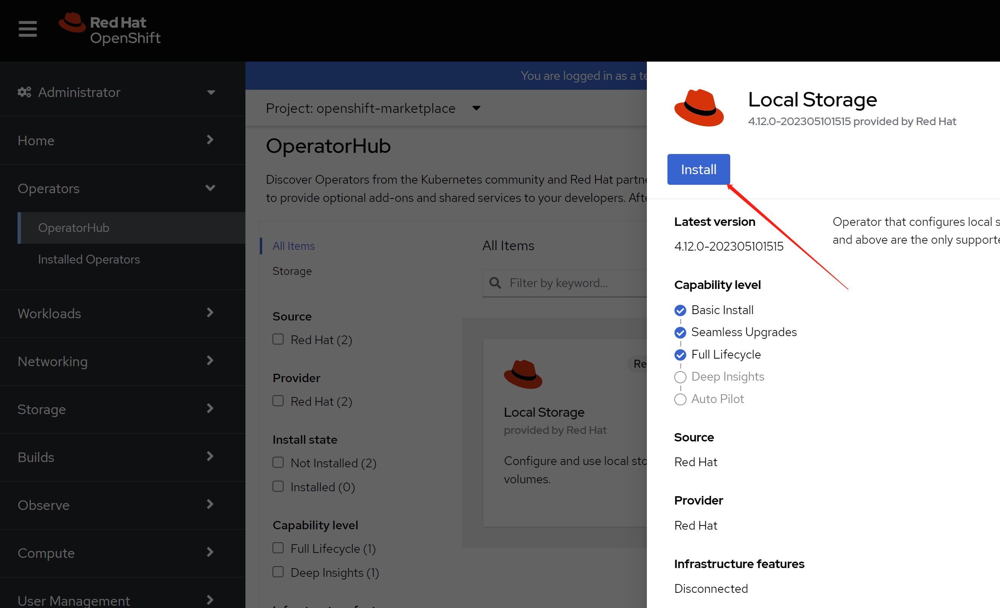

enable monitoring, this is optional.

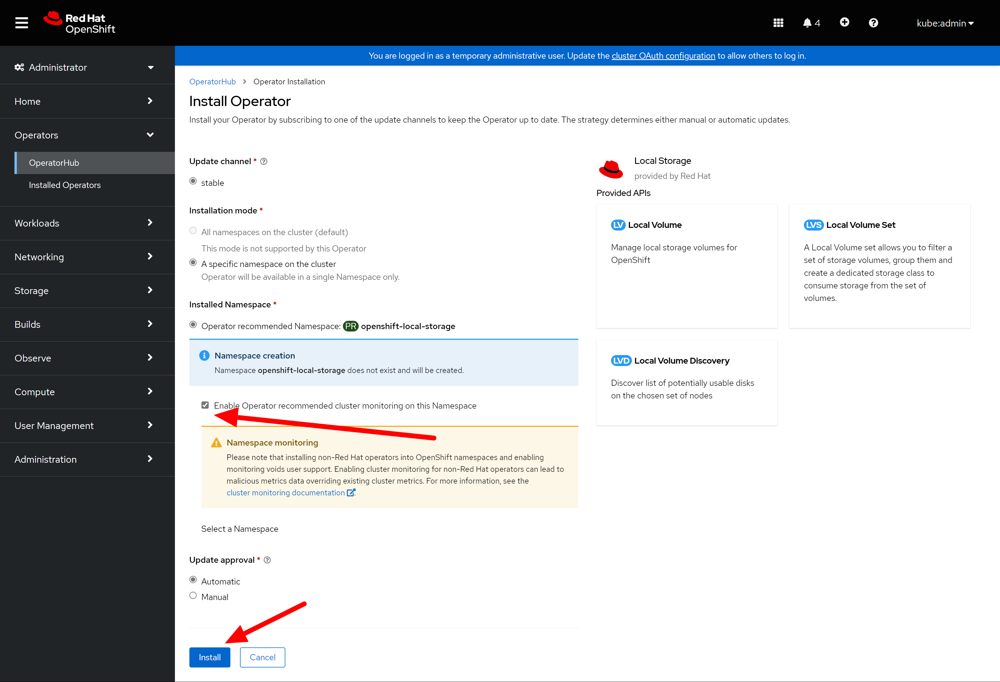

just wait, then it will be ok.


then, install ODF


click install.

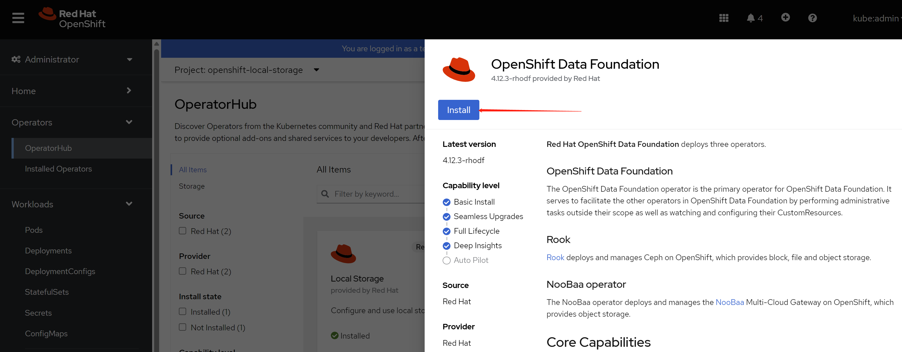

keep the default config.

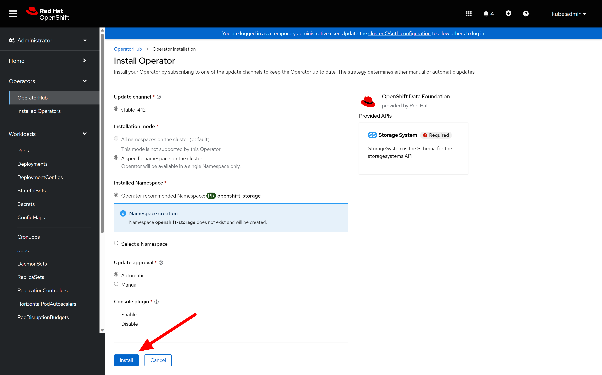

after some time, the odf operator is ready.

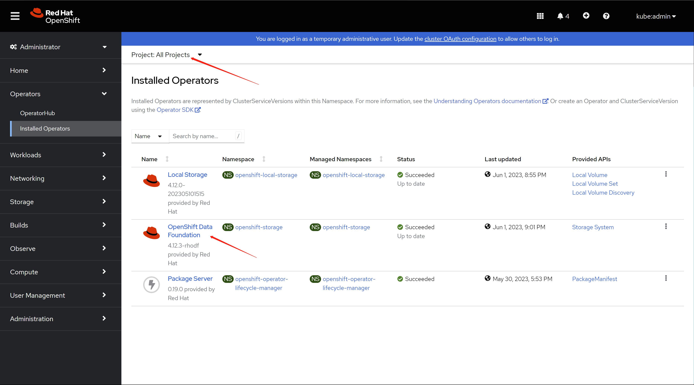

you have to init the ODF, by creating a storage system.

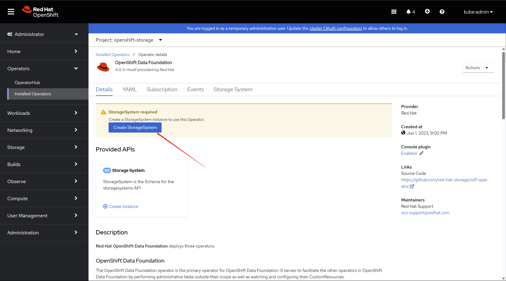

keep default config in the first stop.


then, a config will be apply to local storage operator, and it will auto discovery the local disk, wait for sometime, it will show up all the node in the cluster, and all the disk. Select only infra node.


after click next, it will create local volume set in local storage operator. The local disk will be encapsulated into local volume, and consumed by ODF.

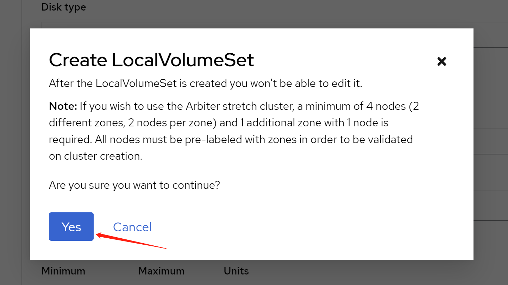

In the next, just keep the default, or you can taint the node. We already taint the node, so do not worry here.

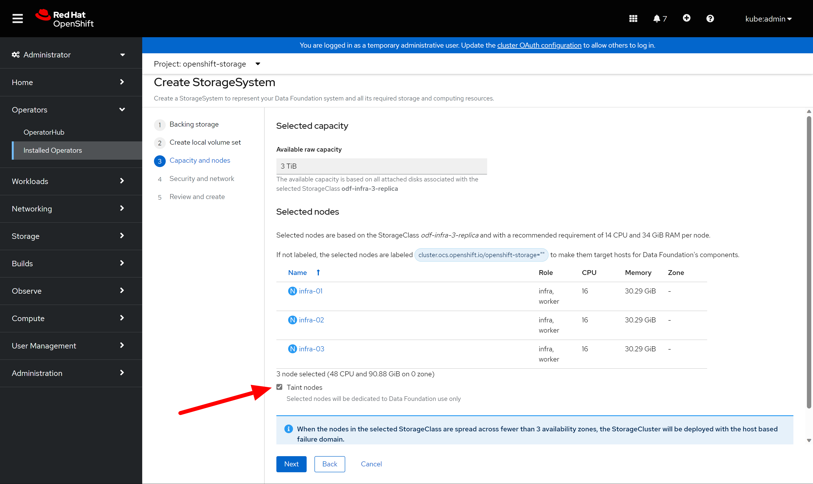

next step, keep the default config.


review your config, and begin to create.


wait for sometime, it will be ok, remember to refresh the web console.

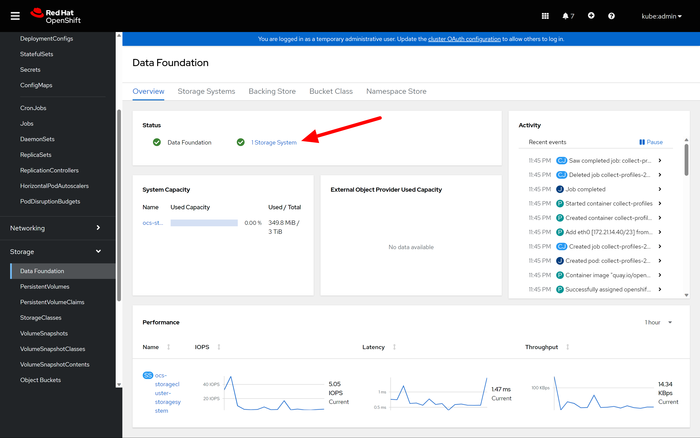

you can see the block and file is ok.

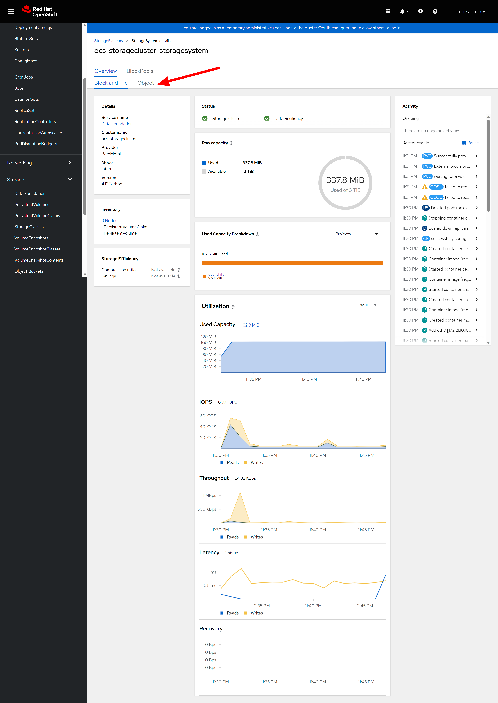

object service is ok either.

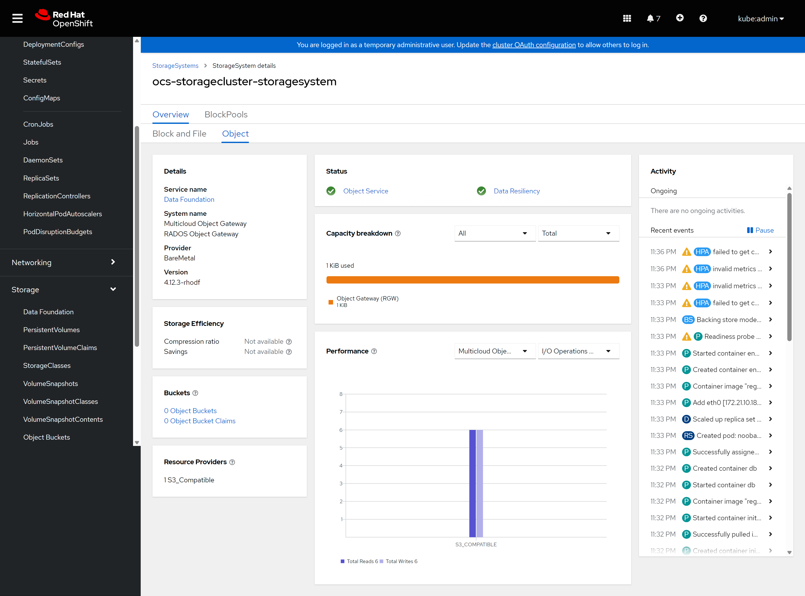

The default storage class is not ok, we will create a new one. To save space, we will use 2-replica, default is 3-replica, we will also use compression.


Select rbd provisioner, and create a new pool

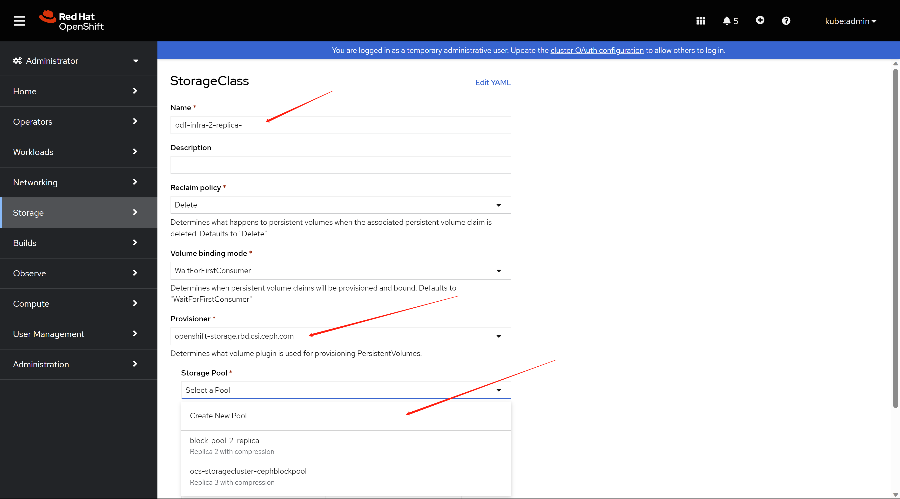

in the popup, set the data replication policy to 2-way, and enable compression.

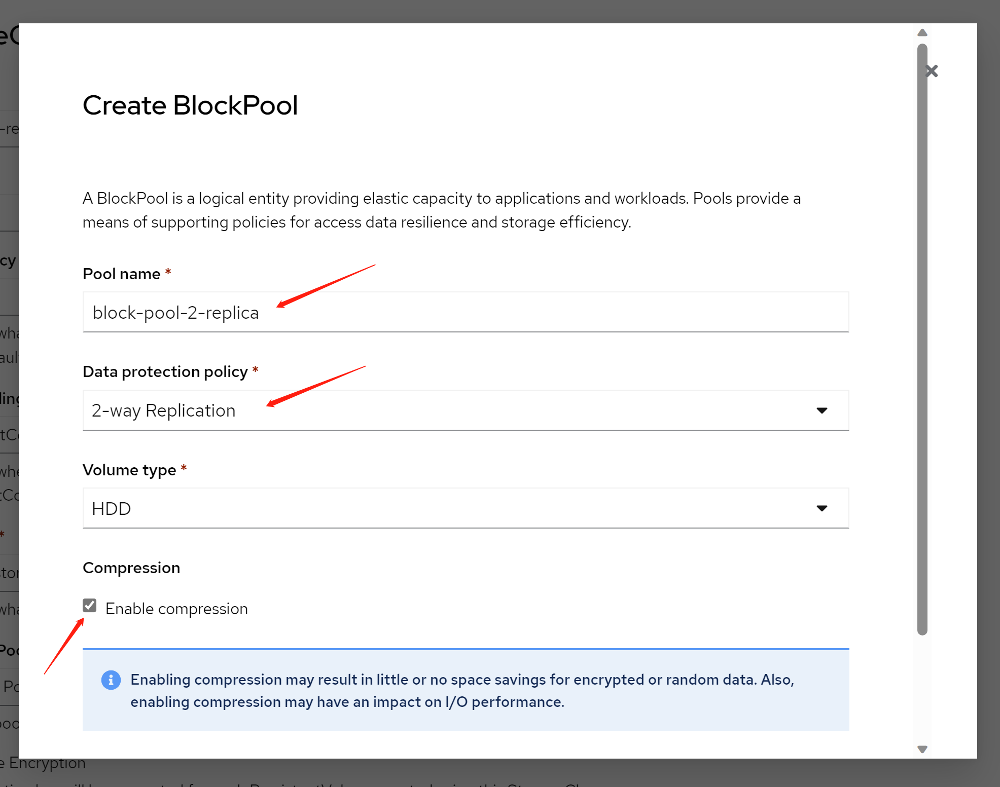

create block pool is ok.

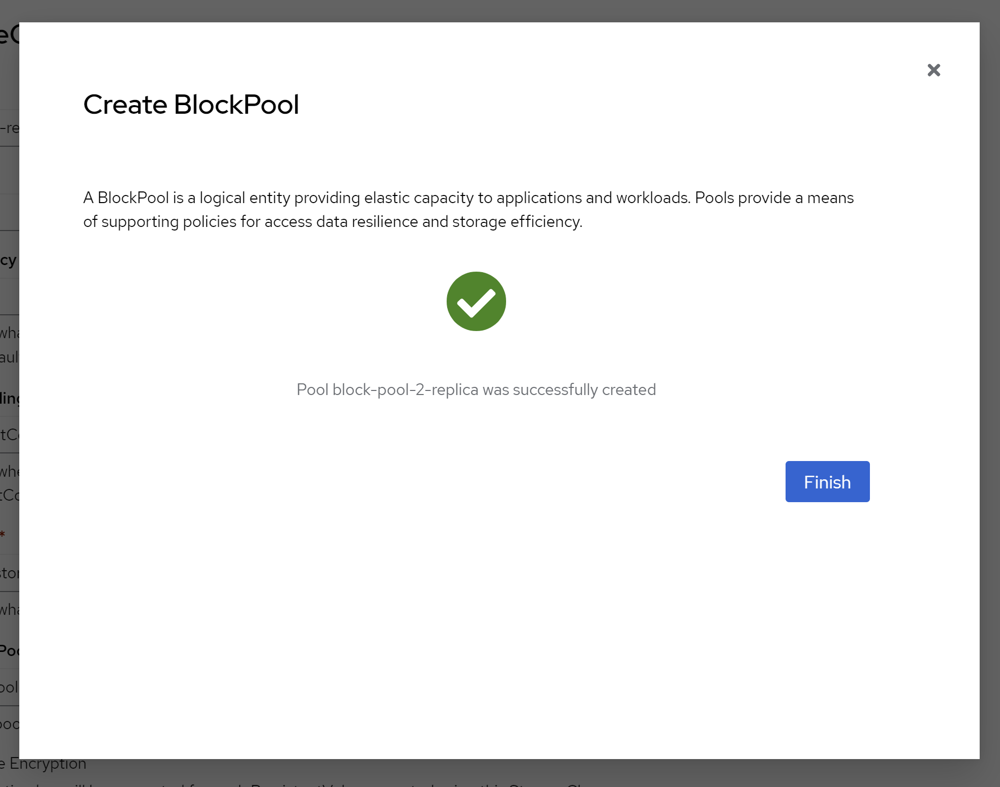

keep other config in default.

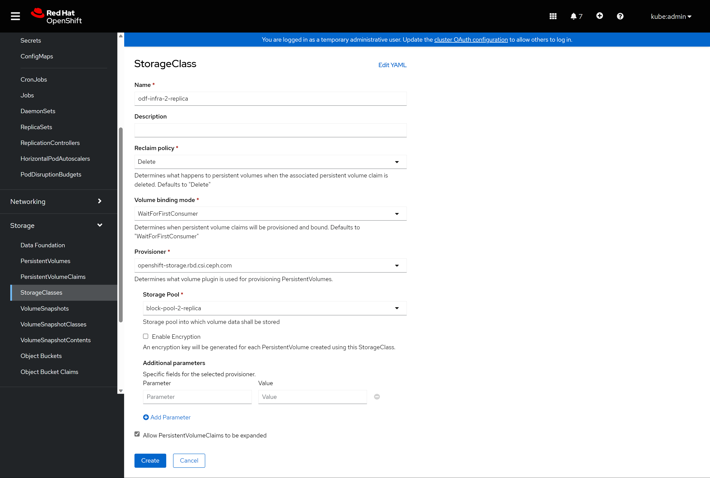

then, the new storage class is ready to use.


## 9.3. patch for csi components

bring csi components to infra node, NO need in our demo lab.

you can ignore below.

offical document:
- https://access.redhat.com/documentation/en-us/red_hat_openshift_data_foundation/4.12/html-single/managing_and_allocating_storage_resources/index#managing-container-storage-interface-component-placements_rhodf


```bash
# bring csi components to infra node
# NO need in out demo lab.
# you can ignore it
oc get configmap rook-ceph-operator-config -n openshift-storage -o yaml
# apiVersion: v1
# kind: ConfigMap
# metadata:
#   creationTimestamp: "2023-06-01T13:00:58Z"
#   name: rook-ceph-operator-config
#   namespace: openshift-storage
#   resourceVersion: "1139866"
#   uid: 94177029-8189-4725-b712-0dbbc6fef71a

cat << EOF > ${BASE_DIR}/data/install/odf.csi-patch.yaml
data:
  CSI_PLUGIN_TOLERATIONS: |
    - key: nodetype
      operator: Equal
      value: infra
      effect: NoSchedule
    - key: node.ocs.openshift.io/storage
      operator: Equal
      value: "true"
      effect: NoSchedule
EOF
oc patch OperatorHub/cluster --type merge \
  --patch-file=${BASE_DIR}/data/install/odf.csi-patch.yaml

```
# 10. end
